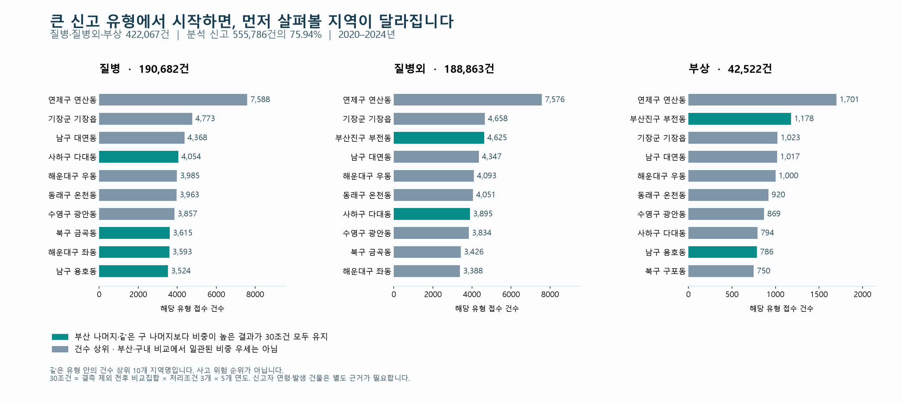

# 부산 119: 큰 신고 특성에서 주민·지역 배경으로 좁히는 분석

2026-09-17. 최신 사용자 지시에 따라 주 실행자가 직접 작성·추가 집계·별도 검산했다. **이번 방향 재검토 이후 새 서브 에이전트 작업을 실행하지 않았다.** 기존 지도·시각화·집계는 보존한다.

## 1. 무엇을 바로잡았는가

프로젝트는 **어떤 신고가 크게·반복적으로 나타나는가 → 어떤 구·군과 동에서 두드러지는가 → 그 지역에는 어떤 주민이 살고 어떤 활동·시설·건물이 있는가 → 확인된 문제와 기존 대응이 어떻게 연결되는가 → 무엇을 보완할 수 있는가**를 설명해야 한다.

앞선 금곡·화명 및 강서 주택·사업체 분석은 해당 사례의 비교 자료로 유효하지만, 전체 프로젝트의 중심 사례가 확정된 것으로 다루면 안 된다. 구성비 차이가 뚜렷하고 배경자료를 확보한 소수 사례를 먼저 깊게 보면서 **큰 신고 규모를 가진 다대·부전·연산 등과 전체 유형별 비교를 충분히 앞에 두지 못했다.** 주택·사업체를 모든 신고의 공통 설명변수로 붙이는 방향은 정정한다.

**주택·사업체 자료의 계산을 폐기한 것이 아니라 역할을 바꾼다.** 주택 화재·시장/공장 분류·승강기처럼 실제 대상물 확인에 기여할 때 쓰는 보조자료다. 질병은 증상·응급도·건강서비스가, 넓은 질병외·부상 분류는 사고 기전·활동·실제 장소가 먼저 필요하다. 주민 구성은 처음부터 모든 지역의 배경으로 함께 보고, 신고자의 연령으로 바꾸지 않는다.

## 2. 지금 프로세스가 어디까지 진행됐는가

| 순서 | 판단 | 이번 실제 작업 | 상태 |
|---|---|---|---|
| 1. 숲: 부산 전체 | 규모가 큰 유형과 반복 유형은 무엇인가 | 5년 555,786접수,70개 종별×세부유형 전부 비교 | 완료 |
| 2. 구·군→동 | 규모와 구성 차이가 함께 보이는 지역은 어디인가 | 16구군 유형별 건수,194지역명×70유형 13,580행; 연도·포함조건30셀 대조 | 완료 |
| 3. 주민 구성 | 어떤 주민 집단이 몇 명·어느 비중으로 거주하는가 | 194지역명 모두에 공식 후보 상태,5개년101연령 연결; 후보끼리 합산 안함 | 완료 |
| 4. 지역 배경 | 그 신고를 설명하는 데 어떤 현장 자료가 필요한가 | 큰 구급유형의12지역명에 상권20분기·생활인구2023~24 후보별 재연결; 건물은 대상물 관련 유형에만 배치 | 계산·역할 구분 완료 |
| 5. 실제 문제·기존 대응 | 어떤 미이용·미점검·결함이 실제로 남아 있는가 | 공식 기존 사업의 대상·조건을 대조. 개별 신고의 원인·대상물·현재 미충족은 아직 연결되지 않음 | 사업 존재 확인, 현장 공백 확정 미완료 |
| 6. 보완·효과 | 무엇을 바꾸고 무엇으로 효과를 평가할 것인가 | 유형별로 필요한 추가 자료·보완의 실행 조건·직접 평가 지표를 구체화 | 조건부 설계; 시행·효과 검증 전 |

웹 수정으로 이 순서를 건너뛰지 않는다. 이번 결과는 1~4단계를 보강하고 5~6단계에서 무엇을 입증해야 하는지 명확히 한 분석이다.

## 3. ‘문제가 큰 곳부터’의 판단 기준

현재 자료로 직접 비교할 수 있는 크기는 **같은 신고 분류의 접수 부담**이다. 사망·중상·재산 피해·이송 지연이 연결되지 않은 상태에서 이를 피해 심각성 순위로 부르지 않는다.

- **규모:** 같은 세부유형 안에서 건수순 비교. 큰 명칭에 여러 행정동이 걸치는 차이를 표시한다.
- **반복:** 5년 각각의 건수와 연도별 상위10 유지 여부를 병렬로 제시한다. 한 번의 증가와 지속적 부담을 구분한다.
- **유형 특성:** 지역 전체 신고 중 해당 분류 비중, 같은 종별 내부 비중을 각각 확인한다.
- **선택 영향:** 결측 제외 전후 비교집합×처리조건3개×5년의30셀에서 부산 나머지·같은 구 나머지와 비교한다.
- **후속 판단 가능성:** 주민 연결과 실제 사고 기전·대상물·기존 대응 근거를 별도로 평가한다. 자료가 있다는 이유로 작은 유형을 주제로 올리지 않는다.

종합점수·임의 가중치·피해 위험도는 만들지 않았다. 상위5·10·20은 표의 길이와 포함 범위를 확인하는 기준이며 정책 자격 문턱이 아니다. 같은 건수의 동률도 보존했다. 30/30은 독립 실험30회나 통계적 유의성 점수가 아니다.

## 4. 부산 전체의 큰 유형부터 다시 배치한 결과

선택17개 완전행704,689건 → 정상·운영성 제외574,662건 → 벌집제거18,876건 제외 → **P555,786건**이다. 제외 전 비교집합과 P를 합산하지 않았다.

| 종별·세부유형 | P 접수 | P 전체 비중 | 먼저 필요한 설명 |
|---|---:|---:|---|
| 구급·질병 | 190,682 | 34.31% | 증상·응급도·반복접수와 주민 건강관리/긴급대응의 연결 |
| 구급·질병외 | 188,863 | 33.98% | 분류 정의·사고 기전·발생 활동과 장소 |
| 구급·부상 | 42,522 | 7.65% | 손상 종류·발생 기전·장소별 예방 가능성 |
| 위3유형 합계 | **422,067** | **75.94%** | 전체 부담의 중심부터 분석하고 아래의 특정 현장 유형을 별도 분기 |

질병외와 부상을 임의로 같은 사고로 합치지 않는다. 제공 컬럼 설명서는 ‘긴급구조분류명’의 일반 의미를 설명하지만, 질병외를 음주·낙상·상가사고 등으로 분해하는 정의나 사고 기전 사전을 제공하지 않는다. 큰 분류라는 이유로 특정 예방안으로 바로 바꿀 수 없는 실제 데이터 구분이다.



## 5. 숲에서 동으로: 규모와 특성이 함께 있는 중심 사례

아래 비중 분모는 해당 지역명으로 접수된 P신고 전체다. ‘위’는194지역명 중 **동일 세부유형 접수 건수순**이다.

| 지역명 | 구급 세부유형 | 5년 접수 | 동일 유형 건수순 | 지역 신고 중 비중 | 연도별 상위10 유지 | 부산·구내 비중 비교 | 선정 역할 |
|---|---|---|---|---|---|---|---|
| 연제구 연산동 | 질병 | 7,588 | 1위 | 34.76% | 5/5년 | 13/30 · 3/30 | 전체 규모 비교의 기준. 8개 행정동 후보를 포함해 특정 동 위험으로 전환하지 않음 |
| 사하구 다대동 | 질병 | 4,054 | 4위 | 37.02% | 5/5년 | 30/30 · 30/30 | 규모와 유형 특성이 함께 유지되는 질병 심화 후보 |
| 북구 금곡동 | 질병 | 3,615 | 8위 | 38.90% | 3/5년 | 30/30 · 30/30 | 다대와 주민·시간·이용 조건을 비교할 질병 심화 후보 |
| 해운대구 좌동 | 질병 | 3,593 | 9위 | 36.59% | 4/5년 | 30/30 · 30/30 | 같은 질병 특성을 다른 주민 구성과 비교 |
| 남구 용호동 | 질병 | 3,524 | 10위 | 37.14% | 4/5년 | 30/30 · 30/30 | 질병·부상이 함께 상대적으로 높은 비교 후보 |
| 부산진구 부전동 | 질병외 | 4,625 | 3위 | 38.40% | 5/5년 | 30/30 · 30/30 | 큰 질병외·부상 특성을 원인 미상 상태로 분리해 심화 |
| 부산진구 부전동 | 부상 | 1,178 | 2위 | 9.78% | 5/5년 | 30/30 · 30/30 | 질병외와 합치지 않고 사고 기전·장소 확인을 우선 |

**다대·금곡은 질병, 부전은 질병외·부상의 심화를 먼저 진행할 근거가 더 분명하다.** 다대는 질병 건수4위이며5개연도 모두 같은 유형 상위10을 유지했고, 금곡은8위·3/5년이다. 둘 다 지역 비중과 구급 내부 질병 비중이 부산 나머지보다30조건 모두 높다. 따라서 먼저 분석했던 금곡만 중심으로 고정하지 않고 다대를 함께 앞에 둔다.

부전은 질병외3위·부상2위이고 두 분류 모두 매년 상위10에 들며, 부산·같은구 비교30/30에서 지역 내 비중이 높다. 이는 교통을 다시 중심으로 삼은 결과가 아니다. 두 큰 원분류 자체를 보고 주민·활동 배경을 비교한 결과다. 질병외를 교통·음주·낙상으로 대체하지 않는다.

연산은 세 큰 유형의 건수에서 모두1위이고 매년 상위10을 유지한다. 그러나 질병 비중 우세는 부산13/30·연제구내3/30에 그친다. 8개 행정동 후보를 포괄하는 명칭의 총량이므로 **큰 접수 부담 비교와 특정 유형의 지역 특수성을 분리**해야 한다. 연산제1동 등 어느 하나의 위험을 입증하지 않는다. 대연·우·온천·광안·기장읍 등 나머지 건수 상위도 전체표에서 유지했다.

## 6. 누가 사는가와 어떤 신고인가를 실제로 나란히 연결

| 신고 지역명 | 주민 자료 후보 | 2024말 주민 | 0–14세 | 15–39세 | 40–64세 | 65세 이상 |
|---|---|---|---|---|---|---|
| 사하구 다대동 | 다대제1동 | 35,576 | 3,537 (9.94%) | 8,345 (23.46%) | 15,417 (43.34%) | 8,277 (23.27%) |
| 사하구 다대동 | 다대제2동 | 25,091 | 2,049 (8.17%) | 5,502 (21.93%) | 10,761 (42.89%) | 6,779 (27.02%) |
| 북구 금곡동 | 금곡동 | 34,752 | 2,559 (7.36%) | 7,640 (21.98%) | 14,344 (41.28%) | 10,209 (29.38%) |
| 부산진구 부전동 | 부전제1동 | 14,234 | 645 (4.53%) | 6,533 (45.90%) | 4,379 (30.76%) | 2,677 (18.81%) |
| 부산진구 부전동 | 부전제2동 | 12,202 | 961 (7.88%) | 5,652 (46.32%) | 3,990 (32.70%) | 1,599 (13.10%) |

다대 두 후보의65세 이상 비중은23.27%·27.02%, 금곡은29.38%다. 부전 두 후보는15~39세 비중45.90%·46.32%다. 이 차이는 안내 대상·이용 절차·활동 배경을 구분할 이유이며, 다대·금곡 신고가 고령자의 질병이고 부전 신고가 청년의 사고라는 뜻이 아니다.

주민 후보의 모든101연령과 같은연도 연말 자료를 CSV로 보존했다. 표는2024년말이며5년 평균이 아니다. 명칭의 공식 후보 대응과 실제 신고 위치 확정은 다르다. 복수 후보의 인구는 합산하지 않았고 신고를 인구 비례로 배분하지 않았다.

194지역명×5년970조합 중 인구 후보가 없는9조합을 별도 기록했다. 이 중3조합은 해당 연도 P접수가0건인 명칭이고,6조합에는46접수가 관측됐다. 후보가 있어도2022년 일광면은 해당 후보 코드의 연말 인구가 없어 빈 상태를 유지했다. 따라서 ‘모든 동의 인구가 확정 연결됐다’고 표현하지 않는다.

### 신고 시간과 활동 배경까지 연결한 결과

- 다대 질병4,054접수는08~11시 정점이5/5년에 유지됐다. 20~07시 비중은40.90%다.
- 금곡 질병3,615접수는08~11시 정점이5/5년이며20~07시 비중37.70%다. 같은 질병 중심이라도 규모·주민 분포·야간 비중이 같다 할 수 없다.
- 부전 부상1,178접수의20~07시 비중은55.09%이고5년 통합4시간 정점은20~23시다. 다만 같은 정점 유지가2/5년이므로 ‘매년 같은 야간 정점’으로 주장하지 않는다. 질병외4,625접수의 야간 비중은47.76%, 통합20~23시 정점 유지3/5년이다.
- [부산 생활인구 자료](https://www.data.go.kr/data/15142761/fileData.do)에서 부전1·2동 후보 방문 곡선 정점은2023·2024 모두 각각14시·19시로 다르다. 주민 분포만으로 부전 활동을 하나로 설명할 수 없다는 배경이다. 방문 곡선을 부상 접수의 발생 기전으로 해석하지 않는다.
- [상권 자료](https://www.data.go.kr/data/15083033/fileData.do)의2024년12월 부전 법정동은7,064업소 중 음식2,317개(32.80%), 소매2,162개(30.61%)다. 이번에는12개 주요 명칭의2020~2024 전체20분기를 재연결하고 분기별 비중 범위도 저장했다. 음식점이 많다는 사실을 음주·식당 사고 증가 원인으로 바꾸지 않는다.

시간 분석은17개 결측 제외 집합의 A와P를 별도로 확인했고, 세 큰 구급 분류에서는 B=C=P이다. 제외 전 시간분포까지 안정성을 검증한 것은 아니다. 생활인구는2023~2024 후보별 월12개의 동일가중 평균으로, 시간·인구유형을 더해 실인원으로 쓰지 않았다.

### 기존 대응을 대조하며 확인한 점

[사하구2024 건강up사업 안내](https://www.busan.go.kr/jumin04/1627397)는65세 이상 주민을 대상으로 다대1동을 포함한7개 마을건강센터에서 노쇠검사·프로그램·병원연계를 하고, 전화·방문 사전예약을 안내한다. 이는 **분석기간에도 관련 대응이 있었다**는 근거다. 다대의 전체 질병 신고를 이 사업의 대상 또는 효과지표로 볼 수는 없다. 사업 안내에 등장하지 않는 다대2동을 미지원으로 확정하지 않는다.

[부전1동2026년4월15일 공식 활동](https://www.busan.go.kr/jumin04/1728810)은 고시원·여관 등에 거주하는 취약계층 중·장년1인가구에 찾아가는 건강·복지상담이 있음을 보여준다. 이 자료는 **청년 주민 비중이 높아도 중·장년 취약 주거 배경을 지우면 안 된다**는 현재 현장 근거다. 2020~2024부상 원인·부전 전체 주민 특성·현재 지원 충족률의 증거로 쓰지 않았다.

따라서 ‘다대는 고령자 지원 신설, 부전은 청년 사고예방 신설’처럼 연령 비중만으로 결론 내리지 않는다. 기존 대상·이용조건을 먼저 확인하고, 실제 사고 기전이나 미이용 사유에 맞는 보완만 다음 단계에서 구체화한다.

## 7. 주택·사업체는 언제 쓰는가: 다른 신고 특성의 별도 분기

| 지역명 | 접수 분류 | 5년 접수 | 같은 분류 건수순 | 부산·구내 비중 비교 |
|---|---|---|---|---|
| 해운대구 좌동 | 구조·E/V사고 | 158 | 8위 | 30/30 · 30/30 |
| 강서구 송정동 | 화재·대형화재(시장,공장) | 90 | 1위 | 30/30 · 30/30 |
| 강서구 대저2동 | 화재·일반화재(주택) | 41 | 7위 | 30/30 · 28/30 |
| 부산진구 초읍동 | 구조·산악사고 | 64 | 1위 | 30/30 · 30/30 |
| 금정구 금성동 | 구조·산악사고 | 61 | 2위 | 30/30 · 30/30 |
| 사하구 다대동 | 구조·수난사고 | 67 | 1위 | 30/30 · 30/30 |

| 실제 출발점 | 주민 배경의 역할 | 적합한 지역 자료 | 이번 결론 |
|---|---|---|---|
| 좌동 E/V사고158접수 | 이용 안내의 전 연령 접근성 배경 | 승강기 위치·종류·고장·갇힘·검사·조치 이력, 건물 용도 | 아파트 배경만으로 어느 승강기가 문제인지 알 수 없음. 승강기 기록이 핵심 추가자료 |
| 송정 시장/공장 분류90접수 | 녹산 주민을 송정 주민으로 대체하지 않음 | 실제 화재 대상물, 사업장·시장·소방점검 기록 | 여기서는 사업체 자료가 적합. 신고 분류상 시장과 공장이 합쳐져 있어 공장90사건으로 확정 불가 |
| 대저2 주택 분류41접수 | 지원 대상 연령·자격 확인 배경 | 주택형태·건축시기·소방시설·실제 설치/작동 | 주택 자료가 적합하지만 전체 분석의 중심으로 미리 고정하지 않음 |
| 초읍·금성 산악, 다대 수난 | 지역 주민과 실제 이용자 차이 표시 | 사고 구간·활동·탐방/이용량·계절별 관리 범위 | 주택이나 상권 대신 현장 이용·관리 자료를 선택해야 함 |

좌1~4동 SGIS후보의 아파트 비중은95.06~99.99%지만 **주택 수는 승강기 수가 아니다**. 2024통계·2025경계라는 시점과 공간 기준도 다르다. 건물/사업체 자료는 이처럼 신고의 대상물을 구분할 때 유용하다. 모든 질병·부상 신고의 설명으로 쓰면 본래 방향에서 벗어난다.

각 원분류의 작은 건수는 숨기지 않고 전부 보존하되, 심층 후보를 늘리는 것 자체가 목표가 아니다. 위 현장 분기는 핵심 구급 부담 분석과 별도로 적용 가능성을 평가하며, 자료가 확보됐다는 이유로 주 프로젝트를 그쪽으로 바꾸지 않는다.

## 8. 어떤 문제제기와 차별점으로 이어지는가

문제제기는 **‘부산 어느 동이 가장 위험하다’가 아니라 ‘같은 신고 건수 중심의 일괄 안내로는 지역마다 다른 주요 신고·주민·활동·대상물에 맞는 예방 및 지원을 결정하기 어렵다’**다. 이 어려움은 이번 비교로 구체화됐다.

1. 총량1위 연산과 질병 구성의 차이가 유지되는 다대·금곡은 서로 다른 선정 이유를 가진다.
2. 부전은 질병외·부상 부담이 크고 젊은 주민 비중·상이한 방문시간·취약 주거 대상의 기존 대응이 함께 존재한다. 하나의 연령·상권 이미지로 묶으면 실제 대상을 놓칠 수 있다.
3. 주택/사업체는 화재·승강기 등 대상물 관련 신고에서, 건강·활동 자료는 구급 유형에서 역할이 다르다.
4. 기존 사업이 이미 있는 곳을 신설 대상으로 소개하지 않고, 실제 대상·상태와 이용·조치 완료의 차이를 확인해야 한다.

이것은 **우리 분석의 선정·대상 구분을 개선한 결과**다. 정부가 이러한 분류를 전혀 하지 않거나 주민이 이미 지원에서 누락됐다는 현장 증거는 아직 아니다. 이번 차별점은 여러 공개자료를 같은 기준으로 추적해 ‘선정 이유→주민·현장 구분→기존 대응→추가 입증 조건’을 검토 가능하게 만든 데 있다.

## 9. 다음 보완을 무엇으로 입증할 것인가

| 우선 축 | 현재 확보한 근거 | 실제 문제 확정에 필요한 연결 | 확인되면 가능한 보완과 평가 |
|---|---|---|---|
| 다대·금곡 질병 | 큰 반복 부담·시간·전체 주민 구성·기존 건강지원 | 익명 구급활동의 증상/응급도/기전/대상 연령 집계, 동별 적격 주민의 기존 이용·미이용 사유 | 확인된 적격 미이용자에 맞는 기존 서비스 안내·예약/연계 보완. 연계수락→이용완료, 미완료 사유를 측정 |
| 부전 질병외·부상 | 규모·구성 차이·주민/방문/상권 배경·기존 대상별 현장상담 | 발생 기전(낙상·작업·기타 등 원자료), 실내외·거주/방문 상태, 실제 구간·장소. 명칭 분류정의·기록 변화 확인 | 확인된 다빈도 기전·장소별 기존 예방조치에만 보완. 실제 조건 개선·안내 이해/도달·조치 완료를 평가 |
| 연산 규모 기준 | 세 유형 건수1위·연도 반복 | 실제 행정동 또는 검증된 장소 단위, 대응 수요·환자와 접수 중복 구분 | 큰 명칭 총량을 분해한 뒤 필요한 지역·대상 선정. 총량으로 인력 부족을 추정하지 않음 |
| 승강기·주택/사업장 분기 | 관련 접수 분류·대상물 배경 | 특정 기기/건물의 고장·결함·점검·조치 후 상태 | 현재 남은 결함과 중복되지 않는 보완. 지적사항 조치완료·재점검·재발을 측정 |

‘질병’ 분류만으로 예방 가능한 질환을 구별할 수 없으므로 의료기관 위치 목록을 추가하는 것만으로 해결되지 않는다. ‘부상’에 상권을 붙여도 발생 기전이 생기지 않는다. **이 연결이 없는 채 특정 시설·인력·순찰·돌봄 확대를 결론으로 채우지 않는다.**

예상되는 기여는 적합한 대상·서비스 선택, 불필요한 중복 제안 방지, 확인된 미연계·미조치의 완료 관리다. 아직 시행하지 않아 실제 개선율은 없다. 피해 감소는 동일 사건 정의·장소·전후기간·노출·비교지역을 갖춘 후 평가하며, 이번 과거접수 총량을 곧바로 정책효과로 쓰지 않는다.

## 10. 분류 변화와 해석상 남은 쟁점

질병은2020년39,212→2024년29,362접수, 질병외는25,499→46,481접수다. 실제 수요 변화와 분류·기록 관행 변화를 이 표만으로 분리할 수 없다. 해당 명칭을 임의로 합쳐 변화를 지우지도 않는다. 유형 정의의 연도별 확인과 구급활동 세부자료가 필요한 이유다.

일반전화 등 결측 제외의 대표성 한계는 그대로다. 같은 방향이30조건에서 유지돼도 제외된 집단을 대표하게 되는 것은 아니다. 공식 후보와 실제 신고 위치도 구분한다. 큰 유형의 증감 방향·지역별 잔존율·0건 셀은 전체CSV에서 확인할 수 있다.

## 11. 실행·검증·결과물

작성 코드와 분리한 검산 코드를 주 실행자가 직접 실행했다. 새 서브 에이전트는 사용하지 않았다. 기존 원자료 전수검증은 해시 일치로 재사용하고, 새13580행·30조건407400셀·시간12528셀·주민후보101연령·출처를 검산했다. 상세 결과는 [이번 별도 검산 기록](../../data/processed/신고주민연결심화-20260917/direction-verification/validation.md)에 있다. 검산은 집계 정확성 확인이며 인과·현장 공백·정책효과 입증은 아니다.

```powershell
$env:PYTHONUTF8='1'
.venv-check/Scripts/python.exe analysis/00_공통/reassess_profile_direction_20260917.py
.venv-check/Scripts/python.exe analysis/00_공통/connect_reassessed_profiles_20260917.py
.venv-check/Scripts/python.exe analysis/00_공통/verify_reassessed_profiles_20260917.py
.venv-check/Scripts/python.exe scripts/write_direction_reassessment_20260917.py
```

Python, pandas, numpy, matplotlib 사용. 새 공식원문은 표준라이브러리 urllib로 확보했다. 홈페이지를 재수집하면 동적내용·조회수·수정에 따라 해시가 달라질 수 있다. 계산 재현과 새자료 수집을 구분한다.

- [194지역명×70유형 전체표](../../data/processed/신고주민연결심화-20260917/direction-reassessment/all-194-names-70-subtypes.csv)
- [16구군 전체유형 건수순](../../data/processed/신고주민연결심화-20260917/direction-reassessment/district-all-subtypes-count-order.csv)
- [유형별 상위5·10·20 포함 범위](../../data/processed/신고주민연결심화-20260917/direction-reassessment/top5-top10-top20-coverage.csv)
- [전체 주민 후보·101연령](../../data/processed/신고주민연결심화-20260917/direction-reassessment/all-name-population-candidates.csv)
- [주요 유형의 시간·상권·생활인구·공식 대응 근거](../../data/processed/신고주민연결심화-20260917/direction-connections/)
- [시각화 PNG](../../figures/신고주민연결심화-20260917/방향재검토/01-큰신고유형에서-지역선정.png), [SVG](../../figures/신고주민연결심화-20260917/방향재검토/01-큰신고유형에서-지역선정.svg)

직전 [금곡·화명 및 강서 조건별 심화](부산-119-신고주민-논리연결-심화결과-20260917.md)는 개별 비교 근거로 보존하고, **현재 중심 선정·자료 사용 방향은 이 보고서를 따른다.** 기존 지도와 시각화를 교체하거나 위험 순위로 변경하지 않았다.
