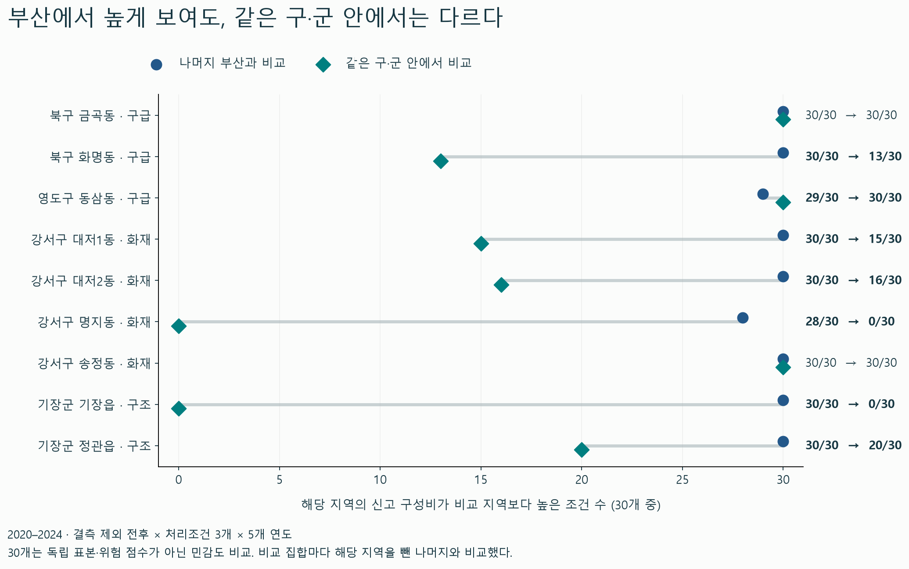
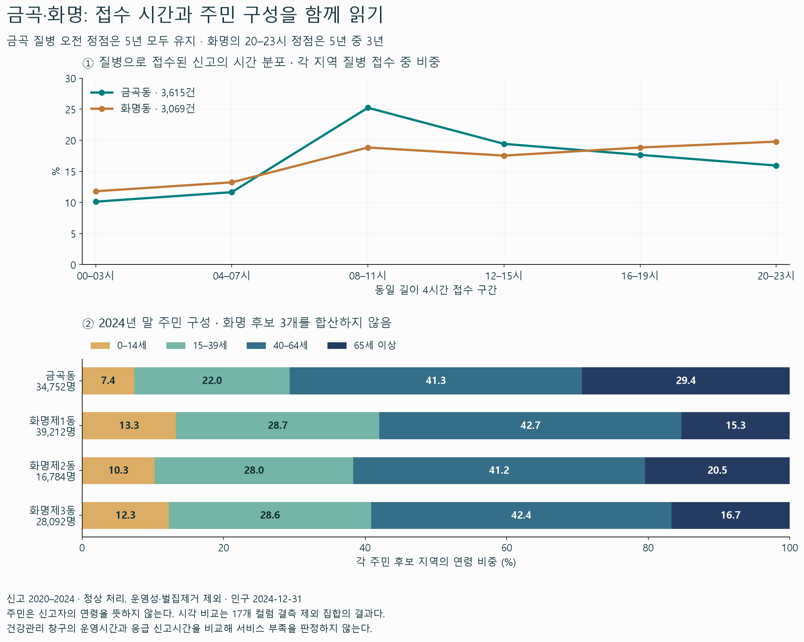
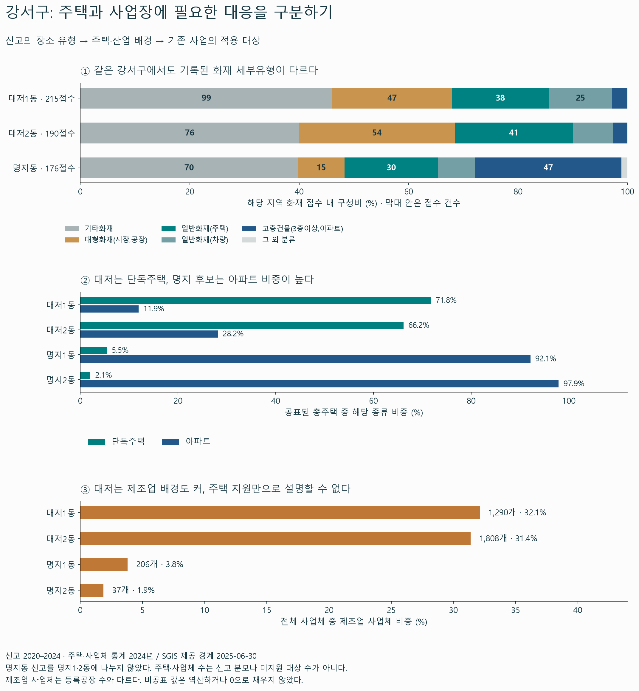

# 부산 119: 신고 특성에서 주민·현장 배경과 기존 대응으로 연결한 심화 결과

작성일 2026-09-17. 신고기간 2020~2024년. [직전 16개 구·군 재분석](부산-119-신고특성과인구구성-재분석-20260917.md)을 출발점으로 한 **추가 분석**이다. 기존 지도·시각화와 직전 결과표는 보존했다. 직전 표는 구군 코드순으로, 위험 상위 순위가 아니다.

## 1. 프로젝트의 논리를 이렇게 연결한다

**반복되는 신고의 종류로 살펴볼 지역을 좁히고, 주민과 현장의 차이로 적용 대상을 구분한 뒤, 이미 있는 서비스의 조건과 실제 도달·조치 결과를 대조한다.**

주민이 고령이라는 이유로 해당 신고를 고령자의 사고로 바꾸는 방식은 사용하지 않는다. 주민 구성은 지역 안내·지원의 대상과 이용 조건을 검토하는 배경이다. 송정처럼 신고명보다 인구 후보 범위가 넓고 사업장 관련 분류가 큰 경우에는, 주민 구성으로 억지 설명하지 않고 현장 배경을 추가한다.

| 단계 | 이번에 실제로 확인한 것 | 다음 단계로 넘어가는 이유 |
|---|---|---|
| 부산 전체 | 정상·운영성·벌집제거 제외 P 555,786건, 모든 70개 종별×세부유형 유지 | 일부 유형을 먼저 빼고 중심 주제를 정하지 않기 위해 |
| 구·군 | 북구는 구급, 강서는 구조·화재 비중의 상대적 우세가 연도×포함조건에서도 유지 | 서로 다른 신고 특성별 검토 시작점을 정하기 위해 |
| 동명 | 금곡 구급은 구내 비교까지 유지; 화명은 비교 범위를 바꾸면 우세가 약화. 송정 화재는 구내 비교에서도 유지 | 구군 평균을 동의 특성으로 그대로 옮기지 않기 위해 |
| 주민·현장 | 금곡↔화명 주민 분포·접수 시간 차이; 대저↔명지 주택·산업 구성 차이 | 같은 종별에 같은 대상·서비스를 자동 연결하지 않기 위해 |
| 기존 대응 | 전 연령 주민센터, 조건부 방문관리, 등록형 안심콜; 주택·노후아파트·사업장 지원이 각각 존재 | 기존 사업을 중복 제안하거나 대상 범위를 잘못 이해하지 않기 위해 |
| 보완·평가 | 대상별 안내·등록갱신 연결, 주거·사업장별 기존 조치의 도달 점검이라는 시범 후보 | 실제 미연계·미조치를 확인한 뒤 시행하고, 완료·작동·이용으로 평가하기 위해 |

이 흐름의 문제제기는 **구·군의 큰 신고 건수나 주민 평균만으로는 동별 예방·지원의 대상을 정할 수 없다는 것**이다. 이번 자료로 정부가 일괄 대응만 해왔다거나 문제를 전혀 보지 못했다고 입증한 것은 아니다. 차별점은 검토 대상을 좁히는 검증과 기존 대응의 적용 조건을 함께 연결하는 방식에 있다.

## 2. 추가 분석의 범위와 기준

- 입력: 직전 검증과 해시가 같은 17개 컬럼 완전행 5개, 제외 전 core8 비교집합, MOIS 같은5년 101연령과 기존 동명 후보. 2018~2019 자료나 중복 원본은 넣지 않았다.
- P 분모: 704,689건 중 정상·운영성 제외 574,662건에서 벌집제거18,876건을 제외한 555,786건. 원본 행·열은 수정하지 않았다.
- 추가 비교: **결측 제외 전후 × 처리조건 A/B/C × 5년 = 30조건**. 직전 ‘전체기간 6조건’과 ‘P의 각 연도 5개’를 각각 확인한 것보다 세밀하다.
- 비교 공간: 매번 해당 지역을 빼고 부산 나머지 또는 같은 구군 나머지와 구성비를 비교했다. 전체16구군·194신고명 종별을 보존하고, 직전 선정9신고명은 세부유형·시간·주민 후보를 심화했다.
- 기준: 구성비가 비교 집합보다 엄격히 높은지를 기록했다. 30/30은 독립 표본 수·통계검정·위험 점수·정책 선정 문턱이 아니다. 9개 사례는 직전 결과 이후 선정한 탐색적 비교이며 결과에 맞춰 분모를 바꾸지 않았다.
- 분모 민감도: 금곡↔화명을 직접 비교할 때 지역 전체 신고와 구급 신고만의 분모를 모두 사용했다. 임의 가중치나 인구 대비 신고율은 만들지 않았다.
- 시각: 4시간·6시간 구간, 각 연도의 정점, 낮08~19시/밤20~07시, 실제 달력일수당 주말·평일을 계산했다. 접수 시각이며 사고 발생 시각·개별 반복 이용은 아니다.

## 3. ‘숲에서 나무’로 좁히자 달라진 선정 해석

| 지역 | 종별 | P 접수/지역 전체 | 비중 | 부산 나머지 대비 높은 조건 | 같은 구·군 나머지 대비 높은 조건 | 이번 역할 |
|---|---|---:|---:|---:|---:|---|
| 북구 금곡동 | 구급 | 8,425/9,293 | 90.66% | 30/30 | 30/30 | 구급 중심의 주 심화 사례 |
| 북구 화명동 | 구급 | 7,536/8,548 | 88.16% | 30/30 | 13/30 | 금곡과 비교할 지역; 구내 최우선으로 확정하지 않음 |
| 영도구 동삼동 | 구급 | 7,652/8,625 | 88.72% | 29/30 | 30/30 | 같은 구내 구급 비교를 확장할 사례 |
| 강서구 송정동 | 화재 | 161/1,657 | 9.72% | 30/30 | 30/30 | 화재 중심 현장 검토 사례; 주민 범위 미확정 |
| 강서구 대저1동 | 화재 | 215/2,963 | 7.26% | 30/30 | 15/30 | 주택·제조업이 함께 있는 배경 비교 |
| 강서구 대저2동 | 화재 | 190/2,613 | 7.27% | 30/30 | 16/30 | 주택·제조업이 함께 있는 배경 비교 |
| 강서구 명지동 | 화재 | 176/7,326 | 2.40% | 28/30 | 0/30 | 아파트·주민구성 대비; 화재 우선지역으로 확정하지 않음 |
| 기장군 기장읍 | 구조 | 1,296/14,273 | 9.08% | 30/30 | 0/30 | 군 전체 구조 특성을 그대로 옮기지 않는 반대 사례 |
| 기장군 정관읍 | 구조 | 626/5,652 | 11.08% | 30/30 | 20/30 | 구조의 세부유형·조건 민감도 비교 |

**금곡은 주 심화 사례, 화명은 비교 지역으로 유지한다.** 두 곳의 구급 비중은 부산 나머지보다 모두30/30에서 높지만 북구 내부에서는 화명이13/30으로 약화된다. 주 분석 P에서는 금곡 구급90.66%에 비해 나머지 북구87.36%로 차이가 있다. 화명88.16%는 나머지 북구88.09%와 가깝다. 30조건 유지 횟수뿐 아니라 실제 차이의 크기도 함께 읽어야 한다.

**강서는 송정의 화재 분류를 현장 검토 대상으로 유지하고, 대저·명지는 배경 대비의 역할을 분명히 한다.** 대저1·2의 구내 민감도15/30·16/30은 현재 P의 비중7.26%·7.27%가 틀렸다는 뜻이 아니라 결측 제외 전후에 우세 판단이 달라진다는 뜻이다. 명지를 ‘부산 평균보다 높으므로 강서 최우선’이라고 부를 수 없다.

영도 구급의 구군 단계는 부산 비교28/30이고, 동삼 구급은 부산29/30·영도 내부30/30이다. 비교 집합이 달라졌음을 명시해야 두 결과를 모순으로 오해하지 않는다. 기장읍 구조는 부산30/30이지만 기장군 내부0/30으로, 군 전체의 구조 특성을 군내 모든 읍면에 그대로 적용할 수 없다는 반례다.



## 4. 북구 금곡↔화명: 신고 구성·시간·주민을 함께 연결

| 비교 지표 | 금곡동 명칭 신고 | 화명동 명칭 신고 | 검증 결과 |
|---|---:|---:|---|
| P 구급/지역 전체 | 8,425/9,293=90.66% | 7,536/8,548=88.16% | 금곡의 구내 우세30/30, 화명13/30 |
| 질병/지역 전체 | 3,615/9,293=38.90% | 3,069/8,548=35.90% | 금곡이 높은 직접 비교30/30; +3.00%p |
| 질병/구급만 | 3,615/8,425=42.91% | 3,069/7,536=40.72% | 금곡이 높은 직접 비교28/30; +2.18%p |
| 낮08~19시 질병 접수 | 2,252건·62.30% | 1,694건·55.20% | 각 지역 질병 접수가 분모 |
| 밤20~07시 질병 접수 | 1,363건·37.70% | 1,375건·44.80% | 밤의 비중 차이를 환자 연령·야간 공백으로 해석하지 않음 |
| 4시간 정점 | 08~11시 | 20~23시 | 금곡5/5년, 화명3/5년 |
| 6시간 정점 | 06~11시 | 18~23시 | 금곡5/5년, 화명4/5년 |

두 분모의 결과를 함께 보면, 금곡의 질병 비중 차이는 구급 자체가 차지하는 비중과 구급 내부 구성 모두와 관련된다. 전체 신고 대비 비중만으로 특정 질환이 더 심각하다고 말하지 않는다.

시간 정점은 전체기간의 처리조건 A/B/C를 바꾸어도 금곡 오전·화명 저녁으로 유지됐다. 하지만 이 검사는 **17개 컬럼 결측 제외 집합 내부**다. 제외 전 시간 분포의 안정성까지 검증한 것으로 확대하지 않는다. 화명의 저녁 정점은 모든 연도에서 같은 것은 아니며, 차이를 ‘항상 야간 집중’으로 바꾸지 않는다.

2024년 말 금곡 주민 후보는34,752명, 0~14세7.36%, 15~39세21.98%, 40~64세41.28%, 65세 이상29.38%다. 화명제1·2·3동 후보의 65세 이상 비중은 각각15.30%·20.46%·16.74%이며, 세 후보의 인구를 합산해 하나의 화명 인구로 만들지 않았다. 전체101연령의 인원·비중과 같은연도 연결은 CSV에 보존했다.



### 기존 대응과 연결했을 때 확인한 의미

[북구 마을건강센터](https://www.bsbukgu.go.kr/health/index.bsbukgu?menuCd=DOM_000000503001006000)는 현재 금곡·화명2·화명3에도 있고, 지역주민 누구나 이용하며 평일09~18시(점심 제외) 운영이다. [방문건강관리](https://www.bsbukgu.go.kr/health/index.bsbukgu?menuCd=DOM_000000506002002000)는 건강관리 접근이 어렵고 관리가 필요한 주민을 대상으로 하며 65세 이상 등은 우선순위다. ‘65세 이상만 대상’이라는 해석은 맞지 않는다.

[119안심콜 공식 안내](https://www.korea.kr/news/policyNewsView.do?newsId=148935029)는 본인·대리등록, 등록 전화번호 사용, 정보 변경 시 갱신을 설명한다. 일반·유선전화 등록도 안내되므로 이동전화만 남은 현재 신고집합과 서비스 이용대상을 같게 볼 수 없다.

따라서 이 비교는 **전 연령 일반 안내, 조건에 맞는 방문관리 연결, 안심콜 등록·정보갱신 지원을 구분할 근거**가 된다. 야간 질병 접수를 건강센터의 무대응으로 해석하거나 바로 야간 운영연장을 제안하지 않는다. 건강관리와 긴급 대응의 목적이 다르기 때문이다. 실제 안내 오류·자격을 갖춘 미연계·등록 또는 갱신 어려움은 아직 동별로 확인되지 않았다.

## 5. 강서: 주민 구성만으로 설명할 수 없는 주택·사업장 차이

추가 자료는 질문에 맞춰 선택했다. 주거형태와 산업배경이 기존 대응의 적용 대상 차이를 설명하는지 확인하기 위해 **보유한 SGIS 주택·산업별 사업체·종사자 원자료**를 집계했다. 상권 업소목록을 제조업 공장 수로 대신 쓰지 않았다.

| SGIS 지역 | 총주택 | 단독주택 | 아파트 | 전체 사업체 | 제조업 사업체 | 제조업 종사자 |
|---|---:|---:|---:|---:|---:|---:|
| 대저1동 | 1,728 | 1,240 (71.8%) | 206 (11.9%) | 4,016 | 1,290 (32.1%) | 4,302 |
| 대저2동 | 1,694 | 1,121 (66.2%) | 477 (28.2%) | 5,759 | 1,808 (31.4%) | 7,311 |
| 명지1동 | 17,343 | 947 (5.5%) | 15,977 (92.1%) | 5,434 | 206 (3.8%) | 882 |
| 명지2동 | 9,079 | 187 (2.1%) | 8,889 (97.9%) | 1,994 | 37 (1.9%) | 85 |

출처: [SGIS 행정구역 통계 및 경계](https://www.data.go.kr/data/15129688/fileData.do). **2024년 통계, 2025-06-30 제공 경계**의 지역 자체 배경이다. 신고는2020~2024 원문 명칭이며 이 표의 경계로 강제 재배정하지 않았다. 단독·아파트 외 주택도 원자료에서 유지하고 비공표 값을0으로 채우거나 잔차로 역산하지 않았다. 사업체 수와 종사자 수는 주민 수·생활인구·사고 분모가 아니다.

대저1·2동은 2024년말 주민65세 이상 비중42.39%·30.55%와 단독주택 비중71.8%·66.2%가 함께 보인다. 동시에 제조업 사업체 비중도32.1%·31.4%다. 따라서 대저를 고령 주거지로만 설명하면 산업 배경을 빠뜨린다. 명지1·2동은 아파트 비중92.1%·97.9%여서 다른 관리·지원 조건을 대조할 배경이 된다.

실제 신고 분류에서도 대저1은 화재215건 중 ‘대형화재(시장,공장)’47건·‘일반화재(주택)’38건, 대저2는190건 중 각각54건·41건이다. 명지동 화재176건 중 ‘고층건물(3층이상,아파트)’는47건이다. ‘기타화재’가 대저1·2·명지에서 각각99·76·70건으로 큰 비중인 점도 유지했다. 유형명은 접수 분류이며 실제 피해 규모나 발화 원인을 뜻하지 않는다.



### 송정은 현장 검토로, 인구 범위는 분리

강서 송정동 명칭의 화재는161/1,657접수=9.72%이고 나머지 강서4.89%보다 높다. 같은구 비교30/30에서 유지된다. 원문 분류 ‘대형화재(시장,공장)’90건은 화재 중55.90%이며 해당 세부유형의 지역 전체 대비 비중도 구내30/30에서 높았다.

이 결과를 실제 대형 화재90사건이나 송정 주민의 피해로 바꾸지 않는다. 송정의 인구 후보 녹산동은 더 넓은 행정동이고, SGIS2025 녹산은 신호동 분리 범위까지 있어 MOIS2024와도 직접 결합할 수 없다. 녹산 제조업4,055개를 송정 공장4,055개로 표시하지 않는다. 송정은 해당 법정동 주소의 사업장·점검 명부로 현장 배경을 좁혀야 하는 사례다.

### 기존 대응을 확인한 뒤 수정한 보완 범위

[부산 화재안전취약자 지원센터](https://119.busan.go.kr/supportcenter01)의 대상에는 조건에 맞는 노후아파트도 포함된다. 주택용 소방시설 설치 안내의 아파트 제외와 별도 취약자 지원의 범위를 혼동하면 안 된다. 건축허가 시기·스프링클러·주민 자격·심사 조건을 실제 대상별로 확인해야 한다.

사업장에도 [2026년 강서 산업단지 안전관리 간담회](https://119.busan.go.kr/gangseo/119gsaler02/1723908), [외국인근로자 사업장 교육·기숙사 점검](https://119.busan.go.kr/gangseo/119gsaler02/1729988)이 이미 확인된다. 따라서 ‘공장 예방사업이 없으니 새 교육을 만들자’는 주장은 성립하지 않는다. 산업단지 명칭 ‘명지’와 주민 행정동 명지를 같은 공간으로 다루지도 않는다.

이 축의 보완 후보는 **주택·아파트·사업장을 나누어 기존 지원·점검·조치 기록과 현재 상태가 맞는지 확인하고, 확인된 누락 대상만 연결하는 것**이다. 총주택 수를 미설치가구 수로, 제조업 수를 미점검 공장 수로 바꿔 계산하지 않는다.

## 6. 지금 확인한 공백과 아직 입증하지 못한 공백

| 구분 | 이번에 확인한 내용 | 주장 가능한 범위 |
|---|---|---|
| 분석의 공백 | 부산 평균 대비 높다는 이유로 구내 우선지역을 결정하면 화명·대저·기장읍의 해석이 달라짐 | 비교 공간·분모를 추가 검증하여 선정 근거를 구체화했다 |
| 해석의 공백 | 같은 구급 특성에 서로 다른 주민·시간 배경이 있음; 같은 구 안에 주택·산업 배경이 함께 있음 | 같은 종류의 예방·지원 대상을 일괄 지정할 수 없다 |
| 대응 연결의 공백 | 연령·주택형태만으로 서비스 자격을 판단하면 방문관리·노후아파트 지원을 잘못 분류할 수 있음 | 이번 결과표에 기존 서비스의 대상·조건을 연결했다 |
| 실제 미충족 | 동별 적격 모수·미등록/미갱신·이용완료·미설치·미조치 명부 미확보 | 해당 지역에 실제 서비스 부족이 얼마나 남았는지는 아직 확정할 수 없다 |
| 정책 효과 | 아직 시범 시행·비교평가를 하지 않음 | 신고 감소·피해 감소·대응시간 단축을 효과로 보고할 수 없다 |

즉, 이번에 메운 것은 **우리 분석에서 지역특성을 기존 대응의 적용 대상으로 연결하지 못했던 부분**이다. 정부가 기록을 보유하지 않거나 모든 기관에서 연계를 못하고 있다는 증거는 아니다. 자료 안내에 이용 실적이 없다는 사실과 실제 미조치를 구분한다.

## 7. 보완 후보를 평가 가능한 형태로 정리

| 구분 | 북구 금곡·화명 비교 | 강서 주거·사업장 비교 |
|---|---|---|
| 확인한 출발점 | 구급·질병 구성과 접수 시간, 주민 분포 차이 | 화재 세부유형, 주민·주택·제조업 배경 차이 |
| 후보 | 기존 주민창구에서 일반 안내·조건부 서비스 연결·안심콜 등록갱신 지원을 나누는 시범 | 주택·아파트·사업장별 기존 설치·점검·조치 기록을 대조하고 확인된 누락만 연계 |
| 시행 전 조건 | 동의한 주민의 자격·기존 이용·안내 오류·등록 또는 갱신 장애 확인 | 현재 주소·용도·지원 자격·기존 수혜/점검·실제 작동과 지적사항 상태 확인 |
| 직접 측정 | 적합한 경로 선택률; 등록·갱신 완료/동의한 적격 참여자; 이용완료/연계 수락자 | 작동확인 장비/직접 점검 장비; 지원완료/확인된 적격 미지원; 조치완료/확인된 지적사항 |
| 비교 설계 | 같은 자격·기간의 기존 안내와 보완 안내를 비교, 실제 참여·중도이탈 기록 | 같은 점검기준·대상물 종류에서 기존 방식과 보완 연결의 완료·재확인 결과 비교 |
| 수정·중단 | 실제 미연계가 없거나 잘못된 연결·중복부담이 늘면 확대하지 않고 수정 | 기존 조치가 충족됐거나 중복 지원만 증가하면 추가 물량을 제안하지 않음 |
| 현재 약속하지 않는 것 | 구급신고 감소율·환자 예후 향상 | 화재·사망·피해 감소율 |

정량 성공 문턱·관측기간·필요 표본 수는 현장 기초분포와 운영 조건을 확보한 다음 시범 전에 정해야 한다. 아직 시행하지 않았으므로 위 표는 결과값이 아니라 실행·평가 설계다.

[2025년 명지동 주택의 감지기 경보 후 어린이2명이 대피한 공식 사례](https://119.busan.go.kr/gangseo/119gsaler02/1680388)는 ‘장비 작동→위험 인지→대피’라는 경로를 보여준다. 단일 사례를 부산의 예상 피해 감소율이나 전체 사업 효과로 일반화하지 않는다.

## 8. 검증·재현·산출물

이번 추가 집계는 작성과 독립 검증을 분리했다. 비교셀146,448개·시간셀142,213개·SGIS9,456셀을 원집계/전처리본/원ZIP에서 대조했고 기본510개 검사그룹 실패0이었다. 별도66개 검사그룹에서 직접비교648셀·18요약, 정점반복411행, 시간처리조건6,281행과 공식10개 출처의 해시·핵심문구를 확인했다. 통계적 비밀보호/비수치376셀은 그대로 유지했다. 이 수치는 검사 규모이며 표본 수·통계적 신뢰도 점수가 아니다.

재현(프로젝트 루트):

```powershell
$env:PYTHONUTF8='1'
.venv-check/Scripts/python.exe analysis/00_공통/analyze_profile_depth_20260917.py
.venv-check/Scripts/python.exe analysis/00_공통/analyze_profile_context_20260917.py
.venv-check/Scripts/python.exe data/processed/신고주민연결심화-20260917/services/build_evidence.py
.venv-check/Scripts/python.exe scripts/plot_profile_depth_20260917.py
.venv-check/Scripts/python.exe scripts/write_profile_depth_report_20260917.py
```

분석·표는 pandas, SGIS읽기는 pyshp/openpyxl/lxml, 그림은 matplotlib를 사용했다. 실제 버전·해시와 입력→집계의 대응은 각 `manifest.json`에 보존한다. 공식 자료를 네트워크에서 새로 받으면 본문·조회수·파일 버전이 바뀔 수 있어 동일 해시 재현과 신규 수집을 구분한다.

| 산출물 | 경로 |
|---|---|
| 30조건·구내/부산 비교, 시간·주민 | [analysis 폴더](../../data/processed/신고주민연결심화-20260917/analysis/) |
| 주택·산업 전체 부산 집계 | [context 폴더](../../data/processed/신고주민연결심화-20260917/context/) |
| 공식 대응·출처·스냅샷·평가표 | [서비스 조사](../../data/processed/신고주민연결심화-20260917/services/evidence.md) |
| 독립 검증 | [verification 폴더](../../data/processed/신고주민연결심화-20260917/verification/) |
| 시각화3종, PNG·SVG 각3개 | [figures 폴더](../../figures/신고주민연결심화-20260917/) |

기존 지도와 시각화 값은 변경하지 않았다. 이번 추가 그림은 비교 범위→신고·주민→주택·산업 순서로 읽으며, 향후 지도 상세의 ‘왜 이 지역을 검토하는가’와 ‘어떤 기존 대응에 연결되는가’를 채울 분석 근거다.
