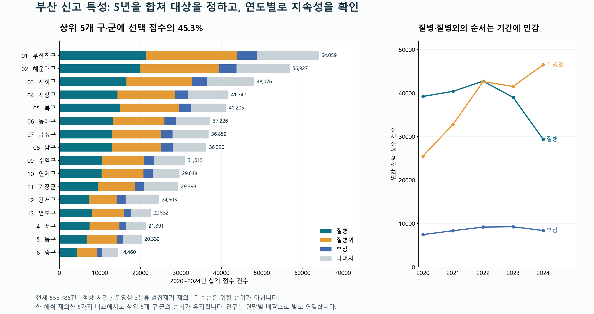
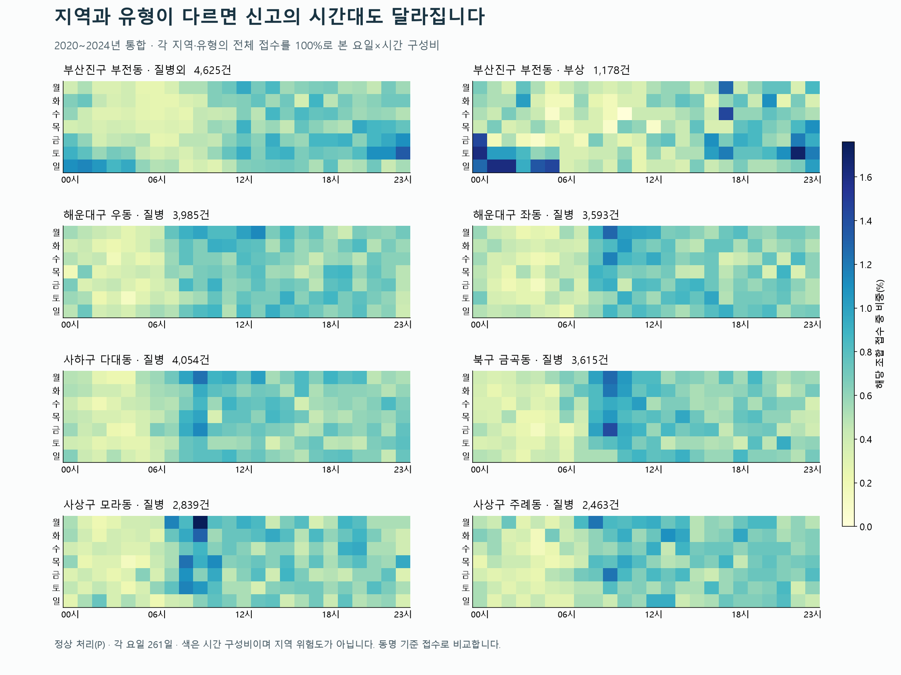
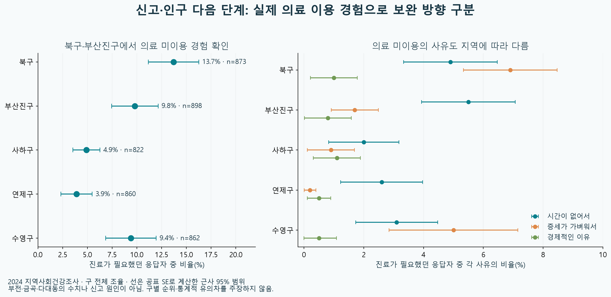
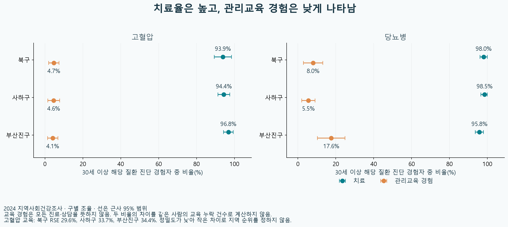
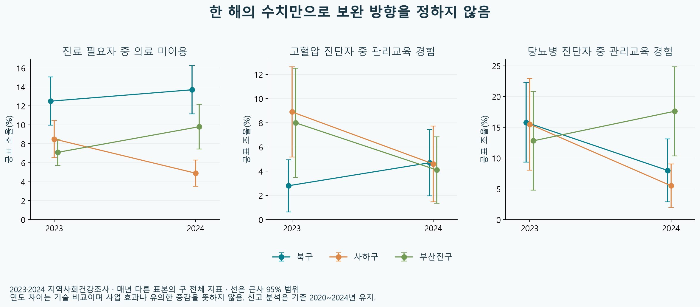

# 부산 동별 119 신고 특성에 따른 맞춤형 예방안 제안 — 최신 작업 통합 정리

**기준일: 2026-09-18 · 신고기간: 2020~2024 통합 · 현재 채택한 내용만 수록**

설명·제안의 근거를 중심으로 현재 결과, 데이터, 방법, 시각화, 코드, 검증, 미완료 범위를 한 문서에 연결한다.

- [1. 현재 프로젝트의 목적과 확정 범위](#s1)
- [2. 사용 데이터·기간·공간 단위](#s2)
- [3. 17개 컬럼과 전처리의 확정 기준](#s3)
- [4. 결측 제외 영향과 분석 가능한 범위](#s4)
- [5. 동 대응과 주민 연결의 상태](#s5)
- [6. 5년 통합 결과와 전체16구·군의 순서](#s6)
- [7. 같은 신고 유형을 따라 동으로 좁힌 핵심 결과](#s7)
- [8. 월·요일·시간과 반복성](#s8)
- [9. 주민 전체 연령 구성과 해석](#s9)
- [10. 상권·생활인구를 실제로 사용한 부분](#s10)
- [11. 보건 이용·교육 경험으로 더한 독립 근거](#s11)
- [12. 지역별 기존 서비스와 실제 확인 내용](#s12)
- [13. 현재 채택한 보완 후보와 평가 설계](#s13)
- [14. 다른 신고 특성에 사용하는 보조 비교](#s14)
- [15. 확인한 필요·남은 공백·효과의 범위](#s15)
- [16. 현재 웹의 위치와 최신 분석 반영 상태](#s16)
- [17. 지금 사용하는 시각화와 설명 순서](#s17)
- [18. 검증 결과와 이번 정리의 검증 범위](#s18)
- [19. 재현 코드와 실행 순서](#s19)
- [20. 현재 사용하는 전체 집계표와 자료 연결](#s20)
- [21. 전체70개 신고 유형의 통합 결과](#s21)
- [22. 상위5구45개 지역·유형 조합의 상세 결과](#s22)
- [23. 출처·입력 명세와 현재 문서의 검증](#s23)

---

<a id="s1"></a>

## 1. 현재 프로젝트의 목적과 확정 범위

**주제: 부산 동별 119 신고 특성에 따른 맞춤형 예방안 제안.**

이 문서는 2026년9월18일 현재 실제 채택한 결과만 묶은 통합본이다. 최종 설명의 중심은 **2020~2024년 통합 신고 → 구·군의 큰 유형 → 같은 유형이 두드러지는 동 → 주민·필요한 지역 배경 → 기존 대응 → 보완 후보와 평가**다. 2025년 신고는 제외한다. 과거의 교통 중심 사례, 사용하지 않는 제안, 구버전 페이지·시각화 목록을 본문이나 부록에 모아 넣지 않았다.

분석을 시작한 이유는 접수 건수만으로는 어느 지역에서 무엇을 예방하고 어떤 서비스를 연결할지 정할 수 없기 때문이다. 같은 구 안에서도 유형 구성·접수 시간·주민 구성·활동 배경이 다르고, 이미 운영 중인 대응도 있다. 따라서 **규모를 먼저 비교하고, 동일 유형의 동으로 좁힌 뒤, 실제 이용·운영 자료로 제안의 근거를 확인**한다.

이번 결과의 차별점은 정부가 몰랐던 문제를 발견했다는 주장이 아니라, 신고·주민·별도 조사·기존 서비스의 서로 다른 단위를 구분하면서 지역 선정과 제안의 이유를 추적할 수 있게 만든 데 있다. 건강조사나 기존 사업 자체는 정부가 이미 운영하는 자료·서비스다.

| 항목 | 현재 확정 내용 |
|---|---|
| 분석기간 | 2020-01-01~2024-12-31, 5년 통합. 연도는 반복성과 민감도 검증에 보존 |
| 기본 입력 | 선택17개 컬럼에 결측이 없는704,689접수 |
| 지역 특성의 주 분모 | 정상 처리·운영성3분류·벌집제거 제외555,786접수 |
| 비교 범위 | 16구군·194접수 동명·70개 종별×세부유형 |
| 화면/표의 기본 순서 | 같은 조건의5년 접수 건수 내림차순. 코드순·피해 위험도순과 구분 |
| 주요5구 | 부산진구·해운대구·사하구·사상구·북구 |
| 심화 범위 | 주요5구의 주요3유형×유형별 구내 상위3동명, 총45조합 |
| 현재 보완 후보 | 다대·금곡의 기존 상담→교육 예약·참여·완료 연결 시범, 시행 전 실제 누락 확인 조건 |
| 효과 상태 | 기대 경로와 평가 기준은 구체화했으나 시범 시행·건강/신고 감소 효과는 측정 전 |

날짜가 오래된 검증본이라도 현재 전처리·동 대응·상권 계산에 실제 재사용하는 근거는 유지한다. 반대로 파일명에 ‘최종’이 있어도 현재 결론에 사용하지 않는 산출물은 이 문서의 전달 목록에 넣지 않는다. 파일 자체를 일괄 삭제한 것은 아니다.


<a id="s2"></a>

## 2. 사용 데이터·기간·공간 단위

| 자료 | 실제 파일 | 현재 용도 |
| --- | --- | --- |
| 119접수 | [data/raw/119접수/신고접수_2020/신고접수_2020.csv](<../../data/raw/119접수/신고접수_2020/신고접수_2020.csv>) | 2020~2024 원본; 기존 전처리 근거 |
| 119접수 | [data/raw/119접수/신고접수_2021/신고접수_2021.csv](<../../data/raw/119접수/신고접수_2021/신고접수_2021.csv>) | 2020~2024 원본; 기존 전처리 근거 |
| 119접수 | [data/raw/119접수/신고접수_2022/신고접수_2022.csv](<../../data/raw/119접수/신고접수_2022/신고접수_2022.csv>) | 2020~2024 원본; 기존 전처리 근거 |
| 119접수 | [data/raw/119접수/신고접수_2023/신고접수_2023.csv](<../../data/raw/119접수/신고접수_2023/신고접수_2023.csv>) | 2020~2024 원본; 기존 전처리 근거 |
| 119접수 | [data/raw/119접수/부산소방재난본부_119신고접수 현황_2024_부산/부산소방재난본부_119신고접수 현황_2024_부산.csv](<../../data/raw/119접수/부산소방재난본부_119신고접수 현황_2024_부산/부산소방재난본부_119신고접수 현황_2024_부산.csv>) | 2020~2024 원본; 기존 전처리 근거 |
| 연말 주민 | [MOIS_202012_연령별인구_부산전체읍면동.csv](<../../data/raw/인구배경/MOIS_202012_연령별인구_부산전체읍면동.csv>) | 각 연말205읍면동; 시·구 합계는 검산 |
| 연말 주민 | [MOIS_202112_연령별인구_부산전체읍면동.csv](<../../data/raw/인구배경/MOIS_202112_연령별인구_부산전체읍면동.csv>) | 각 연말205읍면동; 시·구 합계는 검산 |
| 연말 주민 | [MOIS_202212_연령별인구_부산전체읍면동.csv](<../../data/raw/인구배경/MOIS_202212_연령별인구_부산전체읍면동.csv>) | 각 연말205읍면동; 시·구 합계는 검산 |
| 연말 주민 | [MOIS_202312_연령별인구_부산전체읍면동.csv](<../../data/raw/인구배경/MOIS_202312_연령별인구_부산전체읍면동.csv>) | 각 연말205읍면동; 시·구 합계는 검산 |
| 연말 주민 | [MOIS_202412_연령별인구_부산전체읍면동.csv](<../../data/raw/인구배경/MOIS_202412_연령별인구_부산전체읍면동.csv>) | 각 연말205읍면동; 시·구 합계는 검산 |

신고 CSV는 연도별 하위 폴더 안에 있다. `data/raw/119접수/` 최상위에 CSV가 없다는 이유로 원본이 없다고 판단하지 않는다. 인구 각 파일은 부산시 합계1행·구군 합계16행·읍면동205행이다. 실제 동 비교에는 읍면동 행만 사용하고 시·구 합계를 중복 합산하지 않는다.

| 보조자료 | 현재 채택 범위와 사용 목적 | 합치지 않는 범위 |
|---|---|---|
| 공식 행정동·법정동 관계 | 해당 연도 코드·명칭·유효시점으로 주민 후보 연결 | 후보코드 일치를 실제 신고 위치 확정으로 전환하지 않음 |
| 상권 | 2020~2024의20분기. 주요 구급 유형12접수 동명의 음식·소매 등 업종 구성과 분기 범위 | 업소 수를 방문객 수·위험률 분모·실제 개폐업으로 쓰지 않음 |
| 생활인구 | 2023~2024의 후보 행정동별24개월, 방문·거주·직장 시간 배경 | 2025를 현재 분석에 넣지 않음. 시간×연령의 미제공 교차표를 추정하지 않음 |
| 주택·산업 | SGIS2024 통계·2025-06-30 제공 경계. 대저·명지·송정 및 건물 관련 유형의 보조 비교 | 과거 신고를 현재 경계로 배정하거나 주택을 승강기 수로 바꾸지 않음 |
| 지역사회건강조사 | 2024 5구×32지표, 공표 그룹6,980행·전체160행. 같은5지표는3구의2023~24 30행 | 구 단위 성인 응답을 특정 동·신고자에게 전가하지 않음 |
| 공식 시설·서비스 | 다대·금곡·모라·주례·우/좌 관련 기존 센터, 질환관리·교육·방문 활동의 대상·시간·조건 | 현행 안내를2020~2024 전체기간에 동일하게 소급하지 않음 |

신고와 주민의 같은 연도 연결도 관측시점이 완전히 같은 것은 아니다. 연말 주민은 연평균·생활인구·개별 환자 분모가 아니다. 2025~2026 서비스 안내는 기존 대응의 현재 내용을 비교하는 자료로만 쓰며2025년 신고를 편입한 것이 아니다.


<a id="s3"></a>

## 3. 17개 컬럼과 전처리의 확정 기준

| 컬럼 | 의미 | 사용 목적 |
|---|---|---|
| DCLR_RCPT_NO | 신고접수번호 | 접수행 식별·중복 점검. 실제 사건 고유번호라는 뜻은 아님 |
| DCLR_DT | 신고일시 | 연도·월·계절·요일·시간 비교 |
| CLMTY_CTPV_NM | 재난시도명 | 부산 명시 여부 확인 |
| CLMTY_SGG_NM | 재난시군구명 | 구군 구분, 같은 동명 구별 |
| CLMTY_EMD_NM | 재난읍면동명 | 원문 동별 집계·공식 동 대응 검증 |
| EMRG_RSCU_ASSRT_NM | 긴급구조종별명 | 구급·구조·화재 등 종별 구성 |
| EMRG_RSCU_CLSF_NM | 긴급구조분류명 | 세부 유형 비교 |
| PRCS_RSLT_SE_NM | 처리결과구분명 | 전체·정상 등 포함 조건 비교 |
| RCPT_PATH_NM | 접수경로명 | 접수 방식별 분포와 결측 제외 후 표본 구성 확인 |
| ACDNT_OCRN_LOT | 사고발생경도 | 설명서 상세 정의는 환자발생 위치 경도. 숫자·범위·다른 좌표쌍과 비교 |
| ACDNT_OCRN_LAT | 사고발생위도 | 위 경도와 한 쌍으로 위치 기록 검토 |
| DAMG_RGN_LOT | 손상지역경도 | 손상 발생 지역 경도 기록 검토. 사고발생 좌표를 자동 대체하지 않음 |
| DAMG_RGN_LAT | 손상지역위도 | 위 경도와 한 쌍으로 위치 기록 검토 |
| GRNDS_CTPV_NM | 현장시도명 | 재난시도명과 일치·불일치 확인 |
| GRNDS_SGG_NM | 현장시군구명 | 재난구군명과 일치·불일치 확인 |
| CMPTNC_FRSTN_NM | 관할소방서명 | 기록된 관할 소방서 분포와 기존 대응 확인의 단서 |
| PLCSCN_CNTR_NM | 관할서센터명 | 기록된 센터 분포와 기존 대응 확인의 단서 |

소방본부 설명서 `column_info!B3:F40`의38개 정의를 대조해17개를 채택했다. 나머지21개는 시간 중복표현10개·접수종료3개·도시농촌/규모2개·여부6개다. 시간은 검증한 신고일시에서 파생하며 접수종료를 현장 도착시간으로 쓰지 않는다. 일부 여부 항목과 전부 비어 있는 중앙구조대 요청 항목을 포함하면 연도별 분석이 불가능해져 현재 질문에 필요한17개로 확정했다.

- 17개 중 하나라도 비어 있으면 **그 행을 제외**한다. 컬럼을 지우거나 결측을 채우지 않는다.
- 공란·빈 문자열은 결측으로 처리한다. `N`·정상적인0값은 의미가 확인된 값이며 자동 결측이 아니다.
- 접수번호는 접수행 점검에 쓴다. 동일 위치·시각이라는 이유만으로 중복 제거하지 않는다.
- 부산 명시 여부와 지역 미기재는 분리한다. 미기재를 부산 밖으로 확정하지 않는다.
- 두 좌표쌍은 의미가 다르므로 빈칸이 적은 쪽으로 임의 대체하지 않는다. 좌표계·위치 정확성 검증 없이 행정동에 배정하지 않는다.
- 파생 월·요일·시간은 접수시점 기준이다. 시간 문자열의 양끝 공백을 제거하고 형식을 검증했다.
- 원본·전처리·제외/미연결 기록은 분리 보존한다. 공개 결과에는 개별 접수번호·정밀 신고 위치를 넣지 않는다.

| 집합 | 포함조건 | 5년 건수 |
|---|---|---:|
| 비교집합 | 부산 명시·기존8개 값 기재, 선택 영향 진단에만 사용 | 1,334,514 |
| A | 현재17개 값 모두 기재 | 704,689 |
| B | A 중 정상 처리 | 579,412 |
| C | B 중 업무운행·훈련출동·구급차소독 제외 | 574,662 |
| P | C 중 벌집제거18,876건 제외, 현재 지역 특성의 주 분모 | 555,786 |

비교집합과 P를 합치지 않는다. P의 구성비는 항상 P 안의 해당 지역·유형 분모를 명시한다. 벌집제거는 전처리 검산에만 남기며 심층 검토와 제안에는 사용하지 않는다.


<a id="s4"></a>

## 4. 결측 제외 영향과 분석 가능한 범위

17개 완전 기재 자료는 기존8개 비교집합의52.81%다. 추가 제외629,825행은 무작위로 빠진 것으로 검증되지 않았다. 남은 규모가 크다는 이유만으로 부산 전체를 대표한다고 보지 않는다.

| 접수경로·전체처리5년 | 비교집합 | 현재17개 집합 | 의미 |
|---|---:|---:|---|
| 일반전화 | 141,540 | 0 | 좌표 결측과 현장구군 결측이 겹쳐 제외 |
| IP전화 | 16,676 | 0 | 사고발생 좌표 결측 |
| 공중전화 | 568 | 0 | 사고발생 좌표 결측 |
| 이동전화 | 973,466 | 704,396 | 같은 이동전화 안에서도 잔존율 차이 존재 |

이동전화 잔존율은 정관읍41.53%, 기장읍94.40%, 금곡동91.37%로 달랐다. 동 이름이 사라지지 않았다는 사실은 유형 구성·건수 비교가 그대로 보존됐다는 뜻이 아니다. 일반전화가 빠진 이유를 직접 방문 신고 여부나 전화기 자체의 위치확인 불가능으로 단정하지 않는다.

현재 사용하는 검증은 **결측 전후 비교집합2개×처리조건3개×5년=30조건**이다. 각 지역을 뺀 나머지 부산 및 같은 구의 나머지 지역과 유형 구성비를 비교했다. 30/30은 비교조건 모두에서 같은 방향이라는 의미이며 독립 표본30개·유의확률·정책 효과가 아니다.

보고하는 결론은 네 범위로 구분한다: ①선택 신고 집합에서 직접 확인한 수치 ②제외 전후에도 유지되는 탐색적 구성 특징 ③조건·연도에 민감한 결과 ④전체 부산·개별 환자·확정 행정동으로 확대할 수 없는 결과. 5년 합계는 표본 선택의 문제를 해결하지 않는다. 동×유형×시간의 결측 제외 전 안정성까지 확인했다고 주장하지 않는다.


<a id="s5"></a>

## 5. 동 대응과 주민 연결의 상태

분석 단위는16개 구·군과194개 접수 동명이다. 주민 원자료는각 연말205개 행정동이며 두 수가 다른 이유는 원문 명칭과 행정동의 체계가 다르기 때문이다. 194개를205개 행정동에 그대로 배정하지 않는다.

공식 KIKcd_H(행정기관), KIKcd_B(법정동), KIKmix(관계)와 시점별 원본을 대조했다. 두 이름 가설의 후보를 함께 검토해 단일 후보·다중 후보·시점 불일치·미등록·위치 미확인을 구분한다. 주민 후보를 인구 비례로 나눠 신고를 배분하지 않는다.

- 2020~2024 연말 행정동 코드205개는 각 연도 MOIS 인구 코드와 일치했다.
- 연지동→부암제1동 관계는2020 원본과 후행 이력 복원에 차이가 있어 해당 시점 불확실성을 유지한다.
- 194동명×5년970조합 중 후보 없는9조합을 별도로 남겼다. 3조합은그해 P접수0건, 나머지6조합에는46접수가 있다.
- 2022 일광면은 후보가 있어도 그 후보코드의 연말 주민값이 없어 빈 상태를 유지한다.
- 부전·다대·우·좌·모라·주례 등의 복수 주민 후보는 개별로 표시한다. 미연결을 인구0명·신고0건으로 바꾸지 않는다.
- 지도용 현재 경계·대표점이 있어도 과거 신고의 위치 정확도가 높아지는 것은 아니다. 당시 경계·좌표의 검증이 필요한 행정동별 확정 배정은 완료로 표시하지 않는다.

전체101연령 인원·비중을 유지하고, 본문은 읽기 편하게0~14·15~39·40~64·65세 이상으로 묶는다. 인구 비교는 안내의 적합성과 서비스 이용조건을 검토하는 배경이며 신고자·환자의 나이 분포가 아니다.


<a id="s6"></a>

## 6. 5년 통합 결과와 전체16구·군의 순서

건수는5년의 같은 지역·유형을 합산하고 구성비는5년 분자합계/분모합계로 계산했다. 연도별 비중이나 순위를 평균하지 않는다. 한 해를 제외한4년 합계5개를 추가 비교해 특정 연도에 대한 의존성을 확인했다. 이는 미래 예측이나 신뢰구간 추정이 아니다.

질병 190,682건, 질병외 188,863건, 부상 42,522건으로 세 유형이 **422,067건(75.94%)**이다. 먼저 이 큰 유형을 깊게 보되 나머지 67유형은 전체 표에 보존한다. 이번 핵심 사례를 교통 등 다른 분류로 임의 변경하지 않는다.

| 5년 건수순 | 구·군 | 5년 신고 | 구 내부 주요 세부 유형 | 한 해씩 제외 |
| --- | --- | --- | --- | --- |
| 1 | 부산진구 | 64,059 | 질병외 22,421건 (35.0%)<br>질병 21,439건 (33.5%)<br>부상 4,894건 (7.6%) | 1위 유지 |
| 2 | 해운대구 | 56,927 | 질병 19,987건 (35.1%)<br>질병외 19,468건 (34.2%)<br>부상 4,270건 (7.5%) | 2위 유지 |
| 3 | 사하구 | 48,076 | 질병 16,544건 (34.4%)<br>질병외 16,277건 (33.9%)<br>부상 3,632건 (7.6%) | 3위 유지 |
| 4 | 사상구 | 41,747 | 질병 14,336건 (34.3%)<br>질병외 14,284건 (34.2%)<br>부상 3,102건 (7.4%) | 4위 유지 |
| 5 | 북구 | 41,205 | 질병 14,937건 (36.3%)<br>질병외 14,540건 (35.3%)<br>부상 3,056건 (7.4%) | 5위 유지 |

상위 5개 구·군의 합계는 **252,014건(45.34%)**이다. 2020·2021·2022·2023·2024 중 어느 한 해를 제외해도 1~5위 순서는 같다. 전체16구의 결과에서는 연제구·기장군이 2024년 제외시 10·11위를 바꾸며 나머지 순서는 유지된다.

다만 **질병과 질병외 중 무엇이 1위인지는 기간에 민감하다.** 부산 전체에서는 2020년 또는2021년을 제외하면 질병외가 질병보다 많아진다. 상위5구에서도 최다 유형이 바뀌므로 ‘이 구는 한 종류의 문제만 있다’고 요약하지 않는다. 주요3유형을 병렬로 비교한다. 질병외라는 분류를 특정 원인이나 임상 진단으로 바꾸지도 않는다.



| 건수순 | 구·군 | 5년 접수 | 전체 선택 접수 중 비중 | 한 해 제외시 건수순 범위 |
| --- | --- | --- | --- | --- |
| 1 | 부산진구 | 64,059 | 11.53% | 1~1위 |
| 2 | 해운대구 | 56,927 | 10.24% | 2~2위 |
| 3 | 사하구 | 48,076 | 8.65% | 3~3위 |
| 4 | 사상구 | 41,747 | 7.51% | 4~4위 |
| 5 | 북구 | 41,205 | 7.41% | 5~5위 |
| 6 | 동래구 | 37,226 | 6.70% | 6~6위 |
| 7 | 금정구 | 36,852 | 6.63% | 7~7위 |
| 8 | 남구 | 36,320 | 6.53% | 8~8위 |
| 9 | 수영구 | 31,015 | 5.58% | 9~9위 |
| 10 | 연제구 | 29,648 | 5.33% | 10~11위 |
| 11 | 기장군 | 29,393 | 5.29% | 10~11위 |
| 12 | 강서구 | 24,603 | 4.43% | 12~12위 |
| 13 | 영도구 | 22,532 | 4.05% | 13~13위 |
| 14 | 서구 | 21,391 | 3.85% | 14~14위 |
| 15 | 동구 | 20,332 | 3.66% | 15~15위 |
| 16 | 중구 | 14,460 | 2.60% | 16~16위 |

강서의 화재·구조, 중구의 부상 구성 등 기존 유형별 특징은70유형 표에 그대로 보존한다. 전체 접수 건수16위인 중구를 분석에서 제외한 것이 아니며 코드순 첫 행과 지표 순위를 혼동하지 않는다. 규모가 작더라도 별도의 피해·현장 근거가 있으면 그 유형의 분기로 다룬다.

이번 심화의 범위는 상위5구·주요3유형과 그 안의45조합이다. 전체16구 주요유형의141조합 중 이번 범위 밖의 시간표 미연결은0건으로 채우지 않았다. 전국적으로 공통된 예방안을 모든 동에 복사하지 않는다.

### 통합 합계의 연도별 검산

| 연도 | A 전체처리 | B 정상 | C 운영성 제외 | P 벌집제거까지 제외 |
| --- | --- | --- | --- | --- |
| 2020 | 114,236 | 100,073 | 99,661 | 97,291 |
| 2021 | 139,189 | 113,965 | 113,037 | 109,340 |
| 2022 | 158,478 | 127,241 | 126,252 | 122,670 |
| 2023 | 149,390 | 121,311 | 120,187 | 116,654 |
| 2024 | 143,396 | 116,822 | 115,525 | 109,831 |

주된 설명은5년 통합 결과이며 위 연도표는 누적 합계·반복성·기간 민감도를 확인하기 위해 유지한다.


<a id="s7"></a>

## 7. 같은 신고 유형을 따라 동으로 좁힌 핵심 결과

선정 규칙은 구·군의 5년 총건수순을 유지한 뒤 각 구의 주요3유형, 그 유형의 구내 건수 상위3 동명을 연결하는 것이다. 동률을 보존한다. 전체16구에서141조합, 상위5구에서45조합을 만들었다. 아래8조합은 규모와 구성 차이를 설명하는 사례이며 새로운 종합 위험점수로 선정한 것이 아니다.

| 구 → 접수 동명 | 동일 유형 | 5년 건수 | 지역 내 구성비 | 한 해 제외시 부산 동일유형 건수순 | 구성비 우세(부산 나머지·구내 나머지) | 5년 합계 최다 4시간대 |
| --- | --- | --- | --- | --- | --- | --- |
| 부산진구 → 부전동 | 질병외 | 4,625 | 38.4% | 2~3위 | 30/30 · 30/30 | 20~24시 |
| 부산진구 → 부전동 | 부상 | 1,178 | 9.8% | 2~2위 | 30/30 · 30/30 | 20~24시 |
| 해운대구 → 우동 | 질병 | 3,985 | 32.9% | 5~5위 | 0/30 · 0/30 | 12~16시 |
| 해운대구 → 좌동 | 질병 | 3,593 | 36.6% | 8~10위 | 30/30 · 30/30 | 08~12시 |
| 사하구 → 다대동 | 질병 | 4,054 | 37.0% | 4~6위 | 30/30 · 30/30 | 08~12시 |
| 사상구 → 모라동 | 질병 | 2,839 | 37.8% | 18~19위 | 27/30 · 28/30 | 08~12시 |
| 사상구 → 주례동 | 질병 | 2,463 | 35.9% | 25~28위 | 30/30 · 30/30 | 08~12시 |
| 북구 → 금곡동 | 질병 | 3,615 | 38.9% | 8~10위 | 30/30 · 30/30 | 08~12시 |

‘30조건’은 기존의 결측 제외 전후 비교집합 2개 × 처리조건 3개 × 연도 5개이며 상호 독립된 검정이 아니다. 구성비 우세는 해당 지역을 뺀 나머지 부산 또는 나머지 같은 구와 비교한다. 건수순의 비교 대상은 같은 유형의 부산 접수 동명194개다.

- **부산진구 → 부전동:** 질병외·부상은 구내 규모와 구성비가 함께 두드러진다. 부상의 부산 동명 건수2위는 어느 한 해를 빼도 유지된다. 부전의 질병 건수도 크지만 질병 구성비 우세는 확인되지 않으므로 부전의 중심 설명을 무조건 노인 질병관리로 바꾸지 않는다.
- **해운대구 → 우동·좌동:** 우동은 질병 건수3,985건으로 구내1위다. 좌동은3,593건으로 구내2위지만 질병 구성비가 기존30조건 모두 비교집단보다 높다. **우동은 규모 비교, 좌동은 유형 구성 심화**로 구분한다.
- **사하구 → 다대동:** 질병4,054건은 한 해를 빼도 구내1위이고 구성비 우세도 유지된다. 기존 독립 건강조사와 센터 운영을 연결할 수 있어 조건부 보완안을 설명할 근거가 가장 구체적인 사례 중 하나다.
- **사상구 → 모라동·주례동:** 모라는 질병2,839건으로 구내1위를 유지하지만 구성비 우세는 부산27/30·구내28/30이다. 주례는2,463건으로 규모가 작아도 구성비 우세30/30이므로 동일 유형 비교에 추가했다. 모라를 빼거나 사상구의 총건수4위 위치를 바꾸지 않는다.
- **북구 → 금곡동:** 질병3,615건은 한 해 제외시 부산 같은 유형8~10위, 구내1위를 유지한다. 기존 의료 이용·교육 경험 자료와 현재 센터 운영에 연결한 조건부 시범 후보를 유지한다.


<a id="s8"></a>

## 8. 월·요일·시간과 반복성

기존 심층 시간표가 연결되던 것은45조합 중18개였다. 나머지27개를 포함하도록 검증된5개년 전처리본에서 **월·요일·시간·요일×시간**을 새로 집계했다. 전체 처리(A)와 정상(P), 5년 합계 및 연도별 시간요약540행, 5년 시간교차18,990행을 생성했다.

부전의 부상은20:00부터 다음 날08:00 직전까지의12시간 비중이 정상 처리55.09%, 전체 처리56.47%이며 두 조건 모두20~24시가 최다4시간대다. 질병외는 정상47.76%, 전체47.94%여서 ‘밤12시간에 과반이 몰린다’고 바꿔 말하면 안 된다. 최다4시간대20~24시와 밤12시간 비중은 다른 지표다. CSV의 `night20to07`은 시각의 시간값20~23 및00~07을 모두 포함한다.

다대·금곡·좌·모라·주례의 질병은 통합 최다4시간대가08~12시이고, 우동의 질병은12~16시다. 이8조합의 최다4시간대는 전체 처리와 정상 처리에서 같다. 신고 시간을 그대로 예방서비스 운영시간으로 요구하지 않는다. 응급접수와 예방·교육의 역할은 다르다.

월·요일 비교표에는 실제 달력 일수를 제공한다. 5년은1,827일, 각 요일261일이며 월별 일수는 서로 다르다. 건수·구성비·해당 달력 일수당 접수를 구분했다. 기존 결측 제외 전 시간분포까지 새로 검증한 것은 아니다.



추가로 연도별 반복을 보면 부전 부상의20~24시 정점은2/5년, 질병외는3/5년이다. 따라서 통합 정점을 매년 불변의 야간 정점으로 쓰지 않는다. 다대·금곡 질병의08~12시 정점은 기존 연도별 검토에서5/5년이었다. 월 최다값과 달력 일수당 최다값, 4시간·6시간 정점은 각각의 지표로 보존한다.


<a id="s9"></a>

## 9. 주민 전체 연령 구성과 해석

아래 주민 수와 구성비는 **2024년12월31일** 기준이다. 접수 동명에 대응하는 행정동 후보를 각각 표시하며 합쳐 배정하지 않았다. 전체101연령의 인원·비중과5개 연말은 별도 CSV에 유지한다.

| 소속 구 | 주민 자료 후보 | 주민 수 | 0~14세 | 15~39세 | 40~64세 | 65세 이상 |
| --- | --- | --- | --- | --- | --- | --- |
| 부산진구 | 부전제1동 | 14,234 | 4.5% | 45.9% | 30.8% | 18.8% |
| 부산진구 | 부전제2동 | 12,202 | 7.9% | 46.3% | 32.7% | 13.1% |
| 해운대구 | 우제1동 | 23,491 | 9.5% | 27.3% | 40.5% | 22.7% |
| 해운대구 | 우제2동 | 29,585 | 13.1% | 25.5% | 42.2% | 19.2% |
| 해운대구 | 우제3동 | 27,951 | 15.0% | 23.3% | 42.1% | 19.6% |
| 해운대구 | 좌제1동 | 17,072 | 10.3% | 30.5% | 41.7% | 17.6% |
| 해운대구 | 좌제2동 | 30,235 | 9.0% | 31.3% | 40.8% | 18.9% |
| 해운대구 | 좌제3동 | 14,955 | 9.9% | 25.4% | 41.2% | 23.5% |
| 해운대구 | 좌제4동 | 21,882 | 12.0% | 27.6% | 42.5% | 17.9% |
| 사하구 | 다대제1동 | 35,576 | 9.9% | 23.5% | 43.3% | 23.3% |
| 사하구 | 다대제2동 | 25,091 | 8.2% | 21.9% | 42.9% | 27.0% |
| 사상구 | 모라제1동 | 25,863 | 7.4% | 24.9% | 41.5% | 26.3% |
| 사상구 | 모라제3동 | 8,991 | 3.0% | 13.3% | 39.8% | 43.8% |
| 사상구 | 주례제1동 | 16,344 | 9.9% | 27.5% | 41.1% | 21.5% |
| 사상구 | 주례제2동 | 21,252 | 7.4% | 33.8% | 38.2% | 20.6% |
| 사상구 | 주례제3동 | 11,863 | 7.1% | 25.9% | 40.4% | 26.5% |
| 북구 | 금곡동 | 34,752 | 7.4% | 22.0% | 41.3% | 29.4% |

모라1·3 후보의65세 이상 비중은26.3%와43.8%로 상당히 다르다. ‘모라동은 고령 주민이 몇%’라고 하나의 값으로 합치면 이 차이가 사라진다. 좌동도17.6~23.5%로 후보별 차이가 있으며 어린이·청년·중장년을 함께 유지했다. **이 인구는 접수자나 환자의 연령 분포가 아니다.**

부전1·2 후보의15~39세 비중은45.9~46.3%다. 기존 부전 상권20분기·생활인구 자료는 주민 외 활동 배경이 있음을 설명하는 데 연결한다. 기존2024년12월 상권7,064업소 중 음식2,317(32.8%)·소매2,162(30.6%)라는 맥락도 유지한다. 이를 방문객 부상·음주·낙상의 직접 원인으로 쓰지 않는다. 질병 분류를 설명할 때 상권·공장 자료를 자동 결합하지 않는다.


<a id="s10"></a>

## 10. 상권·생활인구를 실제로 사용한 부분

상권은 예시로만 언급한 것이 아니라 실제20분기 전체를 분석했다. 현재 큰 구급3유형의 상위10 합집합12접수 동명에 검증된 법정동 업종 구성을 연결했고, 생활인구는 후보 행정동별2023~2024 자료로 연결했다. 아래는 현재 부전 질병외·부상 설명에 쓰는 결과다.

| 지표 | 실제 결과 | 설명에 기여하는 내용 |
|---|---|---|
| 부전 법정동2024년12월 상권 | 7,064업소; 음식2,317(32.80%)·소매2,162(30.61%) | 주민 외 방문·활동 배경을 별도로 살필 이유 |
| 부전20분기 업종 비중 | 음식32.66~34.52%, 소매30.61~32.68% | 한 분기의 우연한 수치로만 설명하지 않음 |
| 부전1동 후보 방문 정점 | 2023·2024 모두14시 | 후보별 활동 시각이 다름 |
| 부전2동 후보 방문 정점 | 2023·2024 모두19시 | 부전 전체를 하나의 생활곡선으로 합치지 않음 |
| 부전 부상 통합 시간 | 20:00~다음08:00 직전55.09%; 최다4시간대20~24시 | 밤 접수 특성과 활동 배경을 나란히 제시하되 원인으로 단정하지 않음 |

상권20분기는 관측된 코드·명칭 사전을 대조하고 동일분기 연도 비교와 분기별 비중 범위를 계산한 자료다. 업소ID의 출현·소멸은 실제 개업·폐업이 아니다. 법정동 전체 업소를 특정 시장이나 사고 구간의 업소로 표시하지 않는다.

생활인구는 제공된 월별 추정값이며2023~2024 공통205동·24개월이다. 연간 곡선은12개월 동일가중 평균이며 관측월 수를 보존한다. 서로 다른 인구유형·24시간을 합쳐 고유인원으로 만들지 않고, 별도 시간·연령 파일을 교차해 없는 정보를 생성하지 않는다. 공식 산정 기준과 신고시점이 완전히 같다고 보지 않는다.

**현재 연결의 결론:** 부전에는 주민 배경만으로 설명되지 않는 활동 차이가 있다. 그러나 음식점·소매점이 많다는 사실은 음주·낙상·상점 사고의 직접 증거가 아니다. 특정 원인 예방안을 정하려면 실제 사고 기전·발생장소 자료가 추가되어야 한다. 질병 신고를 설명하는 모든 지역에 상권을 같은 설명변수로 붙이지 않는다.


<a id="s11"></a>

## 11. 보건 이용·교육 경험으로 더한 독립 근거

| 자료 | 확보·재사용 | 기간·공간 | 실제 사용 |
|---|---|---|---|
| KDCA 지역사회건강조사 공식 통계표 | 사하·북구2024 및 사하·북구·부산진2023 새 확보; 진구·연제·수영2024 기존 원본 재사용 | 2024 조사 5월16일~7월31일; 구 전체 성인 표본. 연간 문항은 응답 이전1년 | 의료 미이용·이유·질환 진단/치료/교육·사고 중독. 성·연령 등 공표 그룹 6,980행, 전체 요약160행 |
| 같은 지표의 전년 통계표 | 2023 원본 ZIP/PDF/XLSX | 3구×2년×5지표 | 30개 값과 표준오차를 비교; 사업 효과 분석으로 쓰지 않음 |
| 기존 동별 주민 | 기존 검증본 | 2020~2024 각 연말, 행정동 후보 | 0~100세 이상101연령 보존; 인원·비중을 별도로 제시 |
| 기존 상권·생활인구 | 기존 검증본 | 상권2020~24 20분기 법정동; 생활인구2023~24 후보별 | 부전의 음식·소매 구성과 방문·직장 시간 배경. 사고 원인·위험률 분모로 쓰지 않음 |
| 공식 서비스 안내 | 9개 관련 공개 페이지 보존 | 2026-09-17 확인; 개별 갱신일 별도 | 다대·금곡 현존 센터, 질환교육·등록·안내 조건; 과거부터 같은 운영이었다고 가정하지 않음 |

원본 다운로드: [KDCA 지역사회 건강통계](https://chs.kdca.go.kr/chs/recsRoom/healthStatsMain.do). 선택지표는 자료를 훑기 전에 정한 의료 이용·만성질환 관리·손상 원인 질문에 한정했다. 2023과2024의 미충족 사유 항목에는 코로나19 항목 등 차이가 있어 사유 전체를 동일 시계열로 합치지 않았다.

`n`은 공표표의 비가중 응답자/사건 분모다. 비율은 조사 가중치를 적용한 공표값이다. 둘을 곱해 인원수를 만들지 않는다. 미충족의료 사유 비율의 분모도 **진료가 필요했던 응답자 전체**이며 미충족 경험자만이 아니다. 사고 원인표는 사람 수가 아닌 **사고·중독 건수**를 분모로 사용한다. ‘-(-)’는 0으로 채우지 않는다.

불확실성은 공표 표준오차(SE)의1.96배로 계산한 근사95% 범위를 표시했다. RSE25% 이상은 보수적 주의 표시이며 탈락 기준이나 공식 오류 판정이 아니다. 작은 구별·연도별 차이에 유의차나 위험 순위를 붙이지 않는다. 인구 구조가 다른 구의 조율을 연령표준화 비교처럼 쓰지 않는다.

### 의료 이용·관리교육은 같은 지역 특성이 아니다

| 구 전체 조사 | 진료 필요자 중 의료 미이용 2023→2024 | 2024 분모 n | 고혈압 진단자 교육 경험 2023→2024 | 당뇨 진단자 교육 경험 2023→2024 |
|---|---|---:|---|---|
| 북구 | 12.5% → 13.7% | 873 | 2.8% → 4.7% | 15.8% → 8.0% |
| 사하구 | 8.5% → 4.9% | 822 | 8.9% → 4.6% | 15.5% → 5.5% |
| 부산진구 | 7.1% → 9.8% | 898 | 8.0% → 4.1% | 12.8% → 17.6% |

교육 지표의 대상은30세 이상 해당 질환 진단 경험자다. ‘진단자의 치료율’은2024 고혈압 북구93.9%·사하구94.4%·부산진구96.8%, 당뇨 북구98.0%·사하구98.5%·부산진구95.8%다. **치료 이용 자체와 별도로 관리교육 참여를 점검할 이유가 생겼다.** 모든 상담이 교육 지표에 포함된 것은 아니며, 두 비율을 빼서 같은 사람의 교육 미이수 건수를 추정하지 않는다.

사하구 의료 미이용은8.5%→4.9%로 낮아졌다. 이 기술적 변화는 사업 효과 입증이 아니지만 ‘질병 신고가 많으면 의료 미이용도 계속 심하다’는 단순 설명을 반박한다. 북구12.5%→13.7%도 악화 효과로 단정하지 않고 두 해 모두 관측된 필요로 해석한다.







### 이용을 못 한 이유와 연령도 함께 확인했다

2024 진료 필요자 중 시간 부족을 이유로 이용하지 못한 비율은 북구4.9%(SE0.8), 부산진구5.5%(0.8), 사하구2.0%(0.6)다. 북구에서 증세가 가벼워서라는 응답은6.9%(0.8)다. 이 응답을 실제 임상적 경증 판정 또는 응급질환 인지 실패로 해석하지 않는다. 경제적 사유는 각각1.0%·0.8%·1.1%이며 RSE가 커 정밀도에 주의한다.

19~64세와65세 이상 의료 미이용 공표값은 북구13.0%·15.7%, 사하구6.2%·1.9%, 부산진구11.0%·5.9%다. 따라서 지역의 고령 비중만 보고 모든 보완 대상을 고령자로 제한할 근거가 없다. 이 역시 **구의 조사 응답자 연령별 결과**이며, 금곡·다대·부전 신고자의 연령별 사고가 아니다. 청소년은 이 성인 조사에 포함되지 않지만 기존 주민 인구에서는 그대로 보존했다.

### 부전의 상권과 사고 특성 연결에서 확인한 범위

부전의 부상 접수1,178건 중20~07시 비중55.09%, 질병외4,625건의 같은 비중47.76%다. 이는 각12시간을 비교하는 조건이며, 4시간 정점은 매년 동일하지 않다. 부전1·2동 후보의2023·2024 방문인구 정점은 각각14시·19시다. 2024년12월 부전 법정동 상권7,064업소 중 음식2,317(32.80%), 소매2,162(30.61%)이고20분기에서도 음식32.66~34.52%, 소매30.61~32.68%다.

이 자료들은 주민만으로 활동을 설명할 수 없고 시간·실제 장소를 추가해야 한다는 근거다. 하지만 상권 방문객이 다쳤다는 직접 근거는 아니다. 부산진구 건강조사 사고 원인표의 분모는54건이며 낙상31.1%(SE5.3), 운수28.2%(4.6)다. 구 거주자 조사로서 부전 방문객 사고의 원인표가 아니고, 두 원인의 차이도 불확실하다. 이를 부전의 특정 사고 예방안으로 전용하지 않는다.


<a id="s12"></a>

## 12. 지역별 기존 서비스와 실제 확인 내용

| 구·동 | 기존 대응에서 확인한 내용 | 연결 가능한 결론 |
|---|---|---|
| 부산진구 부전 | 야간 부상·상권·생활인구는 확인. 부전1 취약주거 방문상담도 있으나 같은 사고 대응 서비스는 아님 | 사건 기전·실제 장소 없이 특정 순찰·시설·돌봄을 제안하지 않음. 원인별 예방안은 아직 확정할 수 없음 |
| 해운대구 우·좌 | 구의 고혈압·당뇨 등록관리·교육·의료기관 연계가 존재. 안내상 교실은 주1회6주,4개소 | 질병접수가 많다는 이유로 질환관리 서비스 부재를 주장할 수 없음. 우·좌의 실제 참여·이용 장벽은 별도 실적 필요 |
| 사하구 다대 | 건강생활지원센터 측정·상담·교육, 구의 질환교실·연중 생활터 강좌 존재. 구 조사2024 고혈압/당뇨 교육경험4.6%/5.5% | 새 센터보다 기존 상담에서 필요한 교육 예약·참여·완료를 연결하는 조건부 시범을 제안 |
| 사상구 모라·주례 | 공식 명부에 모라1·3 및 주례1·2·3 센터 존재. 현재 안내 평일09~17시. 모라3의2024년9월4회 찾아가는 상담과 사업연계 기록도 확인 | ‘센터가 없다’·‘방문 연계가 없다’는 주장은 배제. 이미 시행한 연계의 지속·완료 실적은 확보하지 못했으므로 현재 누락이나 효과를 확정하지 않음 |
| 북구 금곡 | 무료 상담·교육, 질환 등록관리와 유선/SMS 안내 존재. 북구 의료 미이용2023 12.5%·2024 13.7%, 고혈압 교육경험2024 4.7% | 기존 교육의 첫 참여·완료 연결 시범을 제안. 문자 신설·시설 신설로 바꾸지 않음 |

새로 확보한 사상구 공식 안내는2026-09-16 수정 표시, 모라3 활동은2024-09-09·10·23·26 시행·2024-10-21 게시, 해운대 질환사업 안내는2025-05-15 수정 표시다. 페이지 공통 하단의 최근 수정일을 과거 활동 시행일로 쓰지 않았다. 과거 신고와 현재 안내의 시점이 다름을 유지한다.

모라3 활동의 ‘주민 약234명’은 기관 게시문상의 규모이며 중복 참여 여부를 모른다. 234명을 고유 수혜자나 의료 미이용 해소 인원으로 확정하지 않는다. 사상구의 오래된2018년 안내09~18시보다 현재 명부09~17시를 현재 운영 설명에 우선했다.

공식 출처: [사상구 마을건강센터](https://www.sasang.go.kr/health/index.sasang?menuCd=DOM_000000404013000000), [모라3동2024 찾아가는 건강센터](https://www.sasang.go.kr/board/view.sasang?boardId=BBS_0000201&dataSid=530673&menuCd=DOM_000000110019000000&startPage=151), [해운대구 고혈압·당뇨관리사업](https://www.haeundae.go.kr/index.do?menuCd=DOM_000000804005002000). 기존 다대·금곡의 상세 출처·표준오차·조사 분모는 [보건 이용·보완 보고서](부산-119-신고인구에서-보건이용과-보완으로-20260917.md)를 재사용한다.

| 지역 | 확인한 기존 대응 | 대상·운영 조건 | 이번 판단 |
|---|---|---|---|
| 금곡 | [북구 마을건강센터](https://www.bsbukgu.go.kr/health/index.bsbukgu?menuCd=DOM_000000503001006000), 금곡동 행정복지센터1층 | 주민 누구나 무료; 평일09~18시, 점심12~13시; 측정·상담·만성질환 교육. 센터별 내용 차이 | 신규 센터 부재 주장은 불가. 실제 교육 연결·완료 실적이 다음 검증 지점 |
| 북구 | [심뇌혈관질환 예방관리](https://www.bsbukgu.go.kr/health/index.bsbukgu?menuCd=DOM_000000503001004000) | 북구 거주 질환자; 등록·교육·유선/SMS 미투약자 안내·혈압혈당계 대여 | ‘문자안내 신설’은 기존 사업과 중복. 교육 첫 참여 및 완료 확인에 초점 |
| 다대 | [다대 건강생활지원센터](https://www.saha.go.kr/health/contents.do?mId=0404060000), 다대1동 행정복지센터3층 | 게시 운영시간09~17시, 점심12~13시; 측정·상담·만성질환 관리·60세 이상 노쇠검사. 페이지갱신2025-08-29 | 마을건강센터 목록에 다대가 없다는 이유로 서비스 없음 처리하면 오류. 건강생활지원센터로 확인됨 |
| 사하구 | [질환 상설교실·생활터 교육](https://www.saha.go.kr/health/contents.do?mId=0404040000) | 고혈압 교실5~6월, 당뇨교실9월; 연중 생활터 강좌·발견 후 교육/진료 연결. 갱신2026-05-19 | 특정 달의 상설교실만 보고 다른 달 지원 없음으로 판단하지 않음 |
| 부전1 | [2026-04-15 찾아가는 보건복지 상담](https://www.busan.go.kr/jumin04/1728810) | 주거취약계층 방문 상담의 실제 활동 기록 | 상권 방문객·부상 현장 대응 사업의 효과 또는 공백 근거로 대체하지 않음 |

사하 마을건강센터5곳과 건강생활지원센터2곳은 공개 안내의 분류가 다르다. 목록 하나만 읽어 다대의 대응을 빠뜨리지 않도록 정정했다. 금곡의 마을건강센터와 다대의 건강생활지원센터를 같은 기관 유형이라고 쓰지도 않는다.

운영시간이 신고가 발생하는 모든 시간을 덮지 않는다는 사실은 응급대응 공백의 증거가 아니다. 예방·상담기관은119와 역할이 다르다. 또한 이 페이지들의2025~26 운영 조건을2020~24에 그대로 소급하지 않는다.


<a id="s13"></a>

## 13. 현재 채택한 보완 후보와 평가 설계

### 금곡: 기존 상담에서 첫 교육 참여까지 연결

북구의 두 해 의료 미이용과 낮은 관리교육 경험은 이용과 참여 경로를 점검할 직접적인 구 단위 근거다. 금곡은 질병 신고 구성 우세와 주민 배경이 함께 확인된 시범 검토 지역이다. 먼저 현재 센터의 기존 등록·교육 절차를 확인한 뒤, 교육 경험이 없고 참여를 희망하는 진단자에게 기존 교육의 예약과 완료 확인을 연결한다. 담당자가 이미 같은 절차를 운영하고 있다면 새 절차를 중복 도입하지 않는다.

핵심 개선 단위는 새로운 건물이나 추가 문자 발송 건수가 아니라 **적격·참여 희망자 중 첫 교육 완료 비율**이다. 전화/대면 안내, 큰 글씨 등은 개인의 필요와 선택에 맞추며 주민 연령만으로 디지털 이용 불가능을 가정하지 않는다. 시간 부족이 확인된 실제 참여자에게만 가능한 시간·방식을 조정한다. 의료 판단과 긴급도 안내 내용은 기존 공식 지침 및 전문인력의 검토 범위에서 사용한다.

### 다대: 기존 센터를 활용한 질환관리 교육 연결

사하구는2024 의료 미이용이 낮아지는 동시에 관리교육 경험이 낮다. 그래서 ‘치료받을 곳이 없다’보다, 센터의 측정·상담이 필요한 교육 참여까지 이어지는지를 개선 목표로 삼는다. 다대1·2의 실제 이용 동을 따로 기록하고 교육 수요·미참여 이유를 확인해 기존 교실·생활터 프로그램으로 연결한다. 상담자 전원이 교육 대상이라는 가정이나 두 동의 신고·인구 비례 배분은 하지 않는다.

**현재 자료로 제안할 수 있는 수준은 이 두 연결 시범안까지다.** 구 조사에서 확인한 미이용·교육 경험을 근거로 필요를 설명할 수 있지만, 금곡·다대 현장에서 이 절차가 누락되었다는 증거는 아직 없다. 따라서 시행 전 현재 실적을 대조하는 조건은 제안에 포함한다. 이것은 막연한 추가 조사 목록이 아니라 도입 여부를 가르는 구체적 조건이다.

### 부전: 사고 기전 자료 확보 전 특정 예방안을 채우지 않음

질병외·부상이라는 분류만으로 시설·순찰·도로정비·음주대책 중 하나를 제안하면 방향을 다시 잃게 된다. 실제 사고부상 데이터 제공처와 분석 명세는 확보했다. 내려받은 뒤에는 `접수/출동/환자 단위와 식별자 → 원인×발생장소×시간 → 연결된 위치 → 노출·현장자료 → 기존 대응` 순서로 분석한다. 실제 신고 위치가 확인되지 않으면 원문 동 수준까지 유지한다.

| 항목 | 금곡·다대 시범의 평가 정의 |
|---|---|
| 시행 전 | 최근 기존 교육 대상·참여·완료·미참여 사유를 거주동·진단별로 확인. 이미 높은 완료라면 새 절차 도입하지 않음 |
| 직접 결과 | 교육 희망 적격 신규 참여자 중30일 내 첫 교육 완료율. 안내 발송 수나 단순 방문 건수와 구분 |
| 지속 결과 | 첫 완료자 중90일 후 핵심 자가관리 내용 확인 및 약속된 상담 이행 비율 |
| 비교 | 현행 안내 대비 예약·완료 확인 절차를 단계적으로 도입. 모집경로·기간·계절을 맞추고 배정·분모·추적 누락을 사전 고정 |
| 부담·중단 | 대기·담당자 업무·개인정보 처리 부담 기록. 완료 개선 없이 부담만 늘면 수정. 동일 기능이 이미 있거나 실제 이용 장벽이 없으면 중복 도입 취소 |
| 장기 효과 | 질환별 증상·응급도와 개인/서비스 연결을 갖춘 별도 설계가 있어야 건강 및119 이용 변화 평가 가능 |

30일·90일은 **평가 설계용 관찰 기간 제안**이며 법정 기준이나 입증된 최적 기간이 아니다. 의료서비스·참여의 기초치와 운영 가능성을 확인한 후, 모집 전에 확정한다. 적은 사례 수로 임의 목표 감소율을 약속하지 않는다.

기대할 수 있는 것은 기존 안내가 실제 교육 참여로 이어지는 비율과 연결의 확인 가능성을 높이는 것이다. 이번에 측정한 효과는 아직 없다. 부산2021 건강조사를 분석한 [고혈압 관리교육 연구](https://rcphn.org/journal/view.php?number=1437&viewtype=pubreader)는 교육 경험과 주민 사회적 배경의 관련성을 다루는 참고 근거다. 횡단 연구의 관련성을 우리 제안의 인과 효과로 가져오지 않고2021·2024의 차이를 같은 지표의 검증된 증감처럼 사용하지 않는다.


<a id="s14"></a>

## 14. 다른 신고 특성에 사용하는 보조 비교

상위5구의 큰 구급 유형이 주 설명 순서다. 전체70유형을 버리지 않으므로 같은 분류를 따라 추가 설명할 수 있는 아래 비교도 유지한다. 이는 기존의 교통 중심 프로젝트로 돌아가는 것이 아니며, 작은 현장 분기를 주 결과보다 앞에 두지 않는다.

| 지역명 | 접수 분류 | 5년 접수 | 같은 분류 건수순 | 부산·구내 비중 비교 |
|---|---|---|---|---|
| 해운대구 좌동 | 구조·E/V사고 | 158 | 8위 | 30/30 · 30/30 |
| 강서구 송정동 | 화재·대형화재(시장,공장) | 90 | 1위 | 30/30 · 30/30 |
| 강서구 대저2동 | 화재·일반화재(주택) | 41 | 7위 | 30/30 · 28/30 |
| 부산진구 초읍동 | 구조·산악사고 | 64 | 1위 | 30/30 · 30/30 |
| 금정구 금성동 | 구조·산악사고 | 61 | 2위 | 30/30 · 30/30 |
| 사하구 다대동 | 구조·수난사고 | 67 | 1위 | 30/30 · 30/30 |

| 실제 출발점 | 주민 배경의 역할 | 적합한 지역 자료 | 이번 결론 |
|---|---|---|---|
| 좌동 E/V사고158접수 | 이용 안내의 전 연령 접근성 배경 | 승강기 위치·종류·고장·갇힘·검사·조치 이력, 건물 용도 | 아파트 배경만으로 어느 승강기가 문제인지 알 수 없음. 승강기 기록이 핵심 추가자료 |
| 송정 시장/공장 분류90접수 | 녹산 주민을 송정 주민으로 대체하지 않음 | 실제 화재 대상물, 사업장·시장·소방점검 기록 | 여기서는 사업체 자료가 적합. 신고 분류상 시장과 공장이 합쳐져 있어 공장90사건으로 확정 불가 |
| 대저2 주택 분류41접수 | 지원 대상 연령·자격 확인 배경 | 주택형태·건축시기·소방시설·실제 설치/작동 | 주택 자료가 적합하지만 전체 분석의 중심으로 미리 고정하지 않음 |
| 초읍·금성 산악, 다대 수난 | 지역 주민과 실제 이용자 차이 표시 | 사고 구간·활동·탐방/이용량·계절별 관리 범위 | 주택이나 상권 대신 현장 이용·관리 자료를 선택해야 함 |

좌1~4동 SGIS후보의 아파트 비중은95.06~99.99%지만 **주택 수는 승강기 수가 아니다**. 2024통계·2025경계라는 시점과 공간 기준도 다르다. 건물/사업체 자료는 이처럼 신고의 대상물을 구분할 때 유용하다. 모든 질병·부상 신고의 설명으로 쓰면 본래 방향에서 벗어난다.

각 원분류의 작은 건수는 숨기지 않고 전부 보존하되, 심층 후보를 늘리는 것 자체가 목표가 아니다. 위 현장 분기는 핵심 구급 부담 분석과 별도로 적용 가능성을 평가하며, 자료가 확보됐다는 이유로 주 프로젝트를 그쪽으로 바꾸지 않는다.

추가 자료는 질문에 맞춰 선택했다. 주거형태와 산업배경이 기존 대응의 적용 대상 차이를 설명하는지 확인하기 위해 **보유한 SGIS 주택·산업별 사업체·종사자 원자료**를 집계했다. 상권 업소목록을 제조업 공장 수로 대신 쓰지 않았다.

| SGIS 지역 | 총주택 | 단독주택 | 아파트 | 전체 사업체 | 제조업 사업체 | 제조업 종사자 |
|---|---:|---:|---:|---:|---:|---:|
| 대저1동 | 1,728 | 1,240 (71.8%) | 206 (11.9%) | 4,016 | 1,290 (32.1%) | 4,302 |
| 대저2동 | 1,694 | 1,121 (66.2%) | 477 (28.2%) | 5,759 | 1,808 (31.4%) | 7,311 |
| 명지1동 | 17,343 | 947 (5.5%) | 15,977 (92.1%) | 5,434 | 206 (3.8%) | 882 |
| 명지2동 | 9,079 | 187 (2.1%) | 8,889 (97.9%) | 1,994 | 37 (1.9%) | 85 |

출처: [SGIS 행정구역 통계 및 경계](https://www.data.go.kr/data/15129688/fileData.do). **2024년 통계, 2025-06-30 제공 경계**의 지역 자체 배경이다. 신고는2020~2024 원문 명칭이며 이 표의 경계로 강제 재배정하지 않았다. 단독·아파트 외 주택도 원자료에서 유지하고 비공표 값을0으로 채우거나 잔차로 역산하지 않았다. 사업체 수와 종사자 수는 주민 수·생활인구·사고 분모가 아니다.

대저1·2동은 2024년말 주민65세 이상 비중42.39%·30.55%와 단독주택 비중71.8%·66.2%가 함께 보인다. 동시에 제조업 사업체 비중도32.1%·31.4%다. 따라서 대저를 고령 주거지로만 설명하면 산업 배경을 빠뜨린다. 명지1·2동은 아파트 비중92.1%·97.9%여서 다른 관리·지원 조건을 대조할 배경이 된다.

실제 신고 분류에서도 대저1은 화재215건 중 ‘대형화재(시장,공장)’47건·‘일반화재(주택)’38건, 대저2는190건 중 각각54건·41건이다. 명지동 화재176건 중 ‘고층건물(3층이상,아파트)’는47건이다. ‘기타화재’가 대저1·2·명지에서 각각99·76·70건으로 큰 비중인 점도 유지했다. 유형명은 접수 분류이며 실제 피해 규모나 발화 원인을 뜻하지 않는다.


### 송정은 현장 검토로, 인구 범위는 분리

강서 송정동 명칭의 화재는161/1,657접수=9.72%이고 나머지 강서4.89%보다 높다. 같은구 비교30/30에서 유지된다. 원문 분류 ‘대형화재(시장,공장)’90건은 화재 중55.90%이며 해당 세부유형의 지역 전체 대비 비중도 구내30/30에서 높았다.

이 결과를 실제 대형 화재90사건이나 송정 주민의 피해로 바꾸지 않는다. 송정의 인구 후보 녹산동은 더 넓은 행정동이고, SGIS2025 녹산은 신호동 분리 범위까지 있어 MOIS2024와도 직접 결합할 수 없다. 녹산 제조업4,055개를 송정 공장4,055개로 표시하지 않는다. 송정은 해당 법정동 주소의 사업장·점검 명부로 현장 배경을 좁혀야 하는 사례다.

### 기존 대응을 확인한 뒤 수정한 보완 범위

[부산 화재안전취약자 지원센터](https://119.busan.go.kr/supportcenter01)의 대상에는 조건에 맞는 노후아파트도 포함된다. 주택용 소방시설 설치 안내의 아파트 제외와 별도 취약자 지원의 범위를 혼동하면 안 된다. 건축허가 시기·스프링클러·주민 자격·심사 조건을 실제 대상별로 확인해야 한다.

사업장에도 [2026년 강서 산업단지 안전관리 간담회](https://119.busan.go.kr/gangseo/119gsaler02/1723908), [외국인근로자 사업장 교육·기숙사 점검](https://119.busan.go.kr/gangseo/119gsaler02/1729988)이 이미 확인된다. 따라서 ‘공장 예방사업이 없으니 새 교육을 만들자’는 주장은 성립하지 않는다. 산업단지 명칭 ‘명지’와 주민 행정동 명지를 같은 공간으로 다루지도 않는다.

이 축의 보완 후보는 **주택·아파트·사업장을 나누어 기존 지원·점검·조치 기록과 현재 상태가 맞는지 확인하고, 확인된 누락 대상만 연결하는 것**이다. 총주택 수를 미설치가구 수로, 제조업 수를 미점검 공장 수로 바꿔 계산하지 않는다.

금곡↔화명은 같은 북구·구급의 비교로 유지한다. 금곡 구급8,425/9,293=90.66%, 화명7,536/8,548=88.16%다. 부산 나머지 대비는 둘 다30/30이나 구내 비교에서는 금곡30/30·화명13/30이다. 질병/지역 전체는38.90%·35.90%, 질병/구급만은42.91%·40.72%다. 같은 구급이라도 분모와 지역 내 특성을 구분할 이유다.

금곡의 질병은 통합08~12시, 화명은20~24시 정점으로 시간·주민 배경이 다르다. 기존 건강센터·조건에 맞는 방문관리·안심콜 등록/갱신은 서로 다른 서비스다. 이 비교만으로 야간 센터 연장이나 고령층 전용 돌봄이 필요하다고 결론 내리지 않는다.


<a id="s15"></a>

## 15. 확인한 필요·남은 공백·효과의 범위

| 구분 | 현재 확인 범위 | 해결 상태 |
|---|---|---|
| 독립 조사에서의 필요 | 구 단위 의료 미이용 경험과 관리교육 경험 공표값 | 새 자료로 수치·분모·SE 및 전년 대조 완료 |
| 기존 대응 목록의 누락 | 다대 센터가 다른 서비스 분류에 존재, 금곡 등록·SMS 사업 이미 존재 | 공식 운영 페이지 대조로 수정 완료 |
| 특정 동의 현재 연결 누락 | 최근 교육 이용·완료·희망자 대비 미이용 실적 | 원자료 미확보. 정부 미조치·동별 미충족으로 확정하지 않음 |
| 질병 접수의 실제 진단·연령 | 접수분류를 환자 진단과 연결할 공식 출동 데이터 | 제공처 확인, 파일 미확보 |
| 부전 사고 원인·장소 | 지역 상권과 야간 접수만으로 기전 확정 불가 | 사고부상 출동 제공처·필드 후보 확인, 원자료 접근 필요 |
| 정책 효과 | 아직 시행하지 않은 두 교육 연결 시범 | 평가 명세 완성, 효과 미측정 |

구급 원자료는 소방안전 빅데이터 플랫폼의 [구급출동390](https://www.bigdata-119.kr/goods/goodsInfo?goods_mng_sn=390), [질병출동393](https://www.bigdata-119.kr/goods/goodsInfo?goods_mng_sn=393), [사고부상396](https://www.bigdata-119.kr/goods/goodsInfo?goods_mng_sn=396)을 확인했다.2023·2024 파일과 과거 묶음이 안내되며, 구매 기능은 로그인 필요, 공개 샘플 링크는 식별자가 공란이다. 로그인 없이 다운로드가 완료됐다고 보고하지 않는다. 공개 컬럼 중 `acdnt_injr_nm`, `acdnt_ocrn_plc_nm`, `ptn_ocrn_type_nm`, `ptn_gndr_nm` 등은 확인 후보이지 한글 정의가 검증된 컬럼이 아니다. AI 설명을 공식 코드북으로 대신하지 않는다. 환자 연령 필드가 충분히 제공되는지도 실제 파일·설명서를 확보한 뒤 확인한다.

계정이 필요한 원자료는 인증을 우회하지 않았다. 제공처 연락이나 자료 신청도 보내지 않았다. 향후2019~2021 묶음을 받으면2020·2021만 추출하고2022 파일의 실제 관측기간을 확인한다. 추가 출동 자료는 기존704,689접수와 별도 집합으로 보존하며 단순 합산하지 않는다.

| 현재 남은 판단 | 필요한 최소 자료 | 판단이 달라지는 조건 |
|---|---|---|
| 다대·금곡 교육 연결 누락 | 적격·희망자·예약·참여·완료·미참여 사유, 거주동·질환·관측기간 | 이미 충분히 연결되면 중복 시범을 도입하지 않음 |
| 부전 질병외·부상의 예방 내용 | 실제 사고 기전·장소·시각·환자/출동 단위, 공식 정의 | 음주·낙상·도로·상점 중 무엇인지 검증된 뒤 해당 대응만 대조 |
| 우·좌·모라·주례의 지역별 미이용 | 해당 지역 서비스 참여·완료·이용장벽 자료 | 구 전체 서비스 존재를 개별 주민 충족으로 바꾸지 않음 |
| 특정 센터의 출동 여력 | 해당 기간 전체 기관·관할·가용대원/차량·동시출동·도착시간 | 지도 표시센터 수를 분모로 시설 부족을 정하지 않음 |
| 확정 행정동의 과거 신고 | 당시 경계·주소/좌표 정의·위치 검증 | 후보 관계와 실제 공간 배정이 확인되는 범위만 확장 |
| 제안의 건강·사고 감소 효과 | 실제 시행·비교군/기간·추적·노출·변경 이력 | 참여 개선과 별도로 충분한 설계가 있을 때만 평가 |

현재 직접 기대하는 변화는 기존 상담에서 필요한 교육 참여로 이어지는 비율과 이행 확인 가능성이다. 기대 경로가 타당하다는 설명, 실제 서비스 부족의 입증, 시행 후 효과 추정은 서로 다른 단계다. ‘현재 확정한 지역별 대응 공백’이나 ‘정부가 미조치했다’는 문장으로 자료 공백을 바꾸지 않는다.


<a id="s16"></a>

## 16. 현재 웹의 위치와 최신 분석 반영 상태

웹은 분석의 근거를 대신하는 것이 아니라 검증된 결과를 탐색하는 전달물이다. 현재 `web/final/`에는 부산 한정 지도와 `analysis/`의 최신 결과 페이지를 연결했다.

**최신 웹 반영 완료:** 5년 통합·상위5구45조합·주민 전체 연령·보건 연결·기존 대응·조건부 시범안을 지도와 결과 페이지에 반영했다. 원격 `develop`의222159a까지5개 커밋을 검토했다.247ad91까지의3개 기능과,4bcb9e3의두 구 분석·PDF 공유,222159a의연도 필터·상세 헤더 간소화·캐시 방지까지 연결했다. cfbdbe7의비교 집계·12그림은4bcb9e3의공유본과 바이트가 같은 것을 git diff로 확인했다. 작업 중인 로컬 분석은 덮어쓰지 않고 원격 스냅샷의 필요한 기능·자료만 연결했다. 주 분석9종과 원격 부산진구·중구 비교12종은 탭으로 구분한다.

| 구성 | 현재 상태 | 최신 결과에 맞춘 연결 기준 |
|---|---|---|
| 지도 기반 | PC, 부산 한정 탐색·구군 강조·상세 패널 갱신 | 16구군 P555,786건·5년 합계 건수순; 연도·종별·70종별×세부유형 필터 |
| 동 선택 | 위치 미확정 명칭은 소속 구군 강조 | 임의의 동 경계·신고 지점 생성 금지 |
| 주민 | 후보별 전체 연령과 기준연도 | 신고 필터가 주민 수를 바꾸지 않게 처리 |
| 기관 표시 | 원격 제공 자료91행·68좌표 위치, 팝업·전환 | 기준일 미기재 인원·차량은 현재 가용량이 아님; 소재지로 관할·접근성 확정 금지 |
| 분석 이야기 | 전체→구군→동→기존서비스→다대·금곡 조건부 보완으로 연결 | 현재 신고 패턴과 실제 서비스 부족의 입증은 구분 |
| 지도 조작 | 최신 develop에 맞춰 일반지도·접수 비중, 연도 필터는 왼쪽 | 실시간 상황·개별 신고 건물·새 위치 정확성을 뜻하지 않음 |

PC1920×1080·1600×900·1366×768 브라우저로 수치·필터·검색·동 선택·인구 후보·뒤로가기·시설 팝업·일반지도/접수 비중·네트워크 실패를 실행 검증했다. 원격 C집계574,662건은16구 모두 기존 동일 조건과 일치하며, 주 분석과의18,876건 차이는 벌집제거다. 구급/구조 양쪽의 ‘교통사고’는 서로 다른 유형이므로 필터에서 구분한다. 코드와 검증은 `scripts/build_current_web_20260918.py`, `scripts/verify_current_web_20260918.py`, `data/processed/최신웹연결-20260918/`에 있다.

프로젝트 루트에서 PC 로컬 서버를 여는 방법:

```powershell
.venv-check/Scripts/python.exe web/final/serve.py --port 8765
```

지도: `http://127.0.0.1:8765/`, 분석 결과·시각화: `http://127.0.0.1:8765/analysis/`. 로컬 서버에서 검증한 주소이며 인터넷 공개 배포나 원격 푸시 완료를 뜻하지 않는다. 온라인 배경지도는 네트워크에 의존하고 지도 제공자·라이선스·출처 표시는 README와 화면에 유지한다.


<a id="s17"></a>

## 17. 지금 사용하는 시각화와 설명 순서

현재 설명에 사용하는 그림은 **9종(PNG·SVG 각9개)**이다. 이전 그림 전체를 다시 나열하지 않고 주 흐름5종과 비교·선정 근거4종으로 구분했다. 그림 수는 분석의 깊이나 정책 효과를 뜻하지 않는다.

| 역할 | 보여주는 결과 | 파일 |
| --- | --- | --- |
| 주 흐름1 | 전체16구의5년 규모·유형 | [PNG](<../../figures/5개년통합-지역유형-제안연결-20260917/01-5년통합-지역규모와유형.png>) · [SVG](<../../figures/5개년통합-지역유형-제안연결-20260917/01-5년통합-지역규모와유형.svg>) |
| 주 흐름2 | 같은 유형의 동별 요일×시간 | [PNG](<../../figures/5개년통합-지역유형-제안연결-20260917/02-지역유형별-5년통합시간.png>) · [SVG](<../../figures/5개년통합-지역유형-제안연결-20260917/02-지역유형별-5년통합시간.svg>) |
| 주 흐름3 | 구 단위 실제 의료 이용 경험 | [PNG](<../../figures/신고보건심화-20260917/01-의료이용-추가근거.png>) · [SVG](<../../figures/신고보건심화-20260917/01-의료이용-추가근거.svg>) |
| 주 흐름4 | 기존 치료와 관리교육의 다른 지표 | [PNG](<../../figures/신고보건심화-20260917/02-기존치료와-관리교육.png>) · [SVG](<../../figures/신고보건심화-20260917/02-기존치료와-관리교육.svg>) |
| 주 흐름5 | 같은 보건 지표의 두 해 비교 | [PNG](<../../figures/신고보건심화-20260917/03-두해-보건지표-검토.png>) · [SVG](<../../figures/신고보건심화-20260917/03-두해-보건지표-검토.svg>) |
| 비교 근거 | 같은 구 내부 비교에 따른 판단 | [PNG](<../../figures/신고주민연결심화-20260917/01-비교범위에따른-지역선정.png>) · [SVG](<../../figures/신고주민연결심화-20260917/01-비교범위에따른-지역선정.svg>) |
| 비교 근거 | 금곡↔화명 시간과 전체 연령 | [PNG](<../../figures/신고주민연결심화-20260917/02-금곡화명-신고시간과주민구성.png>) · [SVG](<../../figures/신고주민연결심화-20260917/02-금곡화명-신고시간과주민구성.svg>) |
| 대상물 분기 | 강서 주택·산업의 차이 | [PNG](<../../figures/신고주민연결심화-20260917/03-강서-주택과산업배경.png>) · [SVG](<../../figures/신고주민연결심화-20260917/03-강서-주택과산업배경.svg>) |
| 선정 근거 | 큰3유형 안에서 지역을 좁히는 근거 | [PNG](<../../figures/신고주민연결심화-20260917/방향재검토/01-큰신고유형에서-지역선정.png>) · [SVG](<../../figures/신고주민연결심화-20260917/방향재검토/01-큰신고유형에서-지역선정.svg>) |

발표·서류에서는 먼저 구군 규모, 같은 유형의 동과 시간, 주민 배경, 독립 보건 근거, 기존 대응, 조건부 보완과 평가 순서로 설명한다. 필요할 때만 구내 비교·대상물 분기를 추가한다. 건수·구성비·달력 일수당 값·조사 가중 비율을 같은 축의 위험 지표로 합치지 않는다.


<a id="s18"></a>

## 18. 검증 결과와 이번 정리의 검증 범위

최신5년 통합 분석은 입력13개의 현재 SHA-256과 기존 명세를 대조했다. 별도 검산 코드는 작성 코드를 가져다 쓰지 않고 `csv/collections`로 구군·유형·동 합계와 동률 순위를 재계산했다. 시간 집계는 전처리5파일에서 별도 계산해18,990셀·540요약을 대조했다. 상위5구45조합, 주민195후보연말 행의 전체101연령 합계와 중복 키를 확인했다.

신고주민 비교의 기존 검산은 비교셀146,448개·시간셀142,213개·SGIS9,456셀을 대조하고, 비공표/비수치376셀을 유지했다. 추가 직접비교·시간조건·공식서비스 점검과 보건조사의 공표표·분모·SE 점검도 해당 검증기록으로 이어진다. 검사 개수를 표본 수나 통계적 신뢰도 점수로 사용하지 않는다.

| 현재 사용하는 검증 기록 | 저장된 상태 |
| --- | --- |
| [5개년통합-지역유형-제안연결-20260917/verification.json](<../../data/processed/5개년통합-지역유형-제안연결-20260917/verification.json>) | PASS |
| [5개년통합-지역유형-제안연결-20260917/delivery-verification.json](<../../data/processed/5개년통합-지역유형-제안연결-20260917/delivery-verification.json>) | PASS |
| [구군에서동심화연결-20260917/verification.json](<../../data/processed/구군에서동심화연결-20260917/verification.json>) | PASS |
| [신고주민연결심화-20260917/direction-verification/validation.json](<../../data/processed/신고주민연결심화-20260917/direction-verification/validation.json>) | PASS |
| [신고주민연결심화-20260917/direction-verification/delivery-validation.json](<../../data/processed/신고주민연결심화-20260917/direction-verification/delivery-validation.json>) | PASS |
| [신고주민연결심화-20260917/verification/validation.json](<../../data/processed/신고주민연결심화-20260917/verification/validation.json>) | pass |
| [신고주민연결심화-20260917/verification/additional-validation.json](<../../data/processed/신고주민연결심화-20260917/verification/additional-validation.json>) | pass |
| [신고보건심화-20260917/verification/verification.json](<../../data/processed/신고보건심화-20260917/verification/verification.json>) | PASS（passed=true） |
| [신고보건심화-20260917/verification/final-review.json](<../../data/processed/신고보건심화-20260917/verification/final-review.json>) | 개별 검사 결과 기록 |
| [신고인구특성재정립-20260917/independent-verification/validation.json](<../../data/processed/신고인구특성재정립-20260917/independent-verification/validation.json>) | pass |

이번 통합 문서 작성은 검증된 CSV를 재사용하고 해시·링크·70유형/45조합·구군 순서를 검산한다. 이후 최신 웹 연결 작업에서 별도 검증 코드로 공개 집계를 대조하고 실제 PC 브라우저 검사를 새로 실행했다. 결과는 `data/processed/최신웹연결-20260918/verification.json`이며, 과거 웹 검사 PASS를 재표기한 것이 아니다.


<a id="s19"></a>

## 19. 재현 코드와 실행 순서

기존 검증 전처리·집계가 보존된 상태에서 최신 통합 결과를 재생성하는 순서다. 수집 코드를 매번 다시 실행하면 공식 페이지가 달라질 수 있으므로, 보존된 입력으로 재현하는 작업과 최신 자료를 다시 받는 작업을 구분한다.

```powershell
$env:PYTHONUTF8='1'
.venv-check/Scripts/python.exe analysis/00_공통/analyze_pooled_five_years_20260917.py
.venv-check/Scripts/python.exe analysis/00_공통/verify_pooled_five_years_20260917.py
.venv-check/Scripts/python.exe scripts/write_pooled_five_year_report_20260918.py
.venv-check/Scripts/python.exe scripts/write_current_project_report_20260918.py
.venv-check/Scripts/python.exe scripts/verify_current_project_report_20260918.py
```

분석은 pandas·numpy·matplotlib, 검산은 Python 표준 라이브러리를 사용한다. 보건 원표는 openpyxl, SGIS의 기존 처리에는 pyshp/lxml 등이 쓰인다. 한글 그림은 Windows 맑은 고딕 기준이다. 현재 환경·입력 해시는 각 분석 명세를 따른다.

| 역할 | 코드 |
| --- | --- |
| 전처리·코드북·동 대응 | [analysis/00_공통/complete_all_selected_20260915.py](<../../analysis/00_공통/complete_all_selected_20260915.py>) |
| 전처리·코드북·동 대응 | [analysis/00_공통/audit_codebook_selection_20260915.py](<../../analysis/00_공통/audit_codebook_selection_20260915.py>) |
| 전처리·코드북·동 대응 | [analysis/00_공통/validate_dong_crosswalk_20260915.py](<../../analysis/00_공통/validate_dong_crosswalk_20260915.py>) |
| 전처리·코드북·동 대응 | [analysis/00_공통/assess_complete17_missingness_20260915.py](<../../analysis/00_공통/assess_complete17_missingness_20260915.py>) |
| 전처리·코드북·동 대응 | [analysis/00_공통/assess_complete17_stability_20260915.py](<../../analysis/00_공통/assess_complete17_stability_20260915.py>) |
| 전체 신고·주민·유형 연결 | [analysis/00_공통/analyze_full_call_profiles_20260917.py](<../../analysis/00_공통/analyze_full_call_profiles_20260917.py>) |
| 전체 신고·주민·유형 연결 | [analysis/00_공통/analyze_population_profiles_20260917.py](<../../analysis/00_공통/analyze_population_profiles_20260917.py>) |
| 전체 신고·주민·유형 연결 | [analysis/00_공통/analyze_profile_depth_20260917.py](<../../analysis/00_공통/analyze_profile_depth_20260917.py>) |
| 전체 신고·주민·유형 연결 | [analysis/00_공통/analyze_profile_context_20260917.py](<../../analysis/00_공통/analyze_profile_context_20260917.py>) |
| 전체 신고·주민·유형 연결 | [analysis/00_공통/reassess_profile_direction_20260917.py](<../../analysis/00_공통/reassess_profile_direction_20260917.py>) |
| 전체 신고·주민·유형 연결 | [analysis/00_공통/connect_reassessed_profiles_20260917.py](<../../analysis/00_공통/connect_reassessed_profiles_20260917.py>) |
| 전체 신고·주민·유형 연결 | [analysis/00_공통/verify_reassessed_profiles_20260917.py](<../../analysis/00_공통/verify_reassessed_profiles_20260917.py>) |
| 전체 신고·주민·유형 연결 | [scripts/write_district_dong_connection_20260917.py](<../../scripts/write_district_dong_connection_20260917.py>) |
| 전체 신고·주민·유형 연결 | [scripts/verify_district_dong_connection_20260917.py](<../../scripts/verify_district_dong_connection_20260917.py>) |
| 보건자료 수집·분석·검산 | [scripts/collect_chs_followup_20260917.py](<../../scripts/collect_chs_followup_20260917.py>) |
| 보건자료 수집·분석·검산 | [scripts/collect_health_service_sources_20260917.py](<../../scripts/collect_health_service_sources_20260917.py>) |
| 보건자료 수집·분석·검산 | [analysis/00_공통/analyze_health_followup_20260917.py](<../../analysis/00_공통/analyze_health_followup_20260917.py>) |
| 보건자료 수집·분석·검산 | [analysis/00_공통/verify_health_followup_20260917.py](<../../analysis/00_공통/verify_health_followup_20260917.py>) |
| 보건자료 수집·분석·검산 | [scripts/write_health_followup_report_20260917.py](<../../scripts/write_health_followup_report_20260917.py>) |
| 5년 통합·그림·보고서 | [analysis/00_공통/analyze_pooled_five_years_20260917.py](<../../analysis/00_공통/analyze_pooled_five_years_20260917.py>) |
| 5년 통합·그림·보고서 | [analysis/00_공통/verify_pooled_five_years_20260917.py](<../../analysis/00_공통/verify_pooled_five_years_20260917.py>) |
| 5년 통합·그림·보고서 | [scripts/write_pooled_five_year_report_20260918.py](<../../scripts/write_pooled_five_year_report_20260918.py>) |
| 5년 통합·그림·보고서 | [scripts/plot_profile_depth_20260917.py](<../../scripts/plot_profile_depth_20260917.py>) |
| 5년 통합·그림·보고서 | [scripts/write_current_project_report_20260918.py](<../../scripts/write_current_project_report_20260918.py>) |
| 5년 통합·그림·보고서 | [scripts/verify_current_project_report_20260918.py](<../../scripts/verify_current_project_report_20260918.py>) |


<a id="s20"></a>

## 20. 현재 사용하는 전체 집계표와 자료 연결

본문의 작은 표만 결과의 전부는 아니다. 현재 단계에서 사용하는 집계표를 아래에 연결했다.13,580동명×유형 행·407,400비교셀·전체 연령 자료를 MD에 가로로 펼치지 않고 CSV에서 그대로 확인하게 한다. 조사 응답·업소·주민·접수의 서로 다른 분모는 합산하지 않는다. 시간표가 일부 사례만 있는 선행 표와45조합을 모두 채운 최신 시간표의 범위를 구분한다.

| 집계표 | 행 | 열 |
| --- | --- | --- |
| [5개년통합-지역유형-제안연결-20260917/01-16구군-5년합계와-한해제외순위.csv](<../../data/processed/5개년통합-지역유형-제안연결-20260917/01-16구군-5년합계와-한해제외순위.csv>) | 16 | 25 |
| [5개년통합-지역유형-제안연결-20260917/02-전체70유형-5년합계와-한해제외순위.csv](<../../data/processed/5개년통합-지역유형-제안연결-20260917/02-전체70유형-5년합계와-한해제외순위.csv>) | 70 | 19 |
| [5개년통합-지역유형-제안연결-20260917/03-구군별70유형-동일유형연결.csv](<../../data/processed/5개년통합-지역유형-제안연결-20260917/03-구군별70유형-동일유형연결.csv>) | 1,120 | 33 |
| [5개년통합-지역유형-제안연결-20260917/04-구군별-주요3유형.csv](<../../data/processed/5개년통합-지역유형-제안연결-20260917/04-구군별-주요3유형.csv>) | 48 | 33 |
| [5개년통합-지역유형-제안연결-20260917/05-194지역명70유형-5년합계와-한해제외순위.csv](<../../data/processed/5개년통합-지역유형-제안연결-20260917/05-194지역명70유형-5년합계와-한해제외순위.csv>) | 13,580 | 52 |
| [5개년통합-지역유형-제안연결-20260917/06-구군주요유형에서-동별상위3-연결.csv](<../../data/processed/5개년통합-지역유형-제안연결-20260917/06-구군주요유형에서-동별상위3-연결.csv>) | 141 | 61 |
| [5개년통합-지역유형-제안연결-20260917/07-상위5구군-유형별동비교.csv](<../../data/processed/5개년통합-지역유형-제안연결-20260917/07-상위5구군-유형별동비교.csv>) | 45 | 61 |
| [5개년통합-지역유형-제안연결-20260917/08-상위5구군-동후보-5개연말전체연령.csv](<../../data/processed/5개년통합-지역유형-제안연결-20260917/08-상위5구군-동후보-5개연말전체연령.csv>) | 195 | 118 |
| [5개년통합-지역유형-제안연결-20260917/09-5년신고에서-기존대응-보완평가로.csv](<../../data/processed/5개년통합-지역유형-제안연결-20260917/09-5년신고에서-기존대응-보완평가로.csv>) | 4 | 50 |
| [5개년통합-지역유형-제안연결-20260917/10-상위5구군45조합-시간요약.csv](<../../data/processed/5개년통합-지역유형-제안연결-20260917/10-상위5구군45조합-시간요약.csv>) | 540 | 12 |
| [5개년통합-지역유형-제안연결-20260917/11-상위5구군45조합-5년시간교차집계.csv](<../../data/processed/5개년통합-지역유형-제안연결-20260917/11-상위5구군45조합-5년시간교차집계.csv>) | 18,990 | 12 |
| [신고보건심화-20260917/health-district-summary-2024.csv](<../../data/processed/신고보건심화-20260917/health-district-summary-2024.csv>) | 160 | 16 |
| [신고보건심화-20260917/health-indicators-all-published-groups.csv](<../../data/processed/신고보건심화-20260917/health-indicators-all-published-groups.csv>) | 6,980 | 16 |
| [신고보건심화-20260917/health-same-indicators-2023-2024.csv](<../../data/processed/신고보건심화-20260917/health-same-indicators-2023-2024.csv>) | 30 | 17 |
| [신고보건심화-20260917/regional-improvement-and-evaluation.csv](<../../data/processed/신고보건심화-20260917/regional-improvement-and-evaluation.csv>) | 3 | 14 |
| [신고보건심화-20260917/selected-region-evidence-links.csv](<../../data/processed/신고보건심화-20260917/selected-region-evidence-links.csv>) | 4 | 37 |
| [신고주민연결심화-20260917/direction-reassessment/all-194-names-70-subtypes.csv](<../../data/processed/신고주민연결심화-20260917/direction-reassessment/all-194-names-70-subtypes.csv>) | 13,580 | 32 |
| [신고주민연결심화-20260917/direction-reassessment/all-name-link-status.csv](<../../data/processed/신고주민연결심화-20260917/direction-reassessment/all-name-link-status.csv>) | 970 | 9 |
| [신고주민연결심화-20260917/direction-reassessment/all-name-population-candidates.csv](<../../data/processed/신고주민연결심화-20260917/direction-reassessment/all-name-population-candidates.csv>) | 1,496 | 118 |
| [신고주민연결심화-20260917/direction-reassessment/city-annual-all-subtypes.csv](<../../data/processed/신고주민연결심화-20260917/direction-reassessment/city-annual-all-subtypes.csv>) | 287 | 4 |
| [신고주민연결심화-20260917/direction-reassessment/district-all-subtypes-count-order.csv](<../../data/processed/신고주민연결심화-20260917/direction-reassessment/district-all-subtypes-count-order.csv>) | 837 | 5 |
| [신고주민연결심화-20260917/direction-reassessment/top5-top10-top20-coverage.csv](<../../data/processed/신고주민연결심화-20260917/direction-reassessment/top5-top10-top20-coverage.csv>) | 210 | 8 |
| [신고주민연결심화-20260917/direction-reassessment/within-subtype-top10.csv](<../../data/processed/신고주민연결심화-20260917/direction-reassessment/within-subtype-top10.csv>) | 736 | 32 |
| [신고주민연결심화-20260917/direction-connections/major-burden-commerce-20quarters.csv](<../../data/processed/신고주민연결심화-20260917/direction-connections/major-burden-commerce-20quarters.csv>) | 4,322 | 14 |
| [신고주민연결심화-20260917/direction-connections/major-burden-commerce-share-range.csv](<../../data/processed/신고주민연결심화-20260917/direction-connections/major-burden-commerce-share-range.csv>) | 119 | 7 |
| [신고주민연결심화-20260917/direction-connections/major-burden-living-candidates-2023-2024.csv](<../../data/processed/신고주민연결심화-20260917/direction-connections/major-burden-living-candidates-2023-2024.csv>) | 240 | 16 |
| [신고주민연결심화-20260917/direction-connections/major-burden-population-candidates.csv](<../../data/processed/신고주민연결심화-20260917/direction-connections/major-burden-population-candidates.csv>) | 200 | 118 |
| [신고주민연결심화-20260917/direction-connections/major-burden-time-cells.csv](<../../data/processed/신고주민연결심화-20260917/direction-connections/major-burden-time-cells.csv>) | 12,528 | 13 |
| [신고주민연결심화-20260917/direction-connections/major-burden-time-summary.csv](<../../data/processed/신고주민연결심화-20260917/direction-connections/major-burden-time-summary.csv>) | 432 | 12 |
| [신고주민연결심화-20260917/direction-connections/major-burden-top10.csv](<../../data/processed/신고주민연결심화-20260917/direction-connections/major-burden-top10.csv>) | 30 | 32 |
| [신고주민연결심화-20260917/direction-connections/secondary-object-specific-context.csv](<../../data/processed/신고주민연결심화-20260917/direction-connections/secondary-object-specific-context.csv>) | 8 | 18 |
| [신고주민연결심화-20260917/analysis/comparison-before-only-names.csv](<../../data/processed/신고주민연결심화-20260917/analysis/comparison-before-only-names.csv>) | 0 | 0 |
| [신고주민연결심화-20260917/analysis/direct-pair-comparison-cells.csv](<../../data/processed/신고주민연결심화-20260917/analysis/direct-pair-comparison-cells.csv>) | 648 | 18 |
| [신고주민연결심화-20260917/analysis/direct-pair-comparison-summary.csv](<../../data/processed/신고주민연결심화-20260917/analysis/direct-pair-comparison-summary.csv>) | 18 | 18 |
| [신고주민연결심화-20260917/analysis/district-all-types-comparison-cells.csv](<../../data/processed/신고주민연결심화-20260917/analysis/district-all-types-comparison-cells.csv>) | 42,624 | 17 |
| [신고주민연결심화-20260917/analysis/district-all-types-comparison-summary.csv](<../../data/processed/신고주민연결심화-20260917/analysis/district-all-types-comparison-summary.csv>) | 1,184 | 19 |
| [신고주민연결심화-20260917/analysis/raw-name-major-types-comparison-cells.csv](<../../data/processed/신고주민연결심화-20260917/analysis/raw-name-major-types-comparison-cells.csv>) | 55,872 | 17 |
| [신고주민연결심화-20260917/analysis/raw-name-major-types-comparison-summary.csv](<../../data/processed/신고주민연결심화-20260917/analysis/raw-name-major-types-comparison-summary.csv>) | 1,552 | 19 |
| [신고주민연결심화-20260917/analysis/selected-name-all-types-comparison-cells.csv](<../../data/processed/신고주민연결심화-20260917/analysis/selected-name-all-types-comparison-cells.csv>) | 47,952 | 17 |
| [신고주민연결심화-20260917/analysis/selected-name-all-types-comparison-summary.csv](<../../data/processed/신고주민연결심화-20260917/analysis/selected-name-all-types-comparison-summary.csv>) | 1,332 | 19 |
| [신고주민연결심화-20260917/analysis/selected-name-annual-subtypes.csv](<../../data/processed/신고주민연결심화-20260917/analysis/selected-name-annual-subtypes.csv>) | 1,367 | 6 |
| [신고주민연결심화-20260917/analysis/selected-name-candidate-all101ages.csv](<../../data/processed/신고주민연결심화-20260917/analysis/selected-name-candidate-all101ages.csv>) | 7,070 | 11 |
| [신고주민연결심화-20260917/analysis/selected-name-candidate-resident-background.csv](<../../data/processed/신고주민연결심화-20260917/analysis/selected-name-candidate-resident-background.csv>) | 70 | 18 |
| [신고주민연결심화-20260917/analysis/selected-name-population-links.csv](<../../data/processed/신고주민연결심화-20260917/analysis/selected-name-population-links.csv>) | 45 | 7 |
| [신고주민연결심화-20260917/analysis/selected-name-time-cells.csv](<../../data/processed/신고주민연결심화-20260917/analysis/selected-name-time-cells.csv>) | 142,213 | 12 |
| [신고주민연결심화-20260917/analysis/selected-name-time-peak-stability.csv](<../../data/processed/신고주민연결심화-20260917/analysis/selected-name-time-peak-stability.csv>) | 411 | 15 |
| [신고주민연결심화-20260917/analysis/selected-name-time-processing-sensitivity.csv](<../../data/processed/신고주민연결심화-20260917/analysis/selected-name-time-processing-sensitivity.csv>) | 6,281 | 15 |
| [신고주민연결심화-20260917/analysis/selected-name-time-summary.csv](<../../data/processed/신고주민연결심화-20260917/analysis/selected-name-time-summary.csv>) | 2,003 | 20 |
| [신고주민연결심화-20260917/context/busan-housing-industry-2024.csv](<../../data/processed/신고주민연결심화-20260917/context/busan-housing-industry-2024.csv>) | 9,456 | 12 |
| [신고주민연결심화-20260917/context/housing-industry-profiles.csv](<../../data/processed/신고주민연결심화-20260917/context/housing-industry-profiles.csv>) | 223 | 18 |
| [신고주민연결심화-20260917/context/selected-context.csv](<../../data/processed/신고주민연결심화-20260917/context/selected-context.csv>) | 15 | 18 |
| [신고주민연결심화-20260917/services/service-logic-links.csv](<../../data/processed/신고주민연결심화-20260917/services/service-logic-links.csv>) | 2 | 10 |
| [구군에서동심화연결-20260917/16구군-건수순-주요유형요약.csv](<../../data/processed/구군에서동심화연결-20260917/16구군-건수순-주요유형요약.csv>) | 16 | 9 |
| [구군에서동심화연결-20260917/16구군-동일조건-전체비교.csv](<../../data/processed/구군에서동심화연결-20260917/16구군-동일조건-전체비교.csv>) | 16 | 38 |
| [구군에서동심화연결-20260917/구군-동-유형-연결근거.csv](<../../data/processed/구군에서동심화연결-20260917/구군-동-유형-연결근거.csv>) | 18 | 39 |
| [구군에서동심화연결-20260917/구군-전체70유형-동별기본연결.csv](<../../data/processed/구군에서동심화연결-20260917/구군-전체70유형-동별기본연결.csv>) | 1,120 | 21 |
| [구군에서동심화연결-20260917/구군-지표별-건수순위와구성비순위.csv](<../../data/processed/구군에서동심화연결-20260917/구군-지표별-건수순위와구성비순위.csv>) | 1,184 | 12 |
| [구군에서동심화연결-20260917/선정범위-상위5-10-20-민감도.csv](<../../data/processed/구군에서동심화연결-20260917/선정범위-상위5-10-20-민감도.csv>) | 3 | 5 |
| [구군에서동심화연결-20260917/연결지역-2024주민후보-전체연령.csv](<../../data/processed/구군에서동심화연결-20260917/연결지역-2024주민후보-전체연령.csv>) | 32 | 118 |
| [구군에서동심화연결-20260917/주요3유형-상위규모와구성유지-핵심연결.csv](<../../data/processed/구군에서동심화연결-20260917/주요3유형-상위규모와구성유지-핵심연결.csv>) | 8 | 37 |
| [신고인구특성재정립-20260917/calls/city-all-subtypes.csv](<../../data/processed/신고인구특성재정립-20260917/calls/city-all-subtypes.csv>) | 70 | 4 |
| [신고인구특성재정립-20260917/calls/condition-comparison.csv](<../../data/processed/신고인구특성재정립-20260917/calls/condition-comparison.csv>) | 384 | 9 |
| [신고인구특성재정립-20260917/calls/district-all-subtypes.csv](<../../data/processed/신고인구특성재정립-20260917/calls/district-all-subtypes.csv>) | 837 | 4 |
| [신고인구특성재정립-20260917/calls/district-summary.csv](<../../data/processed/신고인구특성재정립-20260917/calls/district-summary.csv>) | 16 | 13 |
| [신고인구특성재정립-20260917/calls/region-all-subtypes-by-year.csv](<../../data/processed/신고인구특성재정립-20260917/calls/region-all-subtypes-by-year.csv>) | 19,132 | 6 |
| [신고인구특성재정립-20260917/population/busan-age-bands-2020-2024.csv](<../../data/processed/신고인구특성재정립-20260917/population/busan-age-bands-2020-2024.csv>) | 5 | 13 |
| [신고인구특성재정립-20260917/population/district-age-bands-2020-2024.csv](<../../data/processed/신고인구특성재정립-20260917/population/district-age-bands-2020-2024.csv>) | 80 | 13 |
| [신고인구특성재정립-20260917/population/district-single-age-2020-2024.csv](<../../data/processed/신고인구특성재정립-20260917/population/district-single-age-2020-2024.csv>) | 8,080 | 7 |
| [신고인구특성재정립-20260917/population/district-summary-2024.csv](<../../data/processed/신고인구특성재정립-20260917/population/district-summary-2024.csv>) | 16 | 17 |
| [신고인구특성재정립-20260917/tables/구군별-같은연도신고와-연말주민-2020-2024.csv](<../../data/processed/신고인구특성재정립-20260917/tables/구군별-같은연도신고와-연말주민-2020-2024.csv>) | 80 | 22 |
| [신고인구특성재정립-20260917/tables/구군별-신고특성과-2024주민구성.csv](<../../data/processed/신고인구특성재정립-20260917/tables/구군별-신고특성과-2024주민구성.csv>) | 16 | 37 |
| [신고인구특성재정립-20260917/tables/구군별-전체70유형-반복과선택영향.csv](<../../data/processed/신고인구특성재정립-20260917/tables/구군별-전체70유형-반복과선택영향.csv>) | 1,120 | 17 |

상권·생활인구의 기초 집계는 날짜가2026-09-16인 폴더에서도 현재 실제 재사용하는 파일이 있다. 해당 파일은 구버전 결론이 아니라 검증된 입력이다. 현재 `direction-connections/manifest.json`에 재사용 경로·해시가 명시되어 있다. 주민·보건·공식서비스 원본과 URL·확보일·원문 표 위치도 각 아래 명세로 추적한다.


<a id="s21"></a>

## 21. 전체70개 신고 유형의 통합 결과

분모는 P555,786접수다. 같은 세부명이라도 종별이 다르면 별도 유형이며0건도 보존한다. 이 표를 모든 유형에 같은 예방안이 필요하다는 뜻으로 사용하지 않는다.

| 건수순 | 종별 | 세부유형 | 5년 건수 | P전체 비중 |
| --- | --- | --- | --- | --- |
| 1 | 구급 | 질병 | 190,682 | 34.309% |
| 2 | 구급 | 질병외 | 188,863 | 33.981% |
| 3 | 구급 | 부상 | 42,522 | 7.651% |
| 4 | 구급 | 교통사고 | 25,001 | 4.498% |
| 5 | 기타 | 화재확인출동 | 15,074 | 2.712% |
| 6 | 구급 | 심정지 | 12,387 | 2.229% |
| 7 | 구조 | 시건개방 | 10,671 | 1.920% |
| 8 | 기타 | 기타출동 | 8,989 | 1.617% |
| 9 | 구조 | 동물구조 | 8,216 | 1.478% |
| 10 | 구조 | 기타안전사고 | 6,720 | 1.209% |
| 11 | 구조 | E/V사고 | 6,414 | 1.154% |
| 12 | 구급 | 구급기타 | 6,137 | 1.104% |
| 13 | 구조 | 교통사고 | 4,331 | 0.779% |
| 14 | 화재 | 기타화재 | 3,973 | 0.715% |
| 15 | 구조 | 자연재해 | 2,806 | 0.505% |
| 16 | 구급 | U안심폰대상자 | 2,621 | 0.472% |
| 17 | 화재 | 고층건물(3층이상,아파트) | 2,523 | 0.454% |
| 18 | 화재 | 일반화재(주택) | 2,410 | 0.434% |
| 19 | 구급 | 사고부상 | 2,228 | 0.401% |
| 20 | 구급 | 약물중독 | 1,769 | 0.318% |
| 21 | 기타 | 상황출동 | 1,354 | 0.244% |
| 22 | 구조 | 자살 | 1,252 | 0.225% |
| 23 | 구조 | 산악사고 | 1,157 | 0.208% |
| 24 | 기타 | 민원출동 | 1,017 | 0.183% |
| 25 | 구급 | 임산부 | 1,002 | 0.180% |
| 26 | 화재 | 대형화재(시장,공장) | 891 | 0.160% |
| 27 | 화재 | 일반화재(차량) | 774 | 0.139% |
| 28 | 구조 | 수난사고 | 765 | 0.138% |
| 29 | 구조 | 추락사고 | 488 | 0.088% |
| 30 | 구급 | 화상 | 439 | 0.079% |
| 31 | 구급 | 흉통 | 382 | 0.069% |
| 32 | 기타 | 지원출동(배수) | 335 | 0.060% |
| 33 | 구조 | 기계사고 | 216 | 0.039% |
| 34 | 화재 | 산불 | 181 | 0.033% |
| 35 | 구급 | 행려병자 | 175 | 0.031% |
| 36 | 기타 | 대민지원 | 156 | 0.028% |
| 37 | 기타 | 순찰출동 | 106 | 0.019% |
| 38 | 기타 | 지원출동(근접배치) | 103 | 0.019% |
| 39 | 화재 | 특수화재(선박,위험물) | 86 | 0.015% |
| 40 | 화재 | 지하화재 | 79 | 0.014% |
| 41 | 구급 | 응급신경증상(뇌졸중) | 72 | 0.013% |
| 42 | 구조 | 실종자 | 69 | 0.012% |
| 43 | 화재 | 기타화재(속보설비) | 67 | 0.012% |
| 44 | 구급 | 무선페이징 | 46 | 0.008% |
| 45 | 구급 | 가스중독 | 35 | 0.006% |
| 46 | 기타 | 지원출동(가스) | 32 | 0.006% |
| 47 | 구급 | 아나필락시스 | 27 | 0.005% |
| 48 | 기타 | 응원출동 | 18 | 0.003% |
| 49 | 구조 | 약물사고 | 17 | 0.003% |
| 50 | 기타 | 지원출동(풍수해) | 14 | 0.003% |
| 51 | 기타 | 지원출동(기타) | 13 | 0.002% |
| 51 | 기타 | 지원출동(행사지원) | 13 | 0.002% |
| 53 | 기타 | 예방경계 | 12 | 0.002% |
| 54 | 기타 | 지원출동(전기) | 10 | 0.002% |
| 55 | 구조 | 붕괴사고 | 8 | 0.001% |
| 56 | 기타 | 지원출동(재해) | 6 | 0.001% |
| 57 | 구조 | 폭발사고 | 5 | 0.001% |
| 57 | 화재 | 사회적약자시설(요양원,장애인시설) | 5 | 0.001% |
| 59 | 구급 | 구급예약 | 4 | 0.001% |
| 59 | 기타 | 지원출동(한해) | 4 | 0.001% |
| 61 | 기타 | 산사태 | 3 | 0.001% |
| 62 | 구조 | 화학사고 | 2 | 0.000% |
| 62 | 기타 | 지원출동(도로세척) | 2 | 0.000% |
| 64 | 구조 | 항공구조(수색구조) | 1 | 0.000% |
| 64 | 기타 | 기타 | 1 | 0.000% |
| 64 | 기타 | 지원출동(경호) | 1 | 0.000% |
| 64 | 기타 | 지원출동(급수) | 1 | 0.000% |
| 64 | 기타 | 지원출동(데모시위) | 1 | 0.000% |
| 64 | 기타 | 지원출동(환경) | 1 | 0.000% |
| 64 | 화재 | 전기차화재 | 1 | 0.000% |


<a id="s22"></a>

## 22. 상위5구45개 지역·유형 조합의 상세 결과

구의 총건수 순서를 고정하고 그 안의 주요유형·같은유형 동별 건수순으로 제시한다. 구성비는 해당 접수 동명의 P전체가 분모다. 우세 조건은 부산 나머지·같은 구 나머지 순이다. 야간은20:00~다음08:00 직전12시간이며 해당 동명·유형의 P접수가 분모다. 통합 최다시각이 매년 같다는 의미는 아니다.

| 구군 | 접수 동명 | 유형 | 5년 접수 | 동명 내 비중 | 구내 동일유형 건수순 | 구성비 우세 조건 | 최다4시간대 | 야간 비중 |
| --- | --- | --- | --- | --- | --- | --- | --- | --- |
| 부산진구 | 부전동 | 질병외 | 4,625 | 38.40% | 1 | 30/30 · 30/30 | 20~24 | 47.76% |
| 부산진구 | 개금동 | 질병외 | 2,578 | 34.81% | 2 | 27/30 · 13/30 | 08~12 | 36.50% |
| 부산진구 | 전포동 | 질병외 | 2,399 | 32.17% | 3 | 3/30 · 0/30 | 08~12 | 42.56% |
| 부산진구 | 부전동 | 질병 | 3,420 | 28.39% | 1 | 0/30 · 0/30 | 12~16 | 42.16% |
| 부산진구 | 개금동 | 질병 | 2,666 | 36.00% | 2 | 27/30 · 30/30 | 08~12 | 38.93% |
| 부산진구 | 전포동 | 질병 | 2,368 | 31.75% | 3 | 0/30 · 6/30 | 08~12 | 42.99% |
| 부산진구 | 부전동 | 부상 | 1,178 | 9.78% | 1 | 30/30 · 30/30 | 20~24 | 55.09% |
| 부산진구 | 전포동 | 부상 | 512 | 6.87% | 2 | 2/30 · 0/30 | 12~16 | 38.48% |
| 부산진구 | 개금동 | 부상 | 511 | 6.90% | 3 | 7/30 · 0/30 | 08~12 | 34.44% |
| 해운대구 | 우동 | 질병 | 3,985 | 32.89% | 1 | 0/30 · 0/30 | 12~16 | 40.30% |
| 해운대구 | 좌동 | 질병 | 3,593 | 36.59% | 2 | 30/30 · 30/30 | 08~12 | 39.41% |
| 해운대구 | 반여동 | 질병 | 3,332 | 37.66% | 3 | 30/30 · 30/30 | 08~12 | 41.72% |
| 해운대구 | 우동 | 질병외 | 4,093 | 33.78% | 1 | 6/30 · 2/30 | 12~16 | 39.90% |
| 해운대구 | 좌동 | 질병외 | 3,388 | 34.50% | 2 | 16/30 · 19/30 | 08~12 | 38.02% |
| 해운대구 | 반여동 | 질병외 | 3,061 | 34.60% | 3 | 25/30 · 23/30 | 08~12 | 39.10% |
| 해운대구 | 우동 | 부상 | 1,000 | 8.25% | 1 | 20/30 · 24/30 | 12~16 | 32.50% |
| 해운대구 | 좌동 | 부상 | 744 | 7.58% | 2 | 11/30 · 15/30 | 12~16 | 33.20% |
| 해운대구 | 반여동 | 부상 | 616 | 6.96% | 3 | 10/30 · 14/30 | 08~12 | 35.39% |
| 사하구 | 다대동 | 질병 | 4,054 | 37.02% | 1 | 30/30 · 30/30 | 08~12 | 40.90% |
| 사하구 | 괴정동 | 질병 | 2,901 | 35.18% | 2 | 28/30 · 29/30 | 08~12 | 39.85% |
| 사하구 | 하단동 | 질병 | 2,455 | 31.03% | 3 | 4/30 · 1/30 | 08~12 | 45.13% |
| 사하구 | 다대동 | 질병외 | 3,895 | 35.56% | 1 | 30/30 · 30/30 | 08~12 | 38.66% |
| 사하구 | 괴정동 | 질병외 | 2,789 | 33.83% | 2 | 20/30 · 18/30 | 08~12 | 39.91% |
| 사하구 | 하단동 | 질병외 | 2,540 | 32.10% | 3 | 6/30 · 6/30 | 08~12 | 45.91% |
| 사하구 | 다대동 | 부상 | 794 | 7.25% | 1 | 11/30 · 13/30 | 08~12 | 34.51% |
| 사하구 | 하단동 | 부상 | 659 | 8.33% | 2 | 24/30 · 24/30 | 20~24 | 48.86% |
| 사하구 | 괴정동 | 부상 | 621 | 7.53% | 3 | 13/30 · 10/30 | 16~20 | 35.59% |
| 사상구 | 모라동 | 질병 | 2,839 | 37.77% | 1 | 27/30 · 28/30 | 08~12 | 40.12% |
| 사상구 | 괘법동 | 질병 | 2,469 | 32.39% | 2 | 6/30 · 4/30 | 16~20 | 42.04% |
| 사상구 | 주례동 | 질병 | 2,463 | 35.94% | 3 | 30/30 · 30/30 | 08~12 | 40.89% |
| 사상구 | 괘법동 | 질병외 | 2,719 | 35.67% | 1 | 28/30 · 28/30 | 20~24 | 46.01% |
| 사상구 | 모라동 | 질병외 | 2,679 | 35.64% | 2 | 30/30 · 26/30 | 08~12 | 39.79% |
| 사상구 | 주례동 | 질병외 | 2,292 | 33.45% | 3 | 11/30 · 8/30 | 08~12 | 40.27% |
| 사상구 | 괘법동 | 부상 | 632 | 8.29% | 1 | 30/30 · 30/30 | 20~24 | 49.68% |
| 사상구 | 모라동 | 부상 | 522 | 6.94% | 2 | 3/30 · 2/30 | 08~12 | 33.91% |
| 사상구 | 주례동 | 부상 | 496 | 7.24% | 3 | 6/30 · 7/30 | 08~12 | 38.71% |
| 북구 | 금곡동 | 질병 | 3,615 | 38.90% | 1 | 30/30 · 30/30 | 08~12 | 37.70% |
| 북구 | 구포동 | 질병 | 3,216 | 34.31% | 2 | 22/30 · 1/30 | 08~12 | 40.42% |
| 북구 | 화명동 | 질병 | 3,069 | 35.90% | 3 | 30/30 · 17/30 | 20~24 | 44.80% |
| 북구 | 금곡동 | 질병외 | 3,426 | 36.87% | 1 | 30/30 · 25/30 | 08~12 | 37.42% |
| 북구 | 구포동 | 질병외 | 3,373 | 35.98% | 2 | 30/30 · 28/30 | 16~20 | 39.67% |
| 북구 | 화명동 | 질병외 | 2,991 | 34.99% | 3 | 24/30 · 12/30 | 08~12 | 40.29% |
| 북구 | 구포동 | 부상 | 750 | 8.00% | 1 | 25/30 · 24/30 | 16~20 | 39.87% |
| 북구 | 화명동 | 부상 | 663 | 7.76% | 2 | 19/30 · 18/30 | 16~20 | 37.10% |
| 북구 | 금곡동 | 부상 | 660 | 7.10% | 3 | 2/30 · 2/30 | 08~12 | 30.61% |


<a id="s23"></a>

## 23. 출처·입력 명세와 현재 문서의 검증

다음은 이번 통합에 실제 사용한 근거 문서와 입력 명세다. 전체 옛 문서 목록이나 이전 페이지를 붙인 기록보관용 부록이 아니다. 본문의 주요 결과·자료 해석·조건부 제안은 이 통합 MD에서 읽을 수 있고, 링크는 원표·공식 출처·재현 경로를 추적하는 용도다. 공식 외부 자료를 이번 문서 작업에서 다시 수집한 것으로 표시하지 않는다.

| 현재 근거 문서 | 통합 시점 SHA-256 |
| --- | --- |
| [부산-119-5개년통합-우선지역과제안연결-20260918.md](<부산-119-5개년통합-우선지역과제안연결-20260918.md>) | 6936ae651b59a534988d5bee15b9d10d101322aba5e7bdecb20f5626234999dc |
| [부산-119-신고인구에서-보건이용과-보완으로-20260917.md](<부산-119-신고인구에서-보건이용과-보완으로-20260917.md>) | 64113ff9f087a77357653116a7d60ce8c49cb79ee1747e607c15475cd2db5ccc |
| [부산-119-방향재검토와-유형별연결-20260917.md](<부산-119-방향재검토와-유형별연결-20260917.md>) | 35d2b0cf6c7ec9e3b00c6ef902d5b5a60bb741eb66586af286e362e3beb84a84 |
| [부산-119-신고주민-논리연결-심화결과-20260917.md](<부산-119-신고주민-논리연결-심화결과-20260917.md>) | 00e2fc16a353980fa7b0014476c01cca1985983ca9aa6d7eec2aa7930e6711a5 |
| [컬럼-사용목적과-전체결측조건-20260915.md](<컬럼-사용목적과-전체결측조건-20260915.md>) | 1641d34bf34b48d0f4c239a07adf3841352e13d4d530fb0c804104141348d316 |
| [완전행-분석적합성-평가결과-20260915.md](<완전행-분석적합성-평가결과-20260915.md>) | c1873e30796994d0a12ae80fe061afbd8459ad6c537b90b31466ebacab45679a |
| [원문동-행정동-대응검증-20260915.md](<원문동-행정동-대응검증-20260915.md>) | c94ef4ea5df3aa6375267df47b9090a261b2fa14898d0f395260a477fe877d39 |
| [부산-119-구군전체에서-동별심화로-연결정리-20260917.md](<부산-119-구군전체에서-동별심화로-연결정리-20260917.md>) | 988047a5edadf941f1aaf6672502e71d78675d796892174536aa1ebe3fcf3b79 |

| 입력·공식원본·출력 명세 | 통합 시점 SHA-256 |
| --- | --- |
| [5개년통합-지역유형-제안연결-20260917/manifest.json](<../../data/processed/5개년통합-지역유형-제안연결-20260917/manifest.json>) | 571823355f07d0d989b0a10388cab86ca47fb367d5b5ba827d0123d281341d57 |
| [5개년통합-지역유형-제안연결-20260917/report-delivery.json](<../../data/processed/5개년통합-지역유형-제안연결-20260917/report-delivery.json>) | 5525f861d00b69394bd0df7d7cabf5fc5572e5675cf93163f4a7293e108710a6 |
| [신고보건심화-20260917/analysis-specification.json](<../../data/processed/신고보건심화-20260917/analysis-specification.json>) | b7237833dae1f636ab71f143947f685eae969df9eb881bc717f7ce92a8f3a068 |
| [신고보건심화-20260917/delivery-manifest.json](<../../data/processed/신고보건심화-20260917/delivery-manifest.json>) | 2d6b5ebdfffe3a26352497a6c527ae62fd4130ff491315b63f647a18c07b83f8 |
| [신고보건심화-20260917/sources/chs-download-manifest.json](<../../data/processed/신고보건심화-20260917/sources/chs-download-manifest.json>) | 137f949d058c79787c24de0e4da2d307e96249b87b1e2e94864b0077b99fa852 |
| [신고보건심화-20260917/sources/chs2023-download-manifest.json](<../../data/processed/신고보건심화-20260917/sources/chs2023-download-manifest.json>) | f4dc9b54b10ca673f0ed39f28b32ae47ca7ab9f38c5b67d4d0c0da38cde4535e |
| [신고보건심화-20260917/sources/service-source-manifest.json](<../../data/processed/신고보건심화-20260917/sources/service-source-manifest.json>) | ebbfde043b43d628eb3c30125d05364c69e6e35ad94e1bf95894a72b1412997e |
| [신고주민연결심화-20260917/direction-reassessment/manifest.json](<../../data/processed/신고주민연결심화-20260917/direction-reassessment/manifest.json>) | 241855dce5152e6e6aa9f3abc36e544b456894aa4b51597f68489b23a887a4ed |
| [신고주민연결심화-20260917/direction-connections/manifest.json](<../../data/processed/신고주민연결심화-20260917/direction-connections/manifest.json>) | 1cbbe9c52eef5327af4c1c9e2ba742cca28461b46edb5f8ed047f69b618b3cc8 |
| [신고주민연결심화-20260917/context/manifest.json](<../../data/processed/신고주민연결심화-20260917/context/manifest.json>) | a70bd754eff57e11253659cfa3042c6a0d45aa123359dcf4fc97001f979067bb |
| [신고주민연결심화-20260917/services/manifest.json](<../../data/processed/신고주민연결심화-20260917/services/manifest.json>) | 4c652be8971729e640bb12ae522e3676fedc5af2c1a4b9676853f43dcf42bdd3 |
| [5개년통합-지역유형-제안연결-20260917/sources/manifest.json](<../../data/processed/5개년통합-지역유형-제안연결-20260917/sources/manifest.json>) | be7b6df28b646aa9751b634db20016e0a29c3cf1b4b18278b1fe8ebb8ca669e9 |

이번 문서의 생성 명세와 별도 검증은 `data/processed/최신작업-문서통합-20260918/`에 기록한다. 검증된 분석 원본·CSV·시각화는 보존하고 최신 내용을 웹과 문서에 연결했다. 프로젝트 계획도 현재 방향과 웹 완료 상태에 맞춰 갱신했다.

**현재 완료한 것:** 5년 통합 통계, 구군→동의 동일유형 연결, 전체 연령 주민·활동 배경, 독립 보건 근거, 기존 대응 대조, 두 조건부 보완안과 평가 설계, 분석 검산, 최신 결과의 단일 문서화, develop·최신 비교 브랜치 검토 및 두 웹페이지 연결·PC 실행 검증.

**아직 완료하지 않은 것:** 동별 실제 교육 연결 누락의 입증, 부전 사고 기전·장소 연결, 개별 환자·확정 과거 행정동 배정, 보완안 시행·인과 효과, 인터넷 공개 배포.
