# 부산진구·중구 신고 기반 정책 검토 — 1차 분석

## 지금 확인한 결과

| 지역 | C 신고 5년 합계 | 2024 C 신고 | 2024 연말 주민 | 65세 이상 비율 |
|---|---:|---:|---:|---:|
| 부산진구 | 65,302 | 13,264 | 359,281 | 23.1% |
| 중구 | 14,650 | 2,510 | 37,537 | 32.4% |

**현재 결과로 좁힐 수 있는 후속 질문**

- 부산진구: 구급은 C 신고의 83.7%. 2024년 연말 주민 1천 명 대비 C 신고는 36.9건. 구급 세부유형과 기존 건강·돌봄 지원의 대상·시간 범위가 맞는지 후속 확인한다.
- 중구: 구급은 C 신고의 81.7%. 2024년 연말 주민 1천 명 대비 C 신고는 66.9건. 구급 세부유형과 기존 건강·돌봄 지원의 대상·시간 범위가 맞는지 후속 확인한다.
- 부산진구는 신고 총량이 크고, 중구는 고령 주민 비율과 주민 규모 대비 신고가 높다. 두 구를 같은 이유로 선정하거나 같은 정책으로 묶을 근거는 부족하다.
- 중구의 신고 기록에는 소재지가 서구인 부민·충무119안전센터도 나타난다. 현재 위치 원표와 과거 기록을 대조한 단서이며 실제 지원 출동을 입증하지 않는다. 구 안의 2개 센터만으로 대응 범위를 계산하면 안 된다.
- 고령 비율과 구급 비율을 함께 제시해도 고령자가 구급 신고를 했다는 증거가 아니다. 고독사 예방·보건소 신설·노인 일자리 확대 필요성은 추가 자료로 검증해야 한다.

## 읽는 기준

- 2020–2024년 C 조건을 주 분석으로 사용. A·B·C별 연도·지역 민감도 표 제공.
- A: 부산 명시 + 선택 17개 완전기재. B: A 중 정상. C: B 중 업무운행·훈련출동·구급차소독 제외.
- 원신고 4,552,768건 → A 704,689건 → B 579,412건 → C 574,662건. C는 전체 신고의 대표 표본으로 보장되지 않는다.
- 동일 접수번호는 C 내 중복 없음. 반복 신고자·동일 사고 연결 키는 검증되지 않아 반복 사고율을 계산하지 않았다.
- 공간 집중은 원문 동명 기준. 법정동·행정동 불일치 때문에 동별 인구율로 임의 결합하지 않았다.
- 공식 컬럼표는 PLCSCN_CNTR_NM을 관할서센터명(발생지역에 실제 초동 대응을 수행하는 센터)으로 설명한다. 이번에는 이 신고 필드의 구성을 집계했으며 출동실적·도착시간 로그와 대조하지 않았다.
- 구 인구는 26110(중구), 26230(부산진구)의 10자리 지역코드와 연도로 선택. 신고의 구명은 이 코드와 명시적으로 대응한다.
- 소방자원은 소재지 기준이며 실제 관할·교대 가용량·자료 기준일은 미확인. 신고/센터 비율만으로 부족을 판정하지 않는다.
- 원격 develop은 로컬보다 UI 관련 2개 커밋 앞섰다. 이 분석은 로컬 검증된 전처리 파일로 수행하며 웹 파일은 변경하지 않았다.

## 분석 축별 그림과 해석

### 01_구군_신고규모
선정한 두 구를 부산 전체의 같은 C 조건과 비교한다. 출동·피해자 수가 아니다.
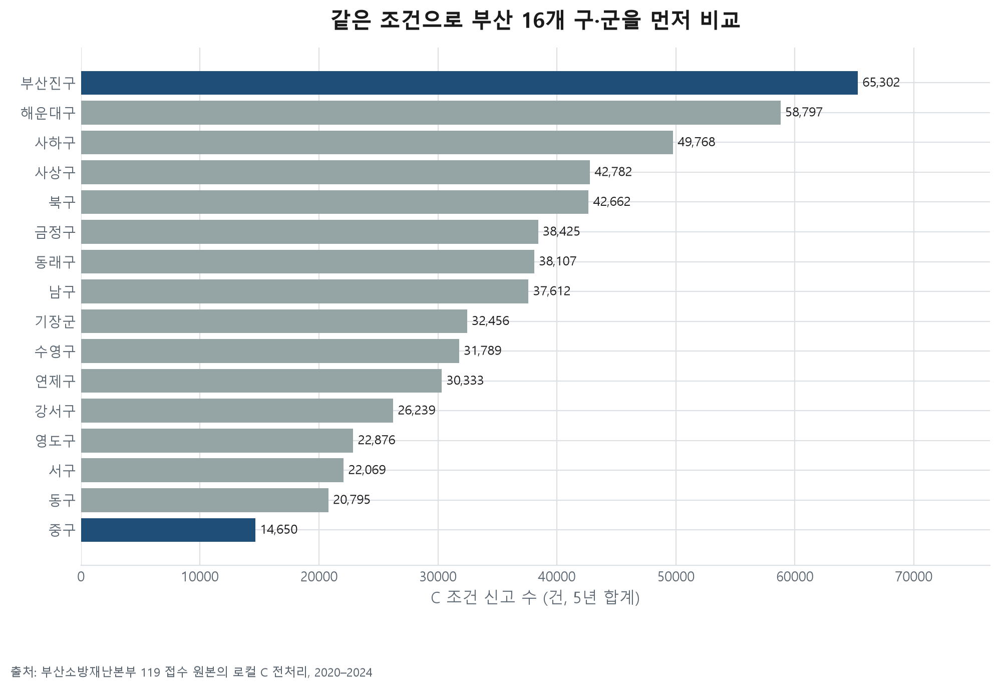

### 02_신고유형_구성
각 구의 C 신고 전체가 분모다. 세부 유형별 원표도 함께 제공한다.
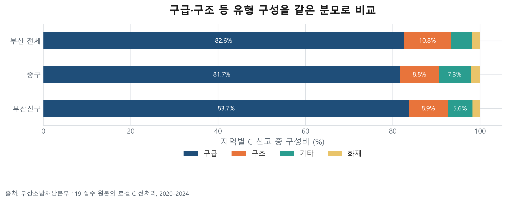

### 03_연도와_조건민감도
A도 이미 선택 17개 결측 제외 후 자료다. 전체 원신고를 대표한다고 단정하지 않는다.
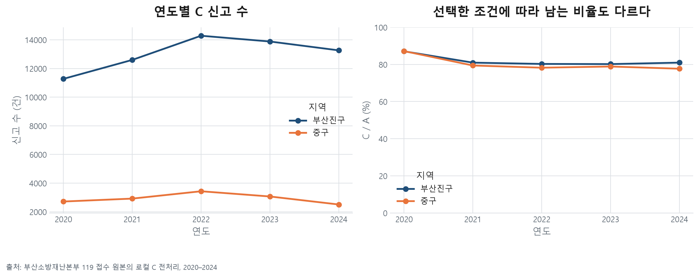

### 04_요일시간_집중
같은 색 눈금. 해당 요일 일수로 나눠 요일 횟수 차이를 보정했다.
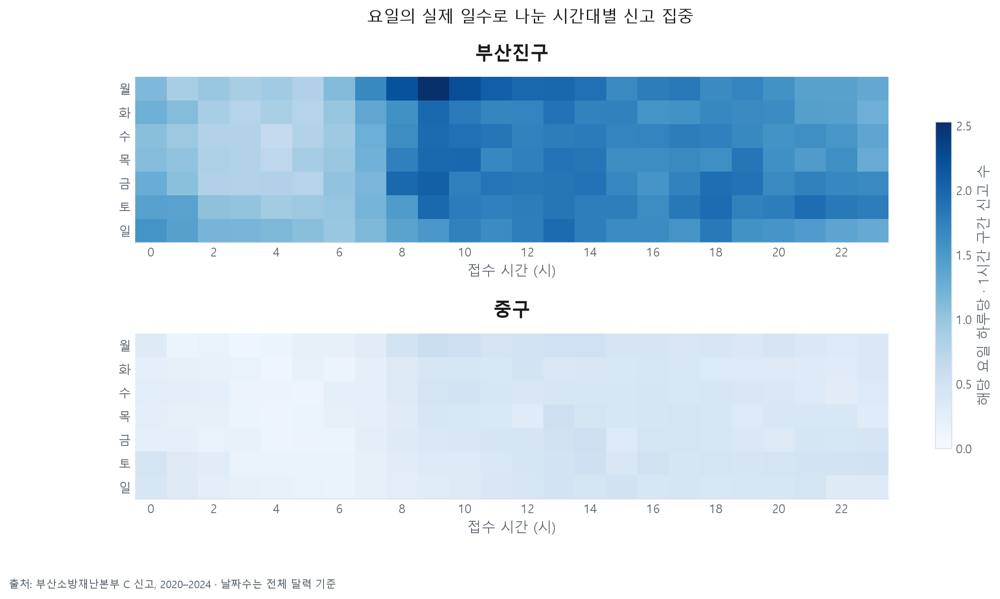

### 05_월별_연도비교
월 길이를 보정하고 연도를 분리한다. 반복적 계절성의 통계적 입증은 아직 하지 않았다.
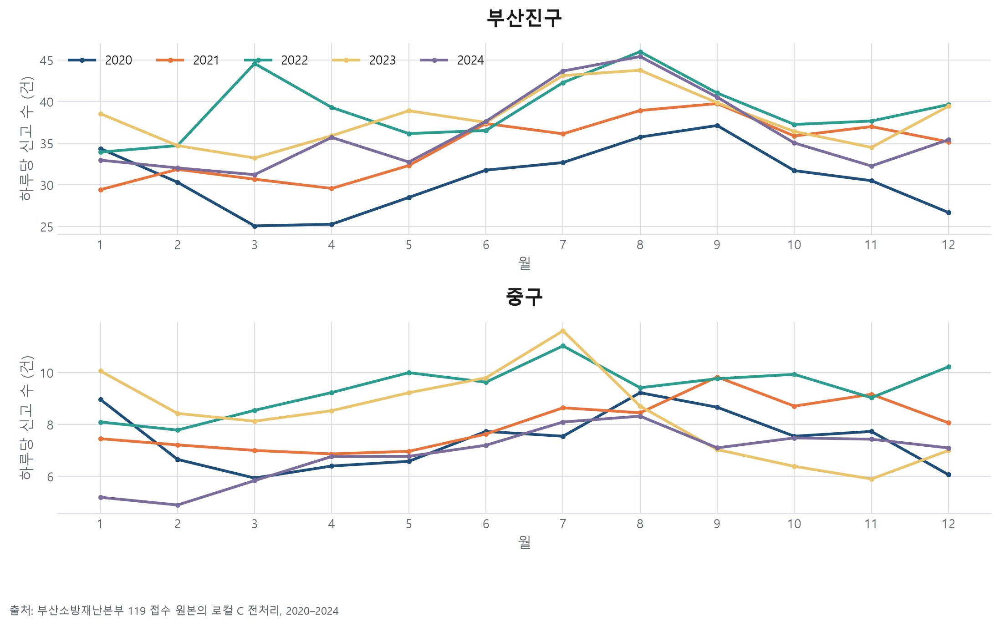

### 06_원문동_집중
원문 동명 집계다. 행정동 경계·인구와 결합하지 않았다. 여러 행정동에 걸친 동명을 임의 분배하지 않는다.
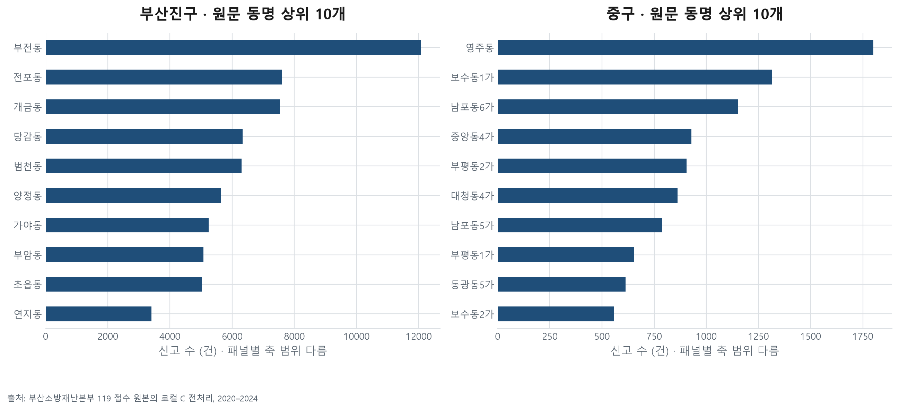

### 07_소방자원_소재지비교
센터 수·인원·차량은 서로 다른 단위다. 기준일·교대인원·관할범위 미확인으로 부족 판정은 보류한다.
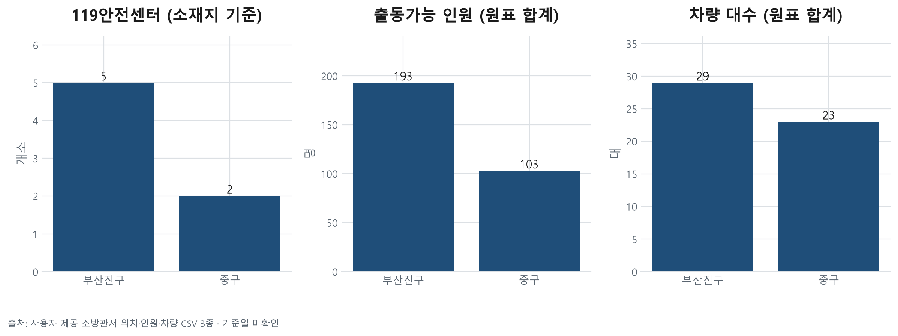

### 08_접근성_전_센터기록확인
접근성 축의 사전 진단이다. PLCSCN_CNTR_NM 기록은 실제 출동·도착시간·센터별 업무량을 보장하지 않는다. 도로망·출동시각·도착시각·당시 가용인원 확보 전 접근성 판정 보류.
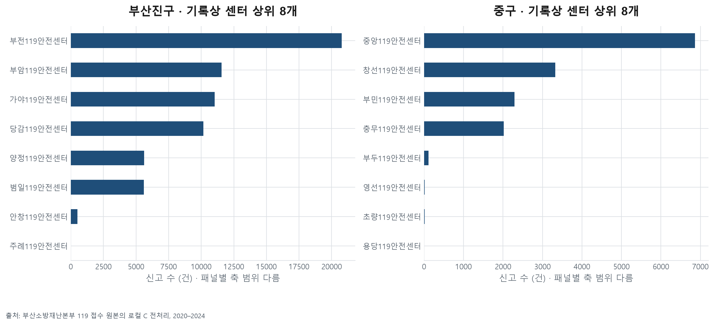

### 09_고령인구_지역맥락
구 코드와 연도를 고정해 연결했다. 신고자의 나이를 뜻하지 않으며 유동인구·방문객 노출이 반영되지 않은 비율이다.
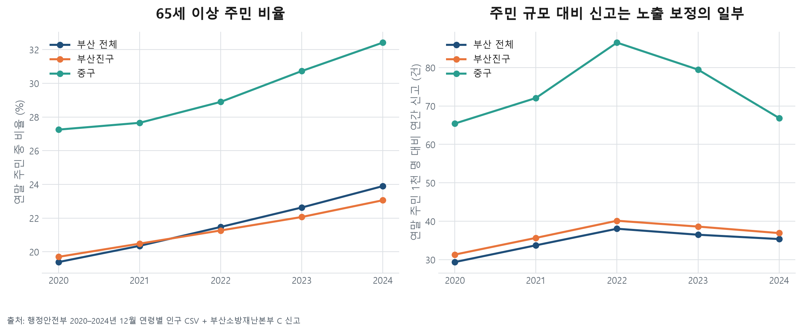

### 10_고령층_구간
겹치지 않는 연령 구간. 고령 주민 수를 고령 신고 수·독거·고독사 위험으로 바꾸지 않는다.
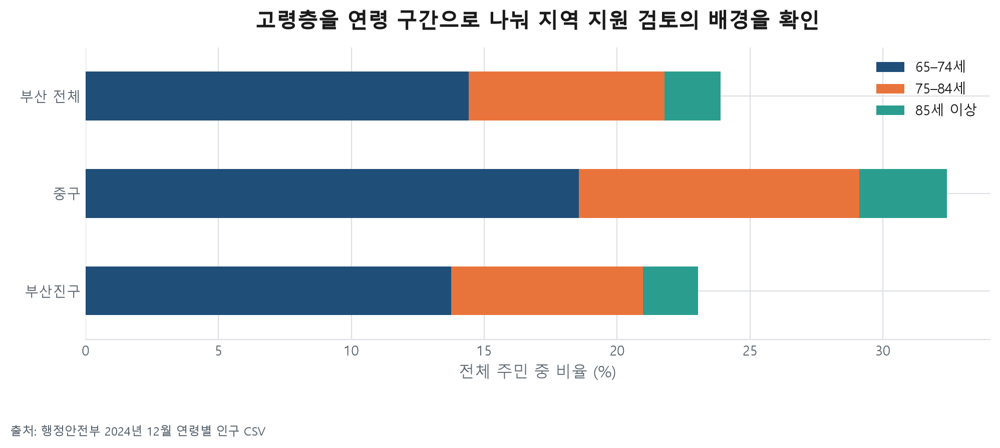

### 11_지원범위_근거공백
지원범위 축은 데이터 확보 현황의 시각화다. 실제 서비스 커버리지 분석은 미완료다.
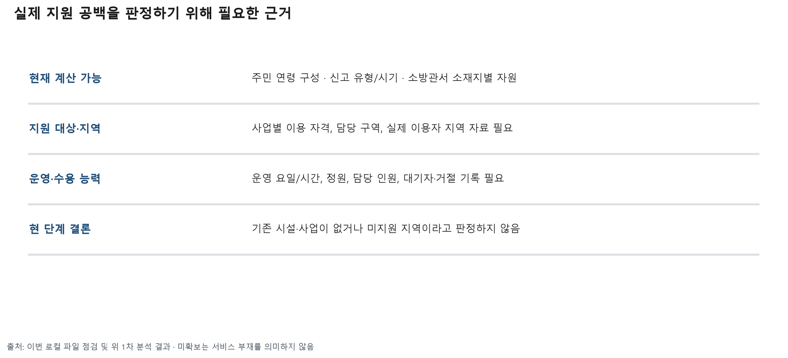

### 12_정책판단_다음검증
정책 방향은 검증할 가설이다. 특정 정책의 효과나 기관 업무 근거를 이번 분석에서 확정하지 않았다.
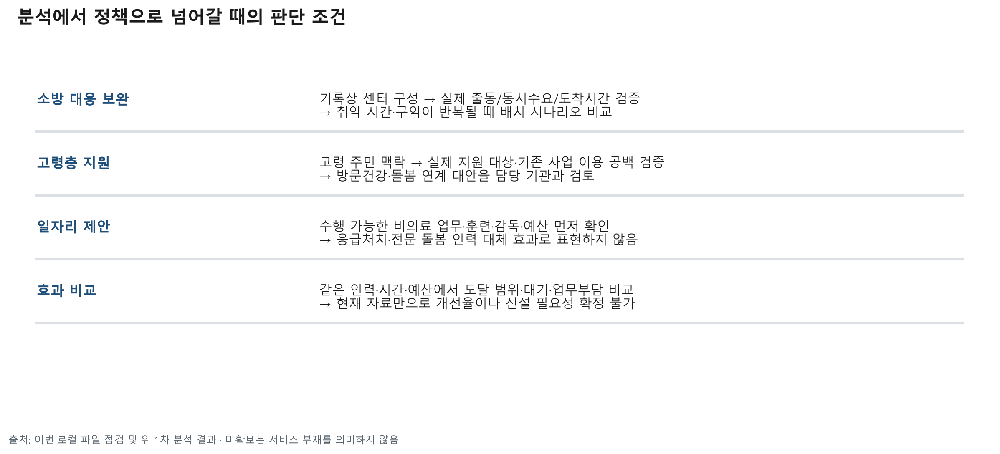

## 다음 확보 자료와 판단
- 접근성: 시점이 맞는 도로망·통행조건, 출동/도착 시각, 관할·상호지원 및 실제 교대 가용 자료. 지금 그림 08은 기록상 센터 구성까지만 확인했다.
- 지원범위: 보건·돌봄 사업별 담당 구역·자격·시간·정원·실제 이용·대기 자료. 로컬 파일에서 측정 가능한 원본을 확인하지 못했다. 기존 공개 웹 분석 문서의 주장만으로 대체하지 않았다.
- 정책 효과: 비교할 대안과 같은 예산·인력 조건이 정해진 후 검증. 노인 일자리·보건소 신설이 필요하다는 결론은 현재 미확정.

## 재현
`.venv/Scripts/python.exe -X utf8 analysis/01_쏠림진단/analyze_two_districts.py`
CSV는 같은 폴더, 원본 해시·출력 해시·검증 요약은 manifest.json. PNG·SVG는 figures/부산진구-중구-1차분석.