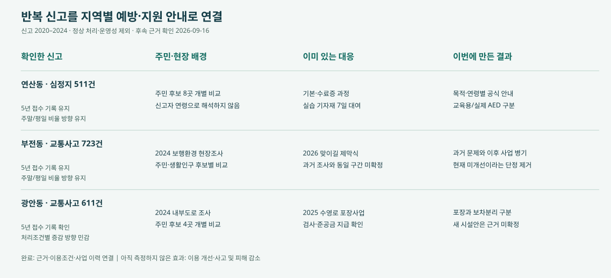
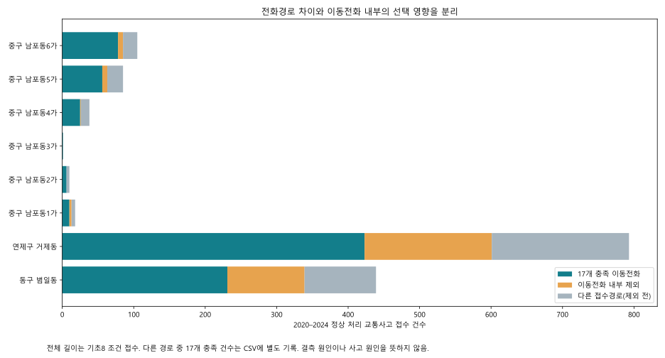
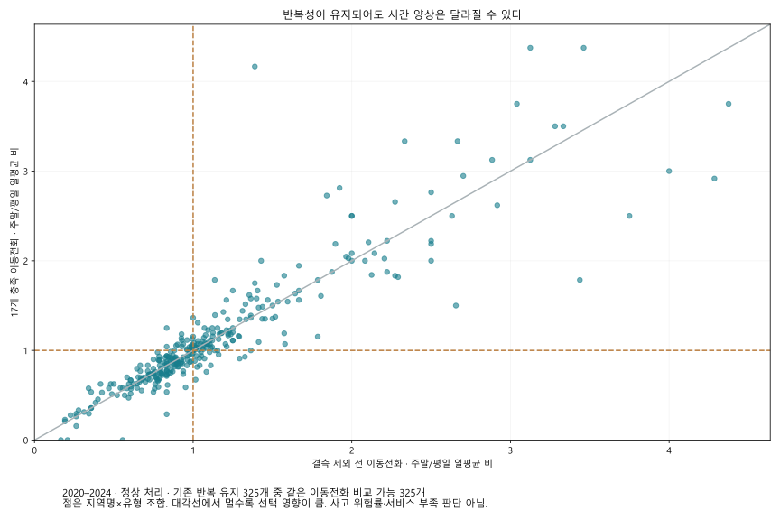
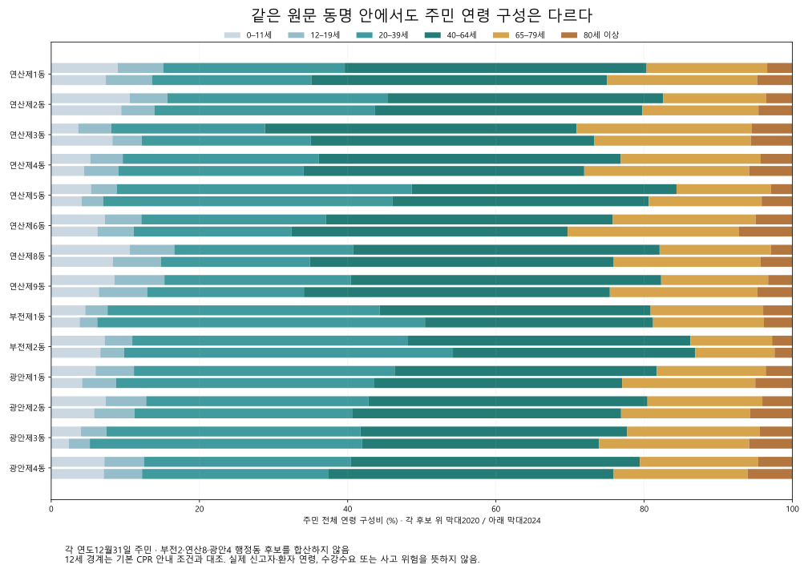
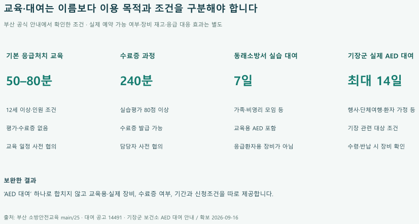

# 부산 119 쟁점 해결과 심층 사례

## 우리가 보려는 것: 반복 신고에 맞는 예방·지원 연결

지역마다 반복되는 신고가 다릅니다. 그 차이를 주민·현장 배경과 기존 서비스에 연결해, 지역별로 필요한 안내와 보완 범위를 구체화했습니다.

출발점은 신고 건수만으로 시설을 더 설치하자는 제안을 만들기 어렵다는 점입니다. 부산시의 AED 정보 불일치 발표, 부산연구원의 보행환경 조사, 기존 지원사업을 함께 확인했습니다. 공식 자료에 흩어진 신고 특성·이용조건·개선 이력을 한 지역의 결과로 연결하는 것이 이번 결과물의 역할입니다.

반복 신고 → 주민·현장 배경 → 기존 대응 → 이번에 구현한 보완. 건수는 2020–2024 정상 처리·운영성 제외 조건의 접수 수이며 실제 사고 수가 아닙니다.

연산동 심정지와 부전동 교통은 우선 심층 사례, 광안동 교통은 조건에 민감한 비교 사례입니다. 최상위 위험지역으로 선정한 것이 아닙니다. 완료한 것은 근거와 이용경로를 연결한 결과 서비스이며, 시설 보수나 운영기관의 업무 변경을 시행한 것은 아닙니다.

[부산시 AED 정보 관리 발표](https://www.busan.go.kr/nbtnewsBU/1691436) · [부산연구원 보행환경 연구](https://data.bdi.re.kr/PDF/View.do?dir=report&path=RPT_00000000001&savename=20250715172207_54971)

## 부산 전체에서 세 사례로 좁힌 근거

194개 신고 지역명×5유형의 970개 조합을 비교하고, 세 처리조건에서 제외 전후 5년 반복·증감 방향이 유지된 325개를 시간조건까지 재검토했습니다. 현장·운영자료로 독립적으로 확인되는 근거와 실제로 구현할 보완 내용이 있는 사례를 골랐습니다.

325개는 시간 전략이나 실제 동 위치까지 검증됐다는 뜻이 아닙니다. 광안동은 모든 처리조건의 안정성을 충족한 사례가 아니라, 기존 사업을 대조할 수 있는 별도 비교 사례입니다. 5년 반복은 각 연도에 접수 기록이 있다는 뜻으로, 지속적인 고위험이나 동일 원인의 반복을 뜻하지 않습니다.

| 지역·유형 | 5년 선택 신고 | 판정 | 선정 근거 | 이번 보완 |
| --- | --- | --- | --- | --- |
| 연산동 · 심정지 | 511건 | 우선 심층 사례 | 5년 반복과 같은 이동전화의 주말·평일 방향이 유지되고, AED·실습대여의 공식 이용조건이 확인됨 | 등록 AED 조회, 실제 장비 대여, 교육용 기자재, 수료증 과정을 목적별로 분리해 안내 |
| 부전동 · 교통사고 | 723건 | 우선 심층 사례 | 5년 반복과 같은 이동전화의 주말·평일 방향이 유지되고, 과거 보행조사 이후 맞이길 사업 기록이 확인됨 | 2024 조사와 2026 사업을 병렬 표시해 과거 문제를 현재 미개선으로 소개하지 않음 |
| 광안동 · 교통사고 | 611건 | 비교 사례 | C 조건의 반복은 확인되나 모든 처리조건의 증감 방향이 안정적이지 않음. 포장사업 검사·지급은 별도로 확인됨 | 수영로 포장사업과 내부도로 보차분리 문제를 구분; 증가·감소 근거로 사업 우선순위를 정하지 않음 |

연산·부전은 325개 중 후속 근거를 확보한 설명 사례이며 유일한 최적 대상이 아닙니다. 거제동·범일동은 증감 방향이 뒤집히는 단계를 설명하는 진단 사례입니다. 소방 조사표의 비고 공란 13행은 관리공백의 근거로 채택하지 않았습니다.

## 선택 영향: 전화경로와 이동전화 내부 제외를 분리했습니다

기존 기초 8개 조건의 비교 집합과 17개 충족 집합을 같은 이동전화 안에서 비교했습니다. 현재 분석 입력을 바꾸거나 제외 신고에 가중치를 주지 않았습니다.

거제동 교통의 2024−2020 변화는 전체 경로 +14건 → 이동전화 −3건 → 17개 충족 이동전화 −6건입니다. 범일동 교통은 −9건 → −7건 → +1건으로, 반전되는 단계가 다릅니다. 이는 건수의 산술 분해이며 결측 발생 원인이나 정책 효과의 인과 분석은 아닙니다.

서로 다른 경로의 제외와 같은 이동전화 내부 제외를 분리한 비교.

| 사례 | 제외 전 전체 | 제외 전 이동전화 | 17개 충족 이동전화 | 이동전화 잔존율 |
| --- | --- | --- | --- | --- |
| 연산동 심정지 | 895 | 710 | 511 | 72.0% |
| 부전동 교통사고 | 1,485 | 1,048 | 723 | 69.0% |
| 광안동 교통사고 | 1,130 | 857 | 611 | 71.3% |

## 반복성이 유지돼도 시간 조건은 별도 검증했습니다

반복 유지 325개 중 같은 이동전화의 결측 제외 전후 주말/평일 하루 평균 비율이 1배를 넘나드는 조합은 33개였습니다. 0.9배 미만↔1.1배 초과로 바뀐 것은 2개이며, 매년 잔존 5건 이상 조건에서는 0개였습니다. 작은 건수와 1배 근처의 변동을 큰 변화로 확대하지 않았습니다.

연산동 심정지는 1.079→1.171배, 부전동 교통은 1.094→1.072배로 방향이 유지됩니다. 이 사실만으로 주말 인력 증원이나 주말 예방 효과를 주장하지 않습니다. 시간자료는 접수 시각입니다.

2020–2024 동일 기간·동일 이동전화의 선택 전후. 이전 보고서의 2020–22 대 2023–24 비교와 다른 질문입니다.

| 매년 잔존 최소 | 비교 조합 | 1배 경계 반전 | 0.9↔1.1 반전 |
| --- | --- | --- | --- |
| 1 | 325 | 33 | 2 |
| 5 | 167 | 19 | 0 |
| 10 | 119 | 15 | 0 |
| 20 | 86 | 11 | 0 |

## 주민 구성도 보완안의 실제 판단에 연결했습니다

연산동 8곳·부전동 2곳·광안동 4곳의 대응 후보를 각각 읽었습니다. 14후보×5년×101연령, 총 7,070행의 인원·비중을 보존했으며 후보를 합치거나 신고를 나누어 배정하지 않았습니다.

연산3동과 부전2동은 고령 주민 인원이 늘었지만 비중은 낮아졌습니다. 구성비 하나로 주민 변화를 설명하면 놓치는 내용입니다.

| 주민 후보 | 전체 주민 2020→2024 | 65세 이상 인원 | 65세 이상 비중 |
| --- | --- | --- | --- |
| 연산제3동 | 7,419 → 10,252명 | 2,160 → 2,744명 | 29.11% → 26.77% |
| 부전제2동 | 9,915 → 12,202명 | 1,366 → 1,599명 | 13.78% → 13.10% |

2020·2024년 각 연말 주민 구성. 나머지 연도를 포함한 전체 인원·비중은 CSV와 탐색기에서 제공합니다.

안내에 반영한 내용: 연령과 목적이 다른 교육을 하나로 묶지 않습니다. 기본 응급처치교육은 12세 이상, 미취학 교육은 별도 과정이며 수료증 과정·실습 기자재 대여도 구분합니다. 12세 미만 모두가 미취학이라는 뜻은 아닙니다.

연령별 주민 수는 신고자 연령, 신청 수요 또는 교육 접근 장벽을 입증하지 않습니다. 실제 이용·미이용이나 장벽은 참여·신청 결과를 별도로 측정해야 합니다.

[전체 연령 인원·비중](candidate_all101ages.csv) · [5년 주민 구성](candidate_annual_age_bands.csv) · [인원과 비중 변화](candidate_change_2020_2024.csv)

## 연산동: AED가 있다는 정보에서 이용 목적까지

연산동 심정지 신고 511건은 지역 배경입니다. 주민의 연령을 환자의 연령으로 추정하거나 신고를 특정 장비 주변 사건에 배정하지 않았습니다.

2026년 3월 보건복지부 지침은 배터리·패치 유효기간 초과, 위치좌표 미설정 등의 외부표출 제한과 보건소·설치기관의 수정 절차를 설명합니다. 따라서 공개 목록은 전체 장비의 무작위 표본이 아니며, ‘지도에 없음=설치되지 않음’이나 ‘신규 관리절차 필요’라는 판단은 성립하지 않습니다.

연산동에 소재한 동래소방서의 실습 기자재 대여는 7일이며 교육용 AED가 포함됩니다. 기장군의 실제 AED 대여와 다른 서비스입니다. 기본 응급처치교육과 수료증 과정도 분리했습니다.

새로운 대여사업을 제안하는 대신 기존 과정·장비의 목적과 신청조건을 구분했습니다.

구현한 보완: 심정지 결과에서 기본 교육·수료증·실습 대여·기존 AED 안내의 공식 경로를 목적별로 제공합니다. 공개 목록의 선택성을 표시하며 실제 작동상태나 예약 재고를 만들지 않습니다.

[보건복지부 제8판 지침(공식 구청 배포본)](https://www.daedeok.go.kr/board/binary/CHC_000005/2111958.hwpx) · [동래소방서 실습 대여](https://119edu.busan.go.kr/main/4?action=view&no=14491) · [응급처치교육 조건](https://119edu.busan.go.kr/main/25)

## 부전·광안: 과거 문제와 이후 정비를 나눴습니다

| 장소 | 새로 확인한 단계 | 현재 판단 | 출처 |
| --- | --- | --- | --- |
| 부전역 앞 맞이길 | 부산시가 2026-02-05 부전역 맞이길 제막식을 기록했다. 2025 결산 교부목록에는 3/31 1,257백만원과12/10 220백만원이 별도 기재된다. 시민리포트는 정비된 접근환경을 서술한다. | 제막식·교부금은 모든 사업항목의 검수·시공범위·접근성 효과를 대신하지 않는다. 시민리포트의 주관적 평가는 공식 효과측정이 아니다. | 제막식 기록 · 시보 시민리포트 · 교부금 내역 |
| 수영로 광안역 일원 | 2025-09-22 계약,2025-09-23 착공. 11/07 검사,11/12 준공금48,520,000원 지급. 최초49,625,750원에서 보험료 등 정산으로1,105,750원 감소. | 준공예정일10/20을 실제 준공일로 쓰지 않는다. 공고 A3,672㎡·L3805m·B9.6~9.8m는 기하상 정합하지 않아 길이를 확정하지 않는다. 계약 금액을 교통안전 효과나 보차분리 해결로 환산하지 않는다. | 입찰 공고 · 계약·지급 내역 |

부전역 앞 맞이길의 제막식 기록은 2026년 변화가 있음을 보여줍니다. 광안역 수영로는 2025년 11월 검사·준공금 지급까지 확인했습니다. 다만 이 사업들이 BDI의 개별 조사구간이나 보차 미분리 문제와 정확히 일치한다는 증거는 확보하지 못했습니다.

구현한 보완: 과거 조사·현재 사업·동일 구간 확인 여부를 함께 표시합니다. ‘여전히 미개선’과 ‘전부 해결’이라는 양쪽 단정을 모두 제거했습니다. 동일 구간의 최신 도면·현장 상태와 기존 평가를 확보한 뒤 시설 변경을 판단하는 것이 다음 운영 단계입니다.

신평역 공원은 실시설계 입찰 단계만 확인돼 준공으로 표시하지 않습니다. 광안역 주민제안은 객관적 수요·사업 채택 근거로 사용하지 않았습니다.

## 다른 신고 유형도 기존 대응까지 확인했습니다

| 유형·사례 | 확인된 현장·주민 배경 | 기존 대응 | 이번 결과와 적용 범위 |
| --- | --- | --- | --- |
| 일반주택 화재 · 기장·온천 | 기장읍·온천1~3동 주택 유형 차이. 고층건물 신고는 별도 분류 | 기장 2026 멀티탭 지원 계획·동래 기존 주택점검 연계 | 건물별 피난정보와 일반주택 지원조건 분리. 완료 실적·미지원 가구 수는 미확정 |
| 산악 · 초읍·금성 | 신고 지역명 배경. 실제 등산로로 사고를 배정하지 않음 | 찬물샘 매트·편책 설치 답변, 금정산 로프·표찰 정비 완료 발표 | 정비 이력·공식 탐방로와 통제 안내 연결. 일괄 시설 증설 근거 없음 |
| 수난 · 우동·다대 | 개장·비개장 시기 구분. 동 신고를 특정 해변 사고로 배정하지 않음 | 폐장 후 안전관리 계획, 다대 야간사업 및 2026 감시시설 계획 | 구역·운영시점 구분. 비개장을 무대응으로 계산하지 않음 |

이 세 유형은 없어진 것이 아니라 기존 대응의 존재와 제안 범위를 확인한 결과로 남습니다. 다섯 유형은 전체 종별 비교 이후 예방·지원 자료를 대조할 수 있어 검토한 범위이며 모든 위험을 포괄하지 않습니다. 벌집제거는 집중 검토에서 제외했습니다.

[주택·산악·수난의 수치와 공식 출처](../followup/index.html#s8) · [194개 지역·5유형 직접 탐색](../followup/explorer.html)

## 13행의 정확한 의미: 불량 표기 중 일반 비고란 공란

‘조치 미기재 13행’이라는 종전 명칭을 바로잡았습니다. 원 HWP 4개의 표 셀을 다시 해석한 결과, 해당 열은 조치 완료 전용 항목이 아닌 일반 비고란입니다. 132조사행 중 131행에 판정이 있으며, 불량 표기 19행 중 기장 6행에는 현지시정이 쓰여 있고 금정 3행·부산진 10행은 비고가 비었습니다.

| 조사 원본 | 조사행 | 판정행 | 불량 표기 | 불량 중 현지시정 | 불량 중 비고 공란 | 전체 비고 공란 |
| --- | --- | --- | --- | --- | --- | --- |
| 기장 | 33 | 33 | 6 | 6 | 0 | 19 |
| 동래 | 39 | 39 | 0 | 0 | 0 | 39 |
| 금정 | 26 | 25 | 3 | 0 | 3 | 25 |
| 부산진 | 34 | 34 | 10 | 0 | 10 | 34 |
| 합계 | 132 | 131 | 19 | 6 | 13 | 117 |

금정은 연기 1행 외 25행 전체, 부산진은 34행 전체의 비고가 비었습니다. 양호 행도 포함된 서식 특성이므로 불량 13행만의 조치기록 누락·관리공백을 확인한 것이 아닙니다. 현지시정 6행도 모든 결함의 최종 완료율로 변환하지 않습니다.

추가 확보한 금정 7월 61행과 8월 26행 사이에는 명칭·주소 동시 일치가 없었습니다. 공개 결과표와 내부 결과통보·조치 이행 절차도 별도입니다. 개별 조치대장을 확보하지 못한 상태이므로 현재 미조치·기한 위반·13개 고유시설로 판정하지 않습니다.

수치는 유지하고 해석을 수정했습니다. 13행은 점검표를 정확히 읽는 보조 결과이며, 예방사업 필요성을 입증하는 공백 지표에서 제외했습니다.

[원문 표 구조·법령·전월 대조](13행-의미재검토.md) · [4개 원본 재집계](inspection-form-summary.csv)

## 기존 교육도 접수 표기만으로 안내하지 않습니다

확보한 사하소방서 공고 17236에는 ‘접수중’, 운영기간 종료 2026-07-31, 신청기간 종료 2026-12-31이 함께 기재돼 있습니다. 정확히 10명인 경우에는 ‘10명 이하 폐강’과 ‘10명 이상 운영’이라는 문장이 상충합니다.

이는 확보한 게시내용의 조건 불일치이며 실제 교육 취소·수강 거부를 입증하지 않습니다. 직접 HTTP 요청은 차단돼 웹 열람 추출본을 보존했으며, 최신 실운영 확인을 했다고 표현하지 않습니다.

시제품에서는 ‘현재 신청 가능’ 버튼 대신 공고 조건과 공식 확인 경로를 표시합니다. 원 기관 페이지를 수정한 것은 아닙니다. 교육이 존재하지 않는다는 주장도 하지 않습니다.

| 확인한 서비스 | 대상·목적 | 기간·시간 | 이용조건 |
| --- | --- | --- | --- |
| 응급처치 기본교육 | 12세 이상 개인(10명 이상) 또는 단체로 안내 | 50–80분 | 담당 소방서와 교육 일정 협의 |
| 응급처치 수료증 과정 | 수료증 발급 희망 대상자 | 240분 | 담당자와 사전 연락·일정 협의 |
| 동래소방서 CPR 실습 기자재 대여 | 가족·비영리단체·동호회 등 일반인; 영리 목적 제외 | 7일 | 유선 문의 → 온라인 신청 → 신분증 지참 방문수령 → 반납 |
| 사하소방서 소방안전교육 | 어린이·청소년·노인·장애인·성인 등 | 협의 | 운영·신청기간 및 정확히 10명일 때 개설 조건이 서로 달라 담당자 확인 필요 |
| 미취학 아동 소방서 방문교육 | 유치원·어린이집 등 미취학 아동 | 30–40분 | 관할 소방서 문의·일정 협의 |

[사하소방서 공고 원문](https://119edu.busan.go.kr/main/4?action=view&no=17236)

## 보완한 공백과 기대효과의 범위

| 문제 | 완료한 결과·기능 | 기대할 수 있는 변화 | 아직 검증하지 않은 효과 |
| --- | --- | --- | --- |
| 선택 영향이 다른 증가·감소를 같은 결론으로 설명 | 경로 구성과 이동전화 내부 제외를 분해해 표시 | 근거가 약한 시간·증감 전략을 구별 | 정책 판단 오류 감소율 |
| 과거 조사 뒤의 정비가 누락된 설명 | 부전·광안 사업의 확인 단계와 출처 연결 | 완료 사업을 중복 제안하거나 전부 해결로 오인하는 설명 감소 | 실제 중복예산 절감·사고 감소 |
| 교육·실제 장비·수료증 조건 혼동 가능 | 목적별 이용조건과 공식 신청·조회 경로 연결 | 필요한 과정과 장비를 정확히 찾을 가능성 | 사용자 탐색시간·신청 성공률·생존율 |
| 점검표를 조치대장처럼 읽던 오류 | 일반 비고란의 공란으로 명칭·해석 수정 | 현재 미조치·관리공백이라는 잘못된 표시 방지 | 시설 시정 완료율·화재 피해 감소 |

사용자 효과 평가는 동일한 정보찾기 과제를 기존 공식 경로와 시제품에서 수행하도록 순서를 교차 배정하고, 정답률·탐색시간·잘못된 현재상태 판단을 비교하는 방식으로 설계했습니다. 아직 참여자를 대상으로 실행하지 않았으므로 개선율을 제시하지 않습니다. 사고 감소는 별도의 장기·현장 평가가 필요합니다.

이번 결과의 공백 보완은 우리 분석과 결과 전달에서 빠졌던 선택 영향·시행 단계·이용조건을 연결한 것입니다. 기관 내부에 해당 업무가 없었다거나 주민의 모든 미충족 수요를 해결했다는 뜻은 아닙니다.

## 이번에 측정·수정한 것과 다음에 측정할 효과

| 평가 대상 | 이번에 한 일 | 결과의 의미 |
| --- | --- | --- |
| 수치·출처·조건의 정확한 전달 | 수정 전 파일·해시를 보존하고 12개 결과 확인 과제를 사전에 고정 | 같은 항목으로 버전 간 회귀검사. 사용자의 정답률·이용 효과가 아님 |
| 숫자를 읽을 수 있는 조작 | 24시간·101연령 수치표를 키보드로 열고 읽는 경로 구현 | 마우스를 올려야만 보이던 정보를 표로 제공. 실제 참여자 실험은 아님 |
| 연령 인원·비중과 후보 연결 | 기존 검증 인구에 7,070행·70연도행·14변화행 독립 대조 | 새 수치와 기존 입력의 일치 확인. 신고자 연령·실제 발생동 확정 아님 |
| 13행의 의미 | 원 HWP 표 셀 재추출과 서식·전월·절차 확인 | 개수는 유지하고 잘못 읽을 수 있던 명칭·공백 주장을 교정 |

다음 효과 평가는 참가자가 같은 정보찾기 과제를 기존 공식 경로와 시제품에서 수행하도록 순서를 교차 배정해 진행할 수 있습니다. 정답·소요시간·현재 운영상태의 오판을 기록하고 과제별 비교 모집단을 공개해야 합니다. 아직 실행하지 않아 정답률 향상·탐색시간 단축·신고 감소 수치는 제시하지 않습니다.

[실제 실행한 검증과 범위](검증기록.md) · [고정한 결과 확인 과제](measurement-spec.json) · [누락·보완 감사](gap-audit.md)

## 남은 판단과 다음 자료

| 대상 | 필요한 구체적 근거 | 그 자료가 결정할 내용 |
| --- | --- | --- |
| 부전·광안 보행 환경 | BDI 조사구간 좌표·사업 준공도면·현재 보차분리/횡단 상태 | 이미 바뀐 구간과 추가 시설 검토 구간의 분리 |
| 소방 불량 조사행 | 동일 조사행의 조치기한·이행·재점검 비식별 결과 | 현재 미조치인지 여부 |
| AED | 공개 동의된 등록 ID별 최신 점검·운영시간·수정 이력 | 정보 불일치가 실제로 정정됐는지와 현재 이용조건 |
| 못골·거제 | 못골 효과평가 원문·거제 최종 의결 및 집행 | 기존 평가 결과 반영·위원회 단계 이후 판단 |
| 교육 | 운영기관이 확인한 최신 기간·인원 조건 | 공고의 상충을 해소한 실제 신청 안내 |

기관에 자료 요청이나 예약을 보내지는 않았습니다. 웹 결과와 코드·집계·출처는 제공하며, 위 자료를 확보하지 않은 상태의 운영 효과는 채워 넣지 않았습니다.

[출처와 입력 기록](source-register.json) · [서비스 조건표](service-conditions.csv) · [증감 단계 분해](annual_direction_channel_decomposition.csv) · [동일 이동전화 비교](same_mobile_comparison.csv)

